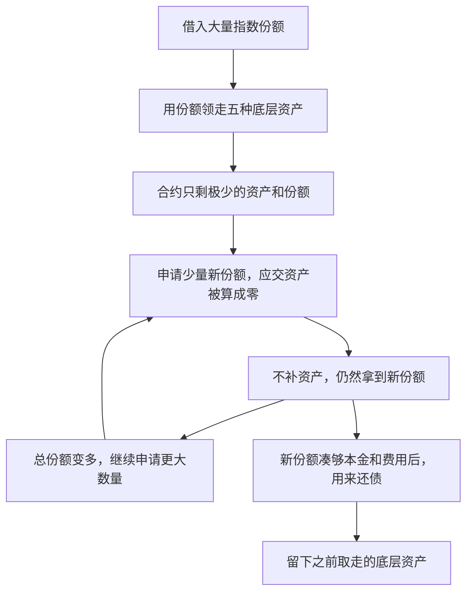

# Thetanuts：先凭份额领走资产，再不交资产补出份额还债

攻击者先借来大量份额，用这些份额取走底层资产。随后，合约在计算“新份额需要交多少资产”时，把很小的应付数量算成了零，却照常发出新份额。攻击者用这些新份额还债，自己留下已经取走的资产。

这个样本使用的是从字节码反推的近似代码。下面的攻击步骤和关键数字还与公开调用记录进行了核对；近似代码中不能完全确认的地方，会单独说明。

## 这个合约是干什么的

出问题的是旧版 **TN-IDX-USDC-PUT 指数代币合约**。它管理一组由五种代币组成的资产，用户持有的指数份额代表其中一部分权益。可以把份额理解为“领取这组资产中相应部分的凭证”。

| 操作                          | 正常情况下应该发生什么                                   |
| ----------------------------- | -------------------------------------------------------- |
| `mint(数量)`：申请新份额    | 用户按比例交入底层资产，合约再给用户新份额。             |
| `claim(数量)`：用份额取资产 | 合约扣掉用户交回的份额，再把对应的底层资产转给用户。     |
| 借入份额并归还                | 借贷合约提供临时份额，要求在同一笔交易里收回本金和费用。 |

这里有两种不同的东西：**份额**是凭证，**底层资产**才是这张凭证代表的财产。正常情况下，多发份额就要有人补进相应资产。

## 漏洞具体在哪

问题发生在 `claim()` 大额取走资产之后，紧接着调用 `mint()` 的过程中。

第一处问题在 [mint 的资产计算](../../dataset/benchmark_complete/20260615_ThetanutsFi_decompiled/ThetanutsIndex.decompiled.pan#L974)：它按“当前资产数量 × 申请份额数 ÷ 当前总份额数”计算应交资产，并直接舍掉不足一个最小单位的部分。当合约只剩一点点资产时，结果可能是零。

第二处问题是：**应交资产都算成零之后，合约仍然发出用户申请的非零份额。** 它执行五种资产的 `transferFrom()`，每种都只要求转入零，然后继续增加用户份额和总份额数。

转账工具只能检查“这次转账是否成功”，不会替指数合约检查“发这么多份额，是否真的收到了相应价值”。零金额转账可以成功，所以这一层检查没有阻止攻击。

## 用一组数字看懂为什么能一直补出份额

假设合约总共只剩 3 个最小份额单位，每种底层资产都只剩 1 个最小单位。有人申请 2 个新份额，计算出的每种应付资产是 `1 × 2 ÷ 3`，不足一个最小单位，舍掉小数后就成了 0。

用户没有交入资产，却拿到了 2 个新份额。总份额从 3 变成 5，下次再申请 4 个，应交数量仍然不足 1，结果还是 0：

| 铸币前总份额 | 申请的新份额 | 每种资产需要交多少 | 铸币后总份额 |
| ------------ | ------------ | ------------------ | ------------ |
| 3            | 2            | 0                  | 5            |
| 5            | 4            | 0                  | 9            |
| 9            | 8            | 0                  | 17           |
| 17           | 16           | 0                  | 33           |

关键在于：**资产没有增加，总份额却越变越多；分母越大，后面就可以申请更多份额而仍不交资产。**

这是帮助理解的数字例子，不表示已经逐个确认了五种资产的历史账本都恰好剩 1。实际调用记录确认了赎回后总份额剩 3，后续读数依次出现 5、9、17、33，以及每次要求补回的五种资产数量都为零。

## 攻击者怎样一步步利用




这次攻击能成功，关键是：**攻击者先用借来的份额领走资产，再利用计算中的舍入问题，不交资产就补出一批新份额，用它们还债。最后，份额数量还回去了，份额背后的资产却留在攻击者手里。**

可以把指数份额理解成“领取资产的凭证”。正常情况下，合约多发一些凭证，就应该收到相应的资产。这次出错的地方，正是“资产没收到，凭证却照样发了”。

下面结合仓库中的代码，按你列出的六步说明。这个合约没有公开的已验证原始源码，仓库保存的是**反编译伪代码**；为方便阅读，我会把复杂变量名改成容易理解的名字，并明确标注示意代码。关键数量已经对照公开交易调用记录核实。

首先分清楚参与这件事的三方：

| 参与方                 | 负责什么                                                                                                                |
| ---------------------- | ----------------------------------------------------------------------------------------------------------------------- |
| **指数合约**     | 持有五种底层金库的份额代币，并发行自己的指数份额`TN-IDX-USDC-PUT`。                                                   |
| **五个底层金库** | 分别对应 BTC/USD、ETH/USD、AVAX/USD、BNB/USD、MATIC/USD 等金库。指数合约持有它们的份额，部分份额可以进一步兑换成 USDC。 |
| **借贷合约**     | 临时借出指数份额，要求在同一笔交易里收回借出的数量和费用。                                                              |

指数合约中，`mint()` 负责“交资产，领新份额”，`claim()` 负责“交回份额，取资产”。

正常的比例关系可以这样理解：假设合约持有某种资产 100 个，总共发行了 100 份。有人想增加 10 份，就应该补进 10 个资产。这样，增发前后每份对应的资产数量保持一致。

---

1. **借来几乎全部份额：先拿到可以取资产的凭证。**

   交易记录显示，攻击前指数合约的总份额是：

   ```text
   153,054,600,572 个最小单位
   = 153,054.600572 份
   ```

   攻击者临时借入：

   ```text
   153,054,600,569 个最小单位
   = 153,054.600569 份
   ```

   两者只差 **3 个最小单位**。

   这里一定要区分“份”和“最小单位”：这个份额代币采用六位小数，**3 个最小单位就是 0.000003 份**。

   借到份额后，这些份额就记在攻击执行合约的余额里。指数合约允许持有人凭份额取资产，所以攻击者可以直接调用 `claim()`。

   这一步的作用是：**用临时借款取得几乎整个资产篮子的领取资格。** 借款需要稍后偿还，但在偿还之前，攻击者已经可以使用这些份额。
2. **调用 `claim()`：把借来的份额消耗掉，把对应资产领走。**

   实际调用是：

   ```solidity
   // 参数使用最小单位
   index.claim(153_054_600_569);
   ```

   反编译代码中，可以看到扣减持有人份额、减少总份额的操作：

   ```python
   # 摘取相关逻辑，省略无关检查
   if balanceOf[caller] < _day:
       revert(...)

   balanceOf[caller] -= _day
   totalSupply -= _day
   ```

   这里的 `_day` 是反编译器起的名字，在这个函数里表示**交回的份额数量**。对应位置在 [claim 的份额扣减代码](D:/code/vibe-coding/ai-auditing-benchmark/ai-auditing-benchmark/dataset/benchmark_simplified/20260615_ThetanutsFi_decompiled/ThetanutsIndex.decompiled.pan:416)。

   用白话说，这几行就是：

   > 先检查你有没有这么多份额，再从你的账户里扣掉这些份额，同时减少市场上存在的总份额。
   >

   后面还有逐一向调用者转出五种底层资产的操作。调用记录确认，这次 `claim()` 成功转出了五种金库份额；之后查询 `totalSupply()`，返回值是 **3**。

   这一步结束后，攻击者的情况变成：

   ```text
   借来的指数份额：已经用掉
   五种底层金库份额：已经拿到手
   借款：仍然需要偿还
   指数合约：只剩极少的总份额和资产
   ```

   **单独看这一步，攻击者还没有解决还款问题。** 如果必须把刚取出的资产完整交回去才能重新获得份额，那么基本没有便宜可占。后面的 `mint()` 漏洞让他绕过了这笔成本。
3. **调用 `mint(2)`：申请的份额大于零，应交的资产却被算成零。**

   `mint()` 的关键计算在 [资产转入数量的计算代码](D:/code/vibe-coding/ai-auditing-benchmark/ai-auditing-benchmark/dataset/benchmark_simplified/20260615_ThetanutsFi_decompiled/ThetanutsIndex.decompiled.pan:143)：

   ```text
   unknowna622ee7c[stor9[idx]].field_256 * _wad / totalSupply
   ```

   把名字换成容易理解的说法，就是：

   ```text
   应交入的某种资产数量
       = 合约记录的该资产数量 × 想增加的份额数量 ÷ 当前总份额
   ```

   这里有三个量：

   | 代码中的量                                | 通俗解释                             |
   | ----------------------------------------- | ------------------------------------ |
   | `unknowna622ee7c[stor9[idx]].field_256` | 合约账本里记着的某一种底层资产数量。 |
   | `_wad`                                  | 用户这次想获得多少新份额。           |
   | `totalSupply`                           | 当前已经发行了多少份额。             |

   为了说明攻击路径，把它整理成下面这段**示意伪代码**。这不是原始 Solidity，省略了管理费等分支：


   ```solidity
   function mint(uint256 newShares) {
       uint256 oldSupply = totalSupply;

       // 对五种底层资产分别计算并收款
       for (每一种底层资产 token) {
           uint256 required =
               recordedBalance[token] * newShares / oldSupply;

           token.transferFrom(
               msg.sender,
               address(this),
               required
           );

           recordedBalance[token] += required;
       }

       // 收款流程结束后，发出用户申请的份额
       totalSupply += newShares;
       balanceOf[msg.sender] += newShares;
   }
   ```

   **问题首先出在整数除法。** 合约中的数量使用整数，计算结果的小数部分会直接舍掉：

   ```text
   2 ÷ 3 = 0
   4 ÷ 5 = 0
   8 ÷ 9 = 0
   ```

   例如，假设赎回之后：

   ```text
   总份额：3 个最小单位
   某一种底层资产：1 个最小单位
   本次申请：2 个最小份额单位
   ```

   那么应交资产就是：

   ```text
   1 × 2 ÷ 3 = 0
   ```

   合约接下来执行的操作相当于：

   ```solidity
   token.transferFrom(攻击者, 指数合约, 0);
   ```

   这是一笔零金额转账，可以正常成功。转账工具检查的是“这次转账有没有失败”，不会替指数合约判断“发这些新份额，究竟应该收到多少价值”。

   **更关键的问题在收款之后。** [mint 末尾的代码](D:/code/vibe-coding/ai-auditing-benchmark/ai-auditing-benchmark/dataset/benchmark_simplified/20260615_ThetanutsFi_decompiled/ThetanutsIndex.decompiled.pan:403)仍然执行：

   ```python
   totalSupply += _wad
   balanceOf[caller] += _wad
   ```

   因此，这一轮的结果是：

   ```text
   合约收到的资产：0
   攻击者获得的新份额：2 个最小单位
   总份额：3 → 5
   ```

   上面“每种资产剩 1 个最小单位”是帮助理解的例子；目前不能据此断言五种资产的历史账本都恰好剩 1。**实际记录能直接确认的是：第一次 `mint(2)` 对五种资产发出的转入请求，金额全部为零，而且调用成功。**
4. **不断增加申请数量：前一次免费增加的份额，帮助下一次继续免费增加。**

   第一次成功后，总份额已经从 3 变成 5，但合约没有收到新资产。

   继续沿用“每种资产剩 1 个最小单位”的示例：

   | 次数    | 调用前总份额 | 本次申请的新份额 | 计算出的应交资产      | 调用后总份额 |
   | ------- | -----------: | ---------------: | --------------------- | -----------: |
   | 第 1 次 |            3 |                2 | `1 × 2 ÷ 3 = 0`   |            5 |
   | 第 2 次 |            5 |                4 | `1 × 4 ÷ 5 = 0`   |            9 |
   | 第 3 次 |            9 |                8 | `1 × 8 ÷ 9 = 0`   |           17 |
   | 第 4 次 |           17 |               16 | `1 × 16 ÷ 17 = 0` |           33 |

   这里形成了一个可以反复利用的过程：


   > 不交资产就增加份额 → 总份额变大 → 下一次计算的分母变大 → 可以申请更多份额，同时让应交资产仍然小于一个最小单位。
   >

   所以，不能简单理解成“总份额很少，就一定可以免费增发”。真正要满足的是：

   ```text
   某种资产的账本数量 × 本次申请份额 < 当前总份额
   ```

   这样做整数除法后，该资产的应交数量才会变成零。攻击者不断增加总份额，让后面的更大申请继续落在这个范围里。

   代码还有一项检查：

   ```python
   if not totalSupply:
       revert(...)
   ```

   它能防止除数为零，但**总份额为 3 可以通过检查**。对应位置在 [mint 的总份额检查](D:/code/vibe-coding/ai-auditing-benchmark/ai-auditing-benchmark/dataset/benchmark_simplified/20260615_ThetanutsFi_decompiled/ThetanutsIndex.decompiled.pan:138)。

   这次实际交易共进行了 **37 次 `mint()`**：

   ```text
   前 36 次申请量：
   2、4、8、16……一直到 68,719,476,736 个最小单位

   第 37 次申请量：
   15,753,396,239 个最小单位
   ```

   累计得到：

   ```text
   153,192,349,709 个最小单位
   = 153,192.349709 份
   ```

   我重新检查了调用记录：**37 次增发各包含 5 次底层资产 `transferFrom()`，总共 185 次，金额全部为零。** 前几次查询到的总份额也确实是 `3 → 5 → 9 → 17 → 33`。这些数字可以在 [固定版本调用记录](https://github.com/DarkNavySecurity/web3-exploit-analysis/blob/0dedb932869fff89899d75a3e6e2315cd87768bd/artifacts/analysis_0xbba9f138fe39503bfd1aa62932dbd6ab35d37d23d48e4b7bf2988a9d5dc39fec/trace_callTracer.json)中核对。
5. **用免费增发出来的份额还债：数量足够，资产却没有补回来。**

   攻击者需要偿还：

   ```text
   本金：153,054.600569 份
   费用：    137.749140 份
   ─────────────────────
   合计：153,192.349709 份
   ```

   这恰好等于刚才通过 37 次 `mint()` 获得的份额。

   调用记录中的还款动作，换成容易阅读的形式，相当于：

   ```solidity
   // 攻击者允许借贷合约扣走足额份额
   index.approve(lendingPool, 153_192_349_709);

   // 随后借贷合约扣款，转回借贷储备地址
   index.transferFrom(
       attacker,
       lendingReserve,
       153_192_349_709
   );
   ```

   这次扣款成功，借贷储备收回了要求的份额数量。

   但这里发生了一个很大的变化：**借出时，这些份额代表着指数合约里的底层资产；还回时，大部分底层资产已经被取走，增发过程中也没有补回来。**

   同一种代币的份额可以互相替代，不需要归还某个带独立编号的“原件”。因此，新发出来的份额可以用于偿还这笔借款。问题出在指数合约允许它们在没有收到相应资产的情况下被发出来。

   到这里，攻击者手里的情况是：

   ```text
   份额借款：已经还清
   刚才免费增发的份额：已经拿去还款
   第一次 claim 领出的五种底层资产：仍然留在手里
   ```
6. **把已经拿到手的部分底层资产换成 USDC。**

   还款后，攻击者继续处理第一次 `claim()` 取得的金库份额：

   | 被处理的金库份额 | 交回的份额数量 |              收到的 USDC |
   | ---------------- | -------------: | -----------------------: |
   | BTC/USD 金库份额 |  49,716.431047 |            70,315.563951 |
   | ETH/USD 金库份额 |  23,955.277333 |            35,155.935127 |
   | **合计**   |             — | **105,471.499078** |

   这两笔操作调用的是底层金库的 `initWithdraw()`。得到的 USDC 随后被转到攻击者的收款地址。其余三种金库份额也被转走，但没有在这笔交易里兑换成 USDC。[事件分析及资产明细](https://www.darknavy.org/web3/exploits/thetanuts-legacy-index-vault-zero-cost-remint/)

   因而，**105,471.499078 USDC 是这笔交易中已经换出并转走的金额**；另外三种金库份额还需要单独统计价值。

阅读原始反编译文件时，要留意 `claim()` 中变量复用和语句先后顺序可能存在还原误差，不能仅凭显示顺序推断精确的赎回公式。上面对这部分采用实际转出结果说明；核心漏洞则由 `mint()` 的比例计算、零金额转账、份额余额增加，以及实际还款记录共同支持。本次做的是代码和历史调用记录核对，没有重新执行攻击。

[调用记录](https://github.com/DarkNavySecurity/web3-exploit-analysis/blob/0dedb932869fff89899d75a3e6e2315cd87768bd/artifacts/analysis_0xbba9f138fe39503bfd1aa62932dbd6ab35d37d23d48e4b7bf2988a9d5dc39fec/trace_callTracer.json)、[事件分析](https://www.darknavy.org/web3/exploits/thetanuts-legacy-index-vault-zero-cost-remint/)

这个漏洞说明，检查“申请份额必须大于零”还不够。合约还必须检查：**发出这些新份额时，用户有没有真的交进足额资产。** 资产或总份额已经很少时，也需要单独处理，不能继续套用会把应付数量算成零的规则。

## 事件信息

| 项目             | 内容                                                                                                                                  |
| ---------------- | ------------------------------------------------------------------------------------------------------------------------------------- |
| Case             | `20260615_ThetanutsFi_decompiled`，原表第 104 行                                                                                    |
| 网络、数据集日期 | Ethereum，`2026.06.15`                                                                                                              |
| 漏洞合约         | [TN-IDX-USDC-PUT：0xc2c3ae0a7b405058558c9b4a63b373486cb86ac7](https://etherscan.io/address/0xc2c3ae0a7b405058558c9b4a63b373486cb86ac7) |
| 攻击交易         | [0xbba9f138…dc39fec](https://etherscan.io/tx/0xbba9f138fe39503bfd1aa62932dbd6ab35d37d23d48e4b7bf2988a9d5dc39fec)                      |
| CSV 金额         | USD 105,000；中文 10.5 万美元，英文 105 千美元                                                                                        |
| 源码性质         | **Panoramix 反编译伪代码，非已验证原始 Solidity**                                                                               |

## 对应代码在哪里

下面的链接分别指向完整版和精简版，便于对照上面的操作步骤。

| 阅读点                     | 完整版                                                                                                           | 精简版                                                                                                             |
| -------------------------- | ---------------------------------------------------------------------------------------------------------------- | ------------------------------------------------------------------------------------------------------------------ |
| 供应量、余额及篮子账本存储 | [storage 声明](../../dataset/benchmark_complete/20260615_ThetanutsFi_decompiled/ThetanutsIndex.decompiled.pan#L6) | [storage 声明](../../dataset/benchmark_simplified/20260615_ThetanutsFi_decompiled/ThetanutsIndex.decompiled.pan#L6) |
| mint 的比例扣款与份额增发  | [mint](../../dataset/benchmark_complete/20260615_ThetanutsFi_decompiled/ThetanutsIndex.decompiled.pan#L974)       | [mint](../../dataset/benchmark_simplified/20260615_ThetanutsFi_decompiled/ThetanutsIndex.decompiled.pan#L126)       |
| claim 的份额销毁及篮子转出 | [claim](../../dataset/benchmark_complete/20260615_ThetanutsFi_decompiled/ThetanutsIndex.decompiled.pan#L1264)     | [claim](../../dataset/benchmark_simplified/20260615_ThetanutsFi_decompiled/ThetanutsIndex.decompiled.pan#L416)      |

## 资料说明

本样本的 `.pan` 文件是 Panoramix 反编译伪代码，不能当作原始 Solidity 编译。反编译工具可能把变量、参数或语句顺序还原错，因此不能只看 `claim` 中显示的先后顺序，就断定原合约使用的是销毁前还是销毁后的总份额。这里以实际赎回结果，以及后续零资产扣款、非零份额增加的调用记录解释攻击。

数据集保存原表的 105,000 美元；实际已换出的 USDC、另外三种未换出的资产，以及其他白帽保护资金，需要分别统计。本说明没有重放攻击，也没有证明伪代码与链上字节码完全一致。

- [源码性质说明](../../dataset/benchmark_complete/20260615_ThetanutsFi_decompiled/SOURCE.md)、[机器可读来源记录](../../dataset/benchmark_complete/20260615_ThetanutsFi_decompiled/SOURCE.json)、[原始反编译页面](https://etherscan.io/bytecode-decompiler?a=0xC2C3AE0a7b405058558C9b4a63b373486CB86Ac7)。
- [固定版本调用记录](https://github.com/DarkNavySecurity/web3-exploit-analysis/blob/0dedb932869fff89899d75a3e6e2315cd87768bd/artifacts/analysis_0xbba9f138fe39503bfd1aa62932dbd6ab35d37d23d48e4b7bf2988a9d5dc39fec/trace_callTracer.json)。
- [Blockaid 原始告警](https://x.com/blockaid_/status/2066524884583215322?s=46)；[DarkNavy 事件分析](https://www.darknavy.org/web3/exploits/thetanuts-legacy-index-vault-zero-cost-remint/)。
