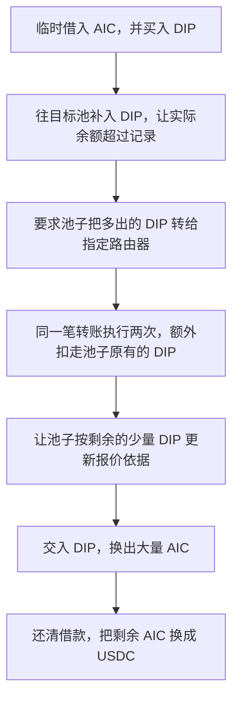

# DIP：池子只想转一笔币，程序却转了两遍

这次攻击的关键是：交易池本来只打算转走多出来的 DIP，代币程序却把同一笔转账执行了两次。第二次转账动用了池子原有的币。攻击者随后让池子按剩下的少量 DIP 重新报价，再用 DIP 换走大量 AIC，最后换成 USDC 获利。

## 这个合约是干什么的

DIP 是一个代币合约，负责记录每个地址有多少 DIP，以及转账时从谁的余额扣除、加到谁的余额上。它还加了两条特殊规则：普通卖出会收取手续费；与指定交易路由器之间的转账走单独的处理分支。这里的“路由器”就是替用户安排代币兑换的合约。

这起事件还涉及 AIC/DIP 交易池。池子里同时放着 AIC 和 DIP，用户可以交进一种币、换出另一种币。兑换价格会受到池内两种币数量的影响。

要理解漏洞，需要分清“池子实际有多少币”和“池子上次记了多少币”。有人直接向池子转币后，这两个数字可能暂时不同：

| 操作                  | 正常作用                                     |
| --------------------- | -------------------------------------------- |
| `balanceOf(pair)`   | 查询池子现在实际持有多少代币。               |
| 池子保存的`reserve` | 池子上次更新时记下的数量，用于后续兑换计算。 |
| `skim(to)`          | 把超过已记录数量的那部分代币转给指定地址。   |
| `sync()`            | 把当前实际余额记下来，供之后的兑换使用。     |

## 漏洞具体在哪

出错的是 [DIP._transfer()](../../dataset/benchmark_complete/20260617_DIP/contracts/flatten/nexus_dip.sol#L1702)。非零转账涉及指定路由器时，它会先执行一次转账；但执行完没有结束，后面又执行了一次相同的转账。

关键顺序可以用下面的说明性伪代码表示：

```text
如果转账涉及指定路由器：
    转账一次
否则，如果是普通卖出：
    计算并处理手续费

再转账一次
```

最后一行也会在路由器分支之后执行。两次实际扣款都发生在基类 [ERC20._transfer()](../../dataset/benchmark_complete/20260617_DIP/contracts/flatten/nexus_dip.sol#L451)，所以余额真的会少两份。这个错误不能理解成“日志多记了一次”。

交易池调用 `skim()` 时，只按多出来的余额计算应该转多少，并不知道 DIP 会重复扣款。攻击者只需把 `skim` 的接收方设为指定路由器，就能让池子进入这个错误分支。攻击者本人不需要取得管理员权限。

## 用一组数字看懂为什么会少钱

下面的数字只是解释原理，不是实际交易金额：

| 步骤                 | 池子实际有多少 DIP | 发生了什么                                    |
| -------------------- | ------------------ | --------------------------------------------- |
| 开始                 | 1,000              | 池子也记录自己有 1,000。                      |
| 攻击者补入 900       | 1,900              | 实际余额比记录多了 900。                      |
| 池子准备清理多出的币 | 1,900              | `skim` 算出只应转走 900。                   |
| 第一次转账           | 1,000              | 多出来的 900 正好被转走。                     |
| 第二次相同转账       | 100                | 又扣了 900，这次扣的是池子原有的币。          |
| 更新记录             | 100                | `sync` 把 100 记成后续兑换使用的 DIP 数量。 |

此时，池子里的 DIP 很少，AIC 一侧仍有大量资产。按这种被改变的比例报价时，输入较少 DIP 就可能换出很多 AIC。DIP 是被转到了路由器地址，并没有在这个过程中被销毁。

## 攻击者怎样一步步利用



攻击者利用了 DIP 合约里的一个转账错误：**池子要求转出一份 DIP，代币合约却从池子里扣了两份。** 攻击者先用这个错误把池内 DIP 几乎移空，再让池子根据剩余余额重新计算兑换比例，最后用手里保留的 DIP 换走大量 AIC。

要看懂这五步，先把几个合约的分工分清楚：

| 合约                         | 在这次攻击中负责什么                                                      |
| ---------------------------- | ------------------------------------------------------------------------- |
| **DIP 代币合约**       | 记录每个地址持有多少 DIP，并执行扣款、收款和转账手续费规则。漏洞在这里。  |
| **AIC/DIP 交易池**     | 存放 AIC 和 DIP，让用户交进一种币、换出另一种币。攻击者主要操纵这只池子。 |
| **AIC/NEX 交易池**     | 临时借出 AIC，给攻击者提供启动资金。                                      |
| **Router，交易路由器** | 帮用户安排兑换，调用代币合约转账，再调用交易池换币。                      |
| **AIC/USDC 交易池**    | 把攻击者最后剩余的 AIC 换成 USDC。                                        |

DIP 转账时的关键代码在 [nexus_dip.sol 第 1715 行](D:/code/vibe-coding/ai-auditing-benchmark/ai-auditing-benchmark/dataset/benchmark_complete/20260617_DIP/contracts/flatten/nexus_dip.sol:1715)。下面保留相关分支，中文注释是我补的：

```solidity
// 接收方是不是交易池
bool isSell = automatedMarketMakerPairs[to];

// 币的发送方或接收方，是不是指定路由器
bool isRouter = (
    from == uniswapV2Router ||
    to == uniswapV2Router
);

if (isRouter) {
    // 第 1719 行：涉及路由器，先转一次
    super._transfer(from, to, amount);

} else if (isSell) {
    // 普通卖出：从本次金额中扣除手续费
    uint256 feeAmt = amount.mul(sellFee).div(100);
    amount = amount.sub(feeAmt);

    if (feeAmt > 0) {
        super._transfer(from, feeAddress, feeAmt);
    }
}

// 第 1731 行：上面的分支结束后，这里还会继续执行
super._transfer(from, to, amount);
```

`if / else if` 只决定执行哪个分支。**执行完分支以后，程序仍然会继续往下走。**

因此，`isRouter == true` 时，程序会依次执行：

```text
第 1719 行：转出 amount
第 1731 行：再转出 amount
```

其中 `super._transfer()` 是调用父合约里真正修改余额的代码。[第 457 行开始](D:/code/vibe-coding/ai-auditing-benchmark/ai-auditing-benchmark/dataset/benchmark_complete/20260617_DIP/contracts/flatten/nexus_dip.sol:457)的核心操作是：

```solidity
uint256 fromBalance = _balances[from];
require(fromBalance >= amount, "ERC20: transfer amount exceeds balance");

unchecked {
    _balances[from] = fromBalance - amount;
    _balances[to] += amount;
}
```

每调用一次，发送方就真的少一份，接收方就真的多一份。第二次调用会读取第一次扣款后的余额，再扣一次。

下面按你列出的五步，把这段错误怎样变成收益讲清楚。交易数字来自已核对的[历史调用记录](https://github.com/DarkNavySecurity/web3-exploit-analysis/blob/0dedb932869fff89899d75a3e6e2315cd87768bd/artifacts/analysis_0x1c09395848a87069c9d6ddbe5adc6249510aba7a2a83479a74b4280cafb5fb29/trace_callTracer.json)。

1. **先临时借来 AIC，再用 AIC 买 DIP。**

   攻击合约先调用 AIC/NEX 池的 `swap()`，从池子中取走 **1,900 万 AIC**。

   这类池子的兑换流程允许“先把币交给你，再在同一笔交易内检查是否收到足够的还款”。池子转出 AIC 后，会调用攻击合约的 `pancakeCall()`，让攻击合约执行后续操作。这个过程通常叫“闪电兑换”。

   可以把调用顺序理解成下面的说明性伪代码：

   ```text
   AIC/NEX 池：
       先把 1,900 万 AIC 转给攻击合约
       调用攻击合约的 pancakeCall()
           攻击合约在这里买币、触发漏洞、换回 AIC、还款
       检查池子最后收到的金额是否足够
       不够就让整笔交易失败，前面的操作一起撤销
   ```

   这种“先转出、执行回调、再检查余额”的顺序，可以在 [PancakePair 的 `swap()` 实现](https://github.com/pancakeswap/pancake-swap-core/blob/master/contracts/PancakePair.sol)中看到。

   拿到 AIC 后，攻击者通过路由器，在 **AIC/DIP 池**买入约 **1,756.49 万 DIP**。

   这次正常买入完成后，目标池的余额和记录大致变成：

   | 资产 |               池内数量 |
   | ---- | ---------------------: |
   | AIC  | 29,037,659.001700876… |
   | DIP  |  9,302,754.558885577… |

   这一步有两个作用：攻击者拿到了后面要使用的 DIP；同时，1,900 万 AIC 进入了目标池，使池内有更多 AIC 可以在后面被换走。
2. **向目标池补入 DIP，制造“实际余额比记录多”的状态。**

   交易池有两组容易混淆的数字：

   - `DIP.balanceOf(pair)`：DIP 合约里记录的，池子**现在实际持有多少 DIP**。
   - `reserve`：交易池自己保存的，**上次更新时有多少 DIP**，后续兑换会使用这个记录。

   直接调用：

   ```solidity
   DIP.transfer(pair, amount);
   ```

   会改变 DIP 合约中的余额，但不会自动执行交易池的 `sync()`。因此，池子实际收到币后，自己保存的 `reserve` 可以暂时保持不变。

   攻击者利用的正是这个差额。

   不过，向池子转入 DIP 会被 DIP 合约认作卖出：

   ```solidity
   bool isSell = automatedMarketMakerPairs[to];
   ```

   此时：

   ```text
   from = 攻击合约
   to   = AIC/DIP 池

   isRouter = false
   isSell   = true
   ```

   所以会进入前面代码里的手续费分支。这笔交易中，手续费是 **6%**，攻击者实际安排的金额为：

   ```text
   从攻击合约转出的总额：
   9,896,547.403069763107963336 DIP

   转给手续费地址：
     593,792.844184185786477800 DIP

   目标池实际收到：
   9,302,754.558885577321485536 DIP
   ```

   于是目标池出现了下面的状态：

   ```text
   原来记录的 DIP：
    9,302,754.558885577321486581

   新收到的 DIP：
    9,302,754.558885577321485536

   当前实际 DIP：
   18,605,509.117771154642972117
   ```

   **新收到的数量几乎等于池子原来持有的数量。** 这个金额安排很关键，因为下一步会把这份“多余余额”转出去两次。
3. **调用 `skim(router)`，让池子自己执行那笔有问题的转账。**

   `skim(to)` 的正常用途是：把实际余额中超过已记录数量的那部分，转给 `to`。

   只看 DIP 一侧，其处理逻辑可以简化成：

   ```text
   多余的 DIP = 池子实际持有的 DIP - 池子记录的 DIP
   把这部分 DIP 转给指定接收方
   ```

   攻击者把接收方指定为路由器：

   ```solidity
   pair.skim(router);
   ```

   池子算出的多余数量是：

   ```text
   18,605,509.117771154642972117
   -
    9,302,754.558885577321486581
   =
    9,302,754.558885577321485536 DIP
   ```

   接下来，**是池子自己调用 DIP 合约的 `transfer()`**，要求把这部分币转给路由器。因此，在 DIP 的 `_transfer()` 里面，参数变成：

   ```text
   from   = AIC/DIP 池
   to     = 指定路由器
   amount = 9,302,754.558885577321485536 DIP
   ```

   这时 `to == uniswapV2Router` 成立，进入重复转账分支：

   ```solidity
   if (isRouter) {
       super._transfer(from, to, amount); // 第一次扣款
   }

   super._transfer(from, to, amount);     // 第二次扣款
   ```

   池子的余额依次变化为：

   | 时点              |                  池内实际 DIP |
   | ----------------- | ----------------------------: |
   | `skim()` 开始前 | 18,605,509.117771154642972117 |
   | 第一次转出后      |  9,302,754.558885577321486581 |
   | 第二次转出后      |          0.000000000000001045 |

   第一次转走了攻击者刚补进去的币。第二次转走了池子原本已有的币。

   用更简单的数字看，就是：


   ```text
   池子原有 1,000 DIP
   攻击者补入 900 DIP，实际变成 1,900

   skim 算出多余的只有 900

   第一次转走 900：剩 1,000
   第二次又转走 900：剩 100
   ```

   一般地，假设池子原有 `R`，攻击者净补入 `E`，那么最后剩下：

   ```text
   R + E - E - E = R - E
   ```

   攻击者把 `E` 安排得非常接近 `R`，池子就会几乎被清空。第二次扣款仍有足够余额，因此也能通过父合约里的余额检查。

   两次转出的 DIP 都进入了**路由器地址**。攻击者的收益来自后面利用失衡的池子换出 AIC。
4. **调用 `sync()`，让几乎为零的 DIP 余额成为新的兑换依据。**

   `skim()` 执行后，DIP 实际余额已经少了，但交易池保存的旧记录还没有跟着更新。

   攻击者紧接着调用：

   ```solidity
   pair.sync();
   ```

   `sync()` 的作用可以理解成：

   ```text
   重新查询池子实际有多少 AIC、多少 DIP
   用这些实际余额覆盖原来的 reserve 记录
   ```

   这与 [PancakePair 中 `sync()` 和 `_update()` 的处理](https://github.com/pancakeswap/pancake-swap-core/blob/master/contracts/PancakePair.sol)一致。

   历史调用记录显示，此时读到的是：

   ```text
   AIC：29,037,659.001700876485423256
   DIP： 0.000000000000001045
   ```

   DIP 的 [`decimals()` 返回 18](D:/code/vibe-coding/ai-auditing-benchmark/ai-auditing-benchmark/dataset/benchmark_complete/20260617_DIP/contracts/flatten/nexus_dip.sol:316)，所以这里的 **1,045 个最小单位，只等于 0.000000000000001045 DIP**。

   `sync()` 将这些数字写入记录以后，池子接下来会按“有大量 AIC、几乎没有 DIP”的状态处理兑换。

   可以把这一过程理解成：**前一步把仓库里的 DIP 实际搬走了，这一步让池子的账本接受搬走后的数量。**
5. **把手里保留的 DIP 卖回去，换走几乎全部 AIC，再还款和兑现。**

   攻击者买入 DIP 后，只拿其中一部分去制造重复转账，因此手里还剩约 **766.84 万 DIP**。

   接下来，攻击者通过路由器把这些 DIP 卖回 AIC/DIP 池。

   这里有一个很容易看错的地方：虽然这次是路由器调用 `transferFrom()`，但转账参数仍然是：

   ```text
   调用者：路由器

   from：攻击合约
   to：  AIC/DIP 池
   ```

   DIP 的路由器判断检查的是 `from` 和 `to`：

   ```solidity
   from == uniswapV2Router || to == uniswapV2Router
   ```

   **它没有检查“谁调用了这个函数”。** 因而这次卖出进入普通卖出分支，仍扣 6% 手续费。这个参数传递可以在 [`transferFrom()` 第 387 行](D:/code/vibe-coding/ai-auditing-benchmark/ai-auditing-benchmark/dataset/benchmark_complete/20260617_DIP/contracts/flatten/nexus_dip.sol:387)直接看到。

   扣税后，约 **720.82 万 DIP** 实际进入池子。

   池子为什么会为这些 DIP 支付几乎全部 AIC？可以用一个简化公式理解。先忽略交易所的兑换手续费，并把“输入 DIP”视作已经扣完代币税、真正进入池子的数量：

   ```text
   能换出的 AIC
   ≈ 池内 AIC × 输入 DIP ÷（原有 DIP + 输入 DIP）
   ```

   代入这次的数量关系：

   ```text
   原有 DIP ≈ 0
   输入 DIP ≈ 720.82 万

   输入 DIP ÷（原有 DIP + 输入 DIP）≈ 1
   ```

   所以：

   ```text
   能换出的 AIC ≈ 池内几乎全部 AIC
   ```

   实际调用记录显示，池子向攻击合约转出了：

   ```text
   29,037,659.001700876485419035 AIC
   ```

   池内 AIC 最后也只剩 **4,221 个最小单位**。

   攻击者随后向借款池归还 **19,060,000 AIC**，手里剩下约 **9,977,659 AIC**。借款回调结束后，攻击合约继续在同一笔交易中，把这些剩余 AIC 换成约 **111,097.60 USDC**，直接付到攻击者地址。[事件分析及最终资金流](https://www.darknavy.org/web3/exploits/dip-token-double-transfer-reserve-manipulation/)

这段代码最直接的问题，就是 **第 1719 行已经完成转账，第 1731 行仍然继续转账**。交易池原本只要求清理多余余额，却因此丢掉了原有储备；随后的 `sync()` 和兑换，把这次额外扣款造成的损失变成了攻击者可以拿走的 AIC 和 USDC。

[调用记录](https://github.com/DarkNavySecurity/web3-exploit-analysis/blob/0dedb932869fff89899d75a3e6e2315cd87768bd/artifacts/analysis_0x1c09395848a87069c9d6ddbe5adc6249510aba7a2a83479a74b4280cafb5fb29/trace_callTracer.json)、[事件分析](https://www.darknavy.org/web3/exploits/dip-token-double-transfer-reserve-manipulation/)

## 计算

这个公式来自交易池采用的一个规则：**忽略兑换手续费时，用户交进一种币、拿走另一种币，兑换前后两种币的数量乘积保持不变。** 把“兑换后池子里剩多少币”代入这个规则，就能算出最多可以拿走多少 AIC。注释 1

先用四个字母表示数量：

| 符号  | 含义                                              |
| ----- | ------------------------------------------------- |
| $x$ | 兑换开始前，池子记录的 DIP 数量                   |
| $y$ | 兑换开始前，池子记录的 AIC 数量                   |
| $d$ | 用户这次实际交进池子的 DIP 数量                   |
| $a$ | 池子这次付给用户的 AIC 数量，也就是我们要算的结果 |

这里的 $d$ 是**实际到账数量**。如果 DIP 转账时扣了 6% 的代币税，就要用扣税后池子真正收到的数量。

1. **先写出兑换前后，池子各有多少币。**

   兑换前，池子有：

   $$
   \text{DIP}=x,\qquad \text{AIC}=y
   $$

   用户交进 $d$ 个 DIP，又拿走 $a$ 个 AIC 后，池子变成：

   $$
   \text{DIP}=x+d,\qquad \text{AIC}=y-a
   $$

   例如，原来有 100 个 DIP，交进 10 个，就变成 110 个；原来有 1,000 个 AIC，付出去多少，就减去多少。
2. **把兑换前后的数量，放进“乘积不变”的规则。**

   兑换前的乘积是：

   $$
   x\times y
   $$

   兑换后的乘积是：

   $$
   (x+d)\times(y-a)
   $$

   因而有：

   $$
   \boxed{(x+d)(y-a)=xy}
   $$

   这就是整个推导的起点。

   更准确地说，池子不能让兑换后的乘积低于要求；当路由器计算“这次最多能换出多少 AIC”时，就取到这个边界。忽略手续费和整数取整后，可以用等号计算。
3. **先算出池子必须留下多少 AIC。**

   对上面的等式，两边同时除以 $x+d$：

   $$
   y-a=\frac{xy}{x+d}
   $$

   左边的 $y-a$，正是**付款后池子剩下的 AIC**。

   这一步的意思是：

   > 池子的 DIP 已经增加到 $x+d$。为了让两种币的数量乘积仍然等于原来的 $xy$，池子至少需要留下 $\frac{xy}{x+d}$ 个 AIC。
   >
4. **用原有 AIC，减去必须留下的 AIC。**

   原来有 $y$ 个 AIC，需要留下 $\frac{xy}{x+d}$ 个，所以能付出去：

   $$
   a=y-\frac{xy}{x+d}
   $$

   为了把右边合并成一个分数，先把 $y$ 改写成：

   $$
   y=\frac{y(x+d)}{x+d}
   $$

   代回去：

   $$
   a=\frac{y(x+d)}{x+d}-\frac{xy}{x+d}
   $$

   分母相同，可以直接相减：

   $$
   a=\frac{y(x+d)-xy}{x+d}
   $$

   展开括号：

   $$
   a=\frac{xy+yd-xy}{x+d}
   $$

   分子里的 $xy$ 和 $-xy$ 抵消，最终得到：

   $$
   \boxed{a=\frac{yd}{x+d}}
   $$

   换回中文就是：

   $$
   \boxed{
   \text{能换出的 AIC}=\frac{
   \text{池内原有 AIC}\times\text{实际输入 DIP}
   }{
   \text{池内原有 DIP}+\text{实际输入 DIP}
   }
   }
   $$

   **在忽略兑换手续费和取整的条件下，这里可以写成等号。** 前面的说明用了“约等于”，是因为实际合约还要处理这些因素。

拿一组简单数字验算。假设兑换前有 **100 DIP、1,000 AIC**，用户交入 **10 DIP**：

$$
a=\frac{1000\times10}{100+10}
=\frac{10000}{110}
\approx90.9091\ \text{AIC}
$$

兑换后：

| 项目     |  兑换前 |      兑换后 |
| -------- | ------: | ----------: |
| 池内 DIP |     100 |         110 |
| 池内 AIC |   1,000 | 约 909.0909 |
| 两者乘积 | 100,000 |  约 100,000 |

用户拿走约 90.9091 AIC，池子留下约 909.0909 AIC，乘积保持不变。

这也解释了为什么不能直接按照最开始“100 DIP 对应 1,000 AIC”的比例，认为交进 10 DIP 就能拿走 100 AIC。假如真的付出 100 AIC，池子就会剩下：

$$
110\ \text{DIP}\times900\ \text{AIC}=99,000
$$

乘积从 100,000 降到了 99,000，不满足规则。**这次交易本身会让池子里的 DIP 增多、AIC 减少，兑换比例会随之变化。**

再回到 DIP 攻击，公式里最关键的其实是这个比例：

$$
\frac{a}{y}=\frac{d}{x+d}
$$

左边表示：**这次能拿走池内多少比例的 AIC。**

右边表示：**这次交入的 DIP，占“原有 DIP 加上新交入 DIP”的多少比例。**

当输入量 $d$ 固定为 100 时，原有 DIP 越少，就越容易换走大量 AIC：

| 原有 DIP$x$ | 输入 DIP$d$ | 可换走的 AIC 比例$\frac{d}{x+d}$ |
| ------------: | ------------: | ---------------------------------: |
|         1,000 |           100 |                           约 9.09% |
|           100 |           100 |                                50% |
|             1 |           100 |                          约 99.01% |
|         0.001 |           100 |                         约 99.999% |

这次攻击在 `skim(router)` 和 `sync()` 之后，把 $x$ 压到了：

$$
x=0.000000000000001045\ \text{DIP}
$$

攻击者随后实际交进来的 $d$，却有约 **720.82 万 DIP**。

与这个输入量相比，原有 DIP 小到几乎可以忽略，因此：

$$
x+d\approx d
$$

所以：

$$
\frac{d}{x+d}\approx\frac{d}{d}=1
$$

进而：

$$
a=y\times\frac{d}{x+d}\approx y
$$

也就是：**按池子此刻记录的数量来算，攻击者可以换走几乎全部 AIC。**

这里还要注意，公式中的 $x$ 和 $y$，取的是**这次卖出开始前、已经被 `sync()` 更新过的储备记录**。因此，即使兑换过程仍然遵守乘积规则，它守住的也是被漏洞大幅缩小后的乘积。此前池子损失的 DIP，已经通过 `sync()` 被写进了新的计算起点。

如果把交易所的兑换手续费也考虑进去，设费率为 $f$，常见计算形式是先得到用于报价的有效输入：

$$
d_{\text{有效}}=d(1-f)
$$

再计算：

$$
a=
\left\lfloor
\frac{y\,d_{\text{有效}}}{x+d_{\text{有效}}}
\right\rfloor
$$

其中向下取整按代币的最小单位进行。这个交易所手续费与 DIP 自己收取的 6% 转账税是两层费用。即便扣掉兑换手续费，只要 $d_{\text{有效}}$ 仍然远远大于那个接近零的 $x$，能换出的 AIC 就仍然接近池内全部余额。

审计这类代码时，最直接的检查是：**一次要求转出多少，发送方总共就应该被扣多少；特殊分支执行完，后面的代码会不会再扣一次。** 池子的清理功能也应该只能拿走多出的币，不能拿走已经属于池子的那部分。

## 事件信息

| 项目             | 内容                                                                                                                          |
| ---------------- | ----------------------------------------------------------------------------------------------------------------------------- |
| Case             | `20260617_DIP`，原表第 102 行                                                                                               |
| 网络             | BNB Smart Chain                                                                                                               |
| 数据集日期       | `2026.06.17`，沿用原表日期                                                                                                  |
| 漏洞合约         | [DIP：0x6c60bf5db0670ae94489d3dde2c60f271625db50](https://bscscan.com/address/0x6c60bf5db0670ae94489d3dde2c60f271625db50#code) |
| 主要受影响交易对 | AIC/DIP：`0xf7d8267d01d1104da2dd30828aa9c0e1647919ef`                                                                       |
| 攻击交易         | [0x1c093958…b5fb29](https://bscscan.com/tx/0x1c09395848a87069c9d6ddbe5adc6249510aba7a2a83479a74b4280cafb5fb29)                |
| CSV 金额         | USD 111,100；中文 11.11 万美元，英文 111.1 千美元                                                                             |
| 源码性质         | 已验证 Solidity 源码；Sourcify 的 creation/runtime 匹配均为`match`                                                          |

## 对应代码在哪里

下面的链接分别指向完整版和精简版，便于对照上面的操作步骤。

| 阅读点               | 完整版                                                                                                       | 精简版                                                                                                 |
| -------------------- | ------------------------------------------------------------------------------------------------------------ | ------------------------------------------------------------------------------------------------------ |
| 路由器与交易对配置   | [DIP 合约声明及构造函数](../../dataset/benchmark_complete/20260617_DIP/contracts/flatten/nexus_dip.sol#L1639) | [对应配置](../../dataset/benchmark_simplified/20260617_DIP/contracts/flatten/nexus_dip.sol#L214)        |
| 路由器分支重复转账   | [DIP._transfer](../../dataset/benchmark_complete/20260617_DIP/contracts/flatten/nexus_dip.sol#L1702)          | [DIP._transfer](../../dataset/benchmark_simplified/20260617_DIP/contracts/flatten/nexus_dip.sol#L273)   |
| 每次调用实际更新余额 | [ERC20._transfer](../../dataset/benchmark_complete/20260617_DIP/contracts/flatten/nexus_dip.sol#L451)         | [ERC20._transfer](../../dataset/benchmark_simplified/20260617_DIP/contracts/flatten/nexus_dip.sol#L113) |

## 资料说明

已取得 DIP 的已验证 Solidity 源码，并核对了公开调用记录。本轮做的是代码与历史资料核对，没有重新运行整笔攻击。

- [源码来源与编译信息](../../dataset/benchmark_complete/20260617_DIP/SOURCE.md)。
- [固定版本调用记录](https://github.com/DarkNavySecurity/web3-exploit-analysis/blob/0dedb932869fff89899d75a3e6e2315cd87768bd/artifacts/analysis_0x1c09395848a87069c9d6ddbe5adc6249510aba7a2a83479a74b4280cafb5fb29/trace_callTracer.json)：从根节点 0 编号，`0.0.1.5` 是清理多余余额，`0.0.1.6` 是紧接着更新池子记录。
- [TenArmor 原始告警](https://x.com/TenArmorAlert/status/2067059314519417163)；[DarkNavy 事件分析](https://www.darknavy.org/web3/exploits/dip-token-double-transfer-reserve-manipulation/)。
