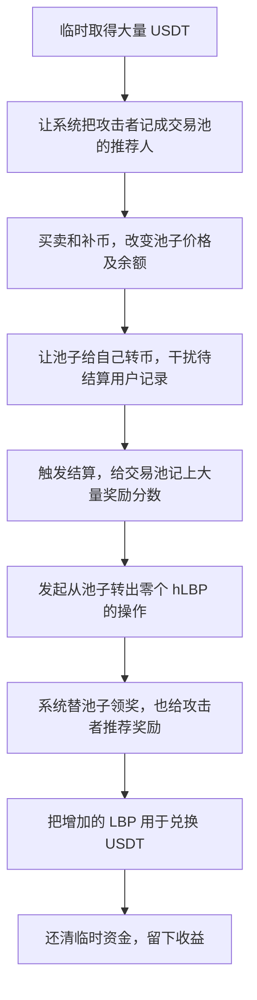

# LittleBoyPlus：把奖励分数算大，再借交易池账户领出奖励

这次攻击利用了几处相互配合的错误：系统用可以临时抬高的池内余额计算奖励分数，又把这批分数记到了交易池账户。攻击者先让自己成为交易池的推荐人，再替池子触发领奖，于是池子和攻击者都得到大量新 LBP。攻击者把这些币用于兑换，最终拿走 USDT。

## 这些合约分别是干什么的

先分清三个名字，它们不是同一种资产：

| 名字    | 它是什么                                 | 在正常业务里有什么用                             |
| ------- | ---------------------------------------- | ------------------------------------------------ |
| LBP     | 可以交易的主代币                         | 用户买卖它，也能把它换成 USDT；协议用它发奖励。  |
| LP 凭证 | 向 LBP/USDT 池存入两种币后得到的份额凭证 | 表示用户在交易池里占了多少份额。                 |
| hLBP    | `LBPHashrate` 合约记录的“算力”       | 这里的算力是发奖励用的分数，不是电脑的计算能力。 |

协议大致按下面的顺序工作：用户往交易池里放资产，得到 LP 凭证；系统估算这份 LP 值多少 USDT，再登记相应 hLBP 分数；之后根据分数发 LBP 奖励，并给推荐人分一部分。

其中，**LBP 合约**既负责主代币转账，也负责识别添加流动性、通知奖励合约，以及最终发出 LBP。**LBPHashrate 合约**负责记分数、记推荐人、算奖励。交易池自己也是一个地址，因此程序也可能把它当成一个能持有分数、能领奖的账户。

## 攻击者怎样一步步利用




这次攻击的关键是：**攻击者让合约给交易池记上大量奖励积分，再替池子领出真正能交易的 LBP，最后把这些额外出现的 LBP 算进卖出量，换走池子里的 USDT。**

你贴出的步骤里，有几个动作看起来很奇怪，例如“池子给自己转账”“转零个币”“让奖励发给池子”。把它们和代码放在一起，就能看出每一步的用途。

下面用 `A` 表示攻击合约，用 `pair` 表示 LBP/USDT 交易池。代码引用仓库中的精简版，片段只摘取与这次攻击有关的部分。

**先分清三种东西：LBP、LP 凭证和 hLBP。** 它们名字相近，但作用不同。

| 名字    | 通俗解释                             | 能做什么                             |
| ------- | ------------------------------------ | ------------------------------------ |
| LBP     | 真正可以买卖的代币                   | 可以卖给交易池，换取 USDT。          |
| LP 凭证 | 往交易池存入两种资产后拿到的份额凭证 | 表示持有人在池子里占了多少份额。     |
| hLBP    | 发奖励用的积分，代码把它叫“算力”   | 合约根据这些积分计算应该发多少 LBP。 |

正常业务大致是：**用户添加流动性 → 得到 LP 凭证 → 协议给这个用户记 hLBP 积分 → 用户以后按积分领取 LBP 奖励。**

主代币合约 `LBP.sol` 负责识别添加流动性、通知奖励合约和发放 LBP；`LBPHashrate.sol` 负责登记积分、计算奖励和维护推荐关系。

---

**第一步，攻击者先让自己成为交易池的推荐人。** 这样池子以后领奖时，攻击者也可以拿到推荐奖励。

在 [LBP 的转账处理代码](D:/code/vibe-coding/ai-auditing-benchmark/ai-auditing-benchmark/dataset/benchmark_simplified/20260618_LittleBoyPlus/src/LBP.sol:387) 中，有这样一段逻辑：

```solidity
if (msg.sender == from && (value == 0 || value == REFCODE_AMOUNT)) {
    try hashrate.notifyMagicBind(from, to) returns (bool) {} catch {}
}
```

把条件翻译成普通话：

- 调用转账的人，就是这笔币的转出方；
- 转账金额是零，或者恰好等于一个特殊数额；
- 满足条件后，就尝试把收款人登记成转出方的推荐人。

特殊数额 `REFCODE_AMOUNT` 是 `11 * 10 ** 14`，按 LBP 的小数位换算，就是 **0.0011 LBP**。

攻击者安排了一次小额买入，让交易池发起一笔金额参数恰好为 `0.0011 LBP` 的转账。此时，LBP 合约看到的是：

```text
msg.sender = 交易池
from       = 交易池
to         = 攻击合约 A
value      = 特殊绑定金额
```

所以，条件里的 `msg.sender == from` 成立，接着执行：

```solidity
notifyMagicBind(pair, A);
```

[推荐关系检查函数](D:/code/vibe-coding/ai-auditing-benchmark/ai-auditing-benchmark/dataset/benchmark_simplified/20260618_LittleBoyPlus/src/LBPHashrate.sol:606) 会检查是否已经绑定、是否涉及销毁地址、是否自己推荐自己等条件，**但没有排除交易池地址**。绑定成功后，实际记录相当于：

```solidity
referrer[pair] = A;
```

这也解释了为什么攻击者先给自己登记一个推荐上级：代码要求新推荐人自己已经有推荐关系，否则会报错。

**这一步完成后，系统就把攻击者当成了“介绍交易池来参加奖励活动的人”。**

---

**第二步，攻击者利用池子给自己转账，把“该给谁记积分”改成了池子地址。**

LBP 合约需要识别谁在添加流动性。它采用的办法是：观察谁把 LBP 转进池子，先把这个地址记下来，等后续确认 LP 总量增加后，再给它登记积分。

在满足资产余额等条件后，[`_stagePending()`](D:/code/vibe-coding/ai-auditing-benchmark/ai-auditing-benchmark/dataset/benchmark_simplified/20260618_LittleBoyPlus/src/LBP.sol:423) 会保存：

```solidity
pendingMintFee = uint96(predicted);
lastTransfer = from;
pendingExpectedUserLp = uint96(expectedLp);
```

最关键的是：

```solidity
lastTransfer = from;
```

意思是：**“刚才把币转进池子的人，先记成这次添加流动性的人。”**

攻击者先往池子补入 LBP 和 USDT，再调用：

```solidity
pair.skim(pair);
```

`skim(to)` 会把池子实际余额中超过已记录储备的部分转给 `to`。这里把收款地址也写成池子，于是出现了一次“池子向池子自己转 LBP”的调用。

对 LBP 合约来说，这次转账的参数是：

```text
from = pair
to   = pair
```

因为收款方是池子，程序仍然会进入添加流动性的暂存逻辑。在这次攻击安排的余额条件下，最终写入：

```solidity
lastTransfer = pair;
```

接着，攻击者调用：

```solidity
pair.mint(A);
```

这一步把实际新增的 LP 凭证发给攻击合约。

于是，两份记录发生了错位：

| 记录                                     | 记的是谁       |
| ---------------------------------------- | -------------- |
| 实际拿到新增 LP 凭证的人                 | 攻击合约 A     |
| LBP 合约暂存的待结算用户`lastTransfer` | 交易池`pair` |

**代码用“最近一次转币方”推断奖励归属，实际拿到 LP 凭证的人却可以是另一个地址。**

---

**第三步，攻击者给自己转零个 LBP，让这份错误记录开始结算。**

攻击者执行：

```solidity
LBP.transfer(A, 0);
```

这笔操作虽然不改变攻击者的 LBP 余额，仍然会运行 LBP 合约的转账处理代码。

代码发现 LP 总量已经增加，又存在之前保存的 `lastTransfer`，就进入结算流程。在 [`_settlePendingLpAdd()`](D:/code/vibe-coding/ai-auditing-benchmark/ai-auditing-benchmark/dataset/benchmark_simplified/20260618_LittleBoyPlus/src/LBP.sol:511) 中，关键代码是：

```solidity
address lastTransfer_ = lastTransfer;

// 省略 LP 增量、手续费等计算

hashrate.notifyCredit(
    lastTransfer_,
    userLpDelta,
    useRUsdt,
    stageTs
);
```

四个参数的意思分别是：

| 参数              | 含义                       |
| ----------------- | -------------------------- |
| `lastTransfer_` | 给谁记积分                 |
| `userLpDelta`   | 新增了多少用户 LP 份额     |
| `useRUsdt`      | 结算时池子记录的 USDT 储备 |
| `stageTs`       | 结算时 LP 的总量           |

因为前一步已经让 `lastTransfer` 变成了池子，所以这次调用相当于：

```text
给交易池记积分；
依据是刚刚增加的 LP 数量，
以及现在池子里的 USDT 储备。
```

**这里确认了 LP 总量增加，却没有把积分接收者与实际 LP 接收者对应起来。**

---

**第四步，大额临时资金让积分计算使用了被攻击者改变过的池子数据。**

[`notifyCredit()`](D:/code/vibe-coding/ai-auditing-benchmark/ai-auditing-benchmark/dataset/benchmark_simplified/20260618_LittleBoyPlus/src/LBPHashrate.sol:166) 中，计算积分的代码是：

```solidity
uint256 hashAmount =
    2 * lpDelta * currentRUsdt / currentTotalLp;

registeredLp[user] += lpDelta;

_mint(user, hashAmount);
```

可以把公式读成：

```text
新增积分
= 新增 LP 占整个池子的比例
× 池子里的 USDT 储备
× 2
```

这里乘以二，是把池子里的 LBP 一侧也按 USDT 一侧估算，从而估计这份 LP 对应的两种资产总价值。

问题在于，`currentRUsdt` 使用的是**结算当时的储备**。攻击者可以先用大量临时资金买入 LBP、补入资产，改变池子价格和储备，再触发积分结算。

本次调用记录中的参数约为：

```text
新增 LP：       23,218.051
LP 总量：      91,821.711
USDT 储备：21,231,876.060
```

代入公式：

```text
新增积分
≈ 2 × 23,218.051 ÷ 91,821.711 × 21,231,876.060
≈ 10,737,390.508 hLBP
```

这批积分被发给了池子。

**临时资金在这里有两个作用：让攻击者能大幅改变池子状态，并让奖励合约在这个状态下计算积分。**

---

**第五步，还有一个关键记账错误：新增积分之前，没有先处理旧积分的奖励记录。** 这解释了为什么刚拿到积分，就能马上领出大量奖励。

先看 [`_harvest()` 的奖励计算](D:/code/vibe-coding/ai-auditing-benchmark/ai-auditing-benchmark/dataset/benchmark_simplified/20260618_LittleBoyPlus/src/LBPHashrate.sol:318)：

```solidity
uint256 hash = balanceOf(user);
uint256 accStatic = staticAccPerShare;

uint256 delta = accStatic - userIndex[user];
uint256 staticReward = (hash * delta) / 1e18;
```

三个主要变量可以这样理解：

| 变量                  | 通俗解释                             |
| --------------------- | ------------------------------------ |
| `hash`              | 这个账户现在有多少积分               |
| `staticAccPerShare` | 到现在为止，每个积分累计对应多少奖励 |
| `userIndex[user]`   | 这个账户上次已经结算到哪里           |

所以奖励的计算方式是：

```text
当前积分数量 × 从上次结算到现在，每个积分新增的奖励
```

这种算法要求：**给账户增加积分前，先把旧积分的奖励算清楚，再让新增积分从当前进度开始计奖。**

但前面看到的 `notifyCredit()` 直接执行了：

```solidity
_mint(user, hashAmount);
```

而新增 hLBP 时，内部转账的 `from` 是零地址。hLBP 的转账处理代码把自动领奖放在了这个条件里：

```solidity
if (from != address(0)) {
    if (from != DEAD) _harvest(from);
    if (to != address(0) && to != DEAD && to != from) _harvest(to);
}
```

因此，**新增积分这条路径跳过了原有奖励结算，也没有同步更新接收者的 `userIndex`。**

用一组假设数字说明，不是本次交易的实际金额：

```text
账户原来有：100 积分
上次结算记录：每积分累计奖励到 10
现在的进度：每积分累计奖励到 12
刚新增：10,000 积分
```

新增积分之前，旧积分应领取：

```text
100 × (12 - 10) = 200
```

刚增加的 10,000 积分应该从当前进度开始计算。

但如果积分先增加，旧记录仍然停在 10，下一次领奖就会算成：

```text
10,100 × (12 - 10) = 20,200
```

**刚增加的积分，也被拿去乘了以前积累的奖励差额。**

实际能多领多少，取决于这个账户原有的领取记录和当时的累计奖励进度。领奖后代码会更新 `userIndex`，所以这个问题发生在“增加积分和奖励记账的先后顺序”上。

---

**第六步，攻击者用零个 hLBP 的转账，替池子触发领奖。**

这次调用的是另一个代币合约：

```solidity
hLBP.transferFrom(pair, DEAD, 0);
```

意思是：

```text
请求从池子向销毁地址转出零个 hLBP。
```

为什么池子没有给攻击者授权，这个调用也能继续？

看继承的 [ERC-20 授权检查](D:/code/vibe-coding/ai-auditing-benchmark/ai-auditing-benchmark/dataset/benchmark_complete/20260618_LittleBoyPlus/lib/openzeppelin-contracts/contracts/token/ERC20/ERC20.sol:294)：

```solidity
uint256 currentAllowance = allowance(owner, spender);

if (currentAllowance < value) {
    revert ERC20InsufficientAllowance(
        spender, currentAllowance, value
    );
}
```

假设授权额度是零，这次要求转走的数量也是零：

```text
0 < 0 不成立
```

所以不会因为授权不足而报错。**这并不意味着攻击者能转走非零数量的 hLBP。**

真正产生影响的是，hLBP 的 [`_update()`](D:/code/vibe-coding/ai-auditing-benchmark/ai-auditing-benchmark/dataset/benchmark_simplified/20260618_LittleBoyPlus/src/LBPHashrate.sol:262) 会执行：

```solidity
if (from != address(0)) {
    if (from != DEAD) _harvest(from);
}
```

这里没有要求 `value > 0`。此时 `from` 是池子，因此调用：

```solidity
_harvest(pair);
```

整条调用关系是：

```text
攻击者请求转出 0 个 hLBP
    ↓
hLBP 合约先替发送方领奖
    ↓
发送方是交易池，所以计算池子的奖励
    ↓
调用 LBP.mintReward(pair, 奖励数量)
    ↓
交易池收到真正可交易的 LBP
```

本次记录里，池子收到约 **115,092.770 LBP**。

这里也要分清你列出的两次零金额转账：

| 操作                                   | 实际作用                             |
| -------------------------------------- | ------------------------------------ |
| 攻击者给自己转零个**LBP**        | 结算之前的 LP 记录，给池子登记积分。 |
| 攻击者请求从池子转出零个**hLBP** | 替池子领取这些积分对应的 LBP 奖励。  |

---

**第七步，推荐关系让攻击者同时拿到自己的那份 LBP。**

`_harvest(pair)` 发完池子的奖励后，还会调用：

```solidity
_distributeDynamic(pair, staticReward);
```

在[推荐奖励分发代码](D:/code/vibe-coding/ai-auditing-benchmark/ai-auditing-benchmark/dataset/benchmark_simplified/20260618_LittleBoyPlus/src/LBPHashrate.sol:355)中，程序从下面这个地址开始向上查找推荐人：

```solidity
address current = referrer[originUser];
```

本次 `originUser` 是池子，而前面已经建立了：

```solidity
referrer[pair] = A;
```

因此，攻击者是第一层推荐人。

代码把静态奖励的 80% 作为动态奖励分配基数，第一层分到其中的 25%。在满足推荐资格条件时，第一层得到的金额相当于静态奖励的 20%：

```text
115,092.770 × 80% × 25%
≈ 23,018.554 LBP
```

这与调用记录中发给攻击合约的奖励相符。

**到这里，池子里新增了一大批 LBP，攻击者自己手里也新增了一批 LBP。**

---

**最后，池子收到的 LBP 为什么也能被攻击者拿来换 USDT？关键是“实际余额”和“账面储备”之间的差额。**

交易池有两种相关数据：

| 数据                        | 含义                                       |
| --------------------------- | ------------------------------------------ |
| 实际余额`balanceOf(pair)` | 代币合约记录的：池子地址现在实际持有多少币 |
| 账面储备`reserve`         | 交易池上一次更新时记下的资产数量           |

LBP 奖励直接增发给池子，会增加实际余额。这个增发过程没有同时调用池子的储备更新函数，所以账面储备暂时保持原值。

PancakePair 的兑换逻辑会根据余额与储备的差额判断收到多少输入资产。本次只向外支付 USDT，因此 LBP 输入量对应的是：

```text
收到的 LBP 数量 = 实际 LBP 余额 - 账面 LBP 储备
```

这个计算不会逐笔区分多出的 LBP 是谁转来的，或者是不是奖励合约刚增发的。[PancakePair 官方源码](https://raw.githubusercontent.com/pancakeswap/pancake-smart-contracts/master/projects/exchange-protocol/contracts/PancakePair.sol)

本次攻击者把自己持有的 LBP 也转入池子后，调用记录显示：

| 数据                           |         约合 LBP 数量 |
| ------------------------------ | --------------------: |
| 池子账面储备                   |               412.034 |
| 池子实际余额                   |           142,092.753 |
| 两者差额，被用于计算兑换输入量 | **141,680.719** |

其中既包含攻击者后来转入的净额，也包含直接发给池子的约 **115,092.770 LBP** 奖励。

攻击者随后发起兑换，并把 USDT 收款地址指定为自己。于是，**直接发给池子的奖励，也帮助攻击者换出了 USDT**。上述积分登记对象、奖励接收者和兑换前余额，都可以在[固定版本的公开调用记录](https://github.com/DarkNavySecurity/web3-exploit-analysis/blob/0dedb932869fff89899d75a3e6e2315cd87768bd/artifacts/analysis_0x55856d9fda4c5be5193561c7d775e823c3d6e499da44aab9da963daf61c50b0c/trace_callTracer.json)中对应起来。

这次大额兑换转出了约 **2,117.02 万 USDT**，其中大部分用于收回此前投入和归还临时资金。你列出的约 **37.76 万 USDT 等值**，是整条攻击完成后的收益口径，不能把这次兑换转出总额直接当成利润。

[调用记录](https://github.com/DarkNavySecurity/web3-exploit-analysis/blob/0dedb932869fff89899d75a3e6e2315cd87768bd/artifacts/analysis_0x55856d9fda4c5be5193561c7d775e823c3d6e499da44aab9da963daf61c50b0c/trace_callTracer.json)、[事件分析](https://www.darknavy.org/web3/exploits/little-boy-plus-lp-share-hashrate-reserve-manipulation/)

## 积分记到池子（pair）的原因

**关键在于：积分记到不同地址后，能够立即领出的奖励不一样。** 在这笔攻击里，攻击合约的奖励进度已经被更新到当前时刻，池子的奖励进度却还停在较早的位置。攻击者把大量新积分记给池子，就能让这些新积分参与计算“过去那一段”的奖励。

上一条只讲了“积分怎样记到池子”，没有把这个区别展开。下面结合代码说明。

先看奖励究竟怎么算。在 [LBPHashrate._harvest()](D:/code/vibe-coding/ai-auditing-benchmark/ai-auditing-benchmark/dataset/benchmark_simplified/20260618_LittleBoyPlus/src/LBPHashrate.sol:318) 中，关键计算是：

```solidity
uint256 hash = balanceOf(user);
uint256 accStatic = staticAccPerShare;

if (hash > 0) {
    uint256 delta = accStatic - userIndex[user];
    if (delta > 0) {
        uint256 staticReward = (hash * delta) / 1e18;
        if (staticReward > 0) {
            lbp.mintReward(user, staticReward);
            emit StaticReward(user, staticReward);
            _distributeDynamic(user, staticReward);
        }
        userIndex[user] = accStatic;
    }
} else {
    userIndex[user] = accStatic;
}
```

三个变量可以这样理解：

| 变量                  | 通俗解释                               |
| --------------------- | -------------------------------------- |
| `hash`              | 这个地址现在有多少积分                 |
| `staticAccPerShare` | 系统累计到现在，每一分积分对应多少奖励 |
| `userIndex[user]`   | 这个地址上一次已经结算到哪个进度       |

所以奖励公式是：

```text
本次奖励
= 当前积分数量
×（系统当前累计进度 − 该地址上次结算进度）
```

**积分再多，如果后面的进度差是 0，当下也领不到静态奖励。**

攻击者需要在同一笔交易里拿到可出售的 LBP，才能变现并归还临时资金。因此，“获得大量积分”和“马上领出大量 LBP”是两个必须连起来完成的步骤。

普通攻击地址与池子的区别，出现在 [LBP 的转账处理](D:/code/vibe-coding/ai-auditing-benchmark/ai-auditing-benchmark/dataset/benchmark_simplified/20260618_LittleBoyPlus/src/LBP.sol:345)：

```solidity
if (tradingOpen) {
    if (from != pair) hashrate.notifyHarvest(from);
    if (to != pair && to != from) {
        hashrate.notifyHarvest(to);
    }
}
```

这段代码的意思是：

- 普通地址转出或收到 LBP，会顺便结算奖励。
- **交易池地址 `pair` 被排除，不会在这里自动结算。**

再结合前面的 `_harvest()`，即使普通地址当时没有积分，也会执行：

```solidity
userIndex[user] = accStatic;
```

也就是：“你还没有积分，暂时不给奖励，但把你的起算进度更新到现在。”

我核对了现有调用记录：攻击合约在前面的买入、向池子转币过程中，已经多次被调用 `notifyHarvest(攻击合约)`。因此，它的进度已经更新过了。同一笔交易里时间不变，[奖励累计程序](D:/code/vibe-coding/ai-auditing-benchmark/ai-auditing-benchmark/dataset/benchmark_simplified/20260618_LittleBoyPlus/src/LBPHashrate.sol:417) 也不会继续增加这一段进度：

```solidity
if (block.timestamp <= lastEmissionUpdate) {
    return (liveStatic, liveNode, 0, false);
}
```

**如果按这笔交易的顺序，把新积分直接记到这个攻击合约，它的“当前进度减去上次进度”已经是 0，不能立刻补领过去的奖励。**

池子则保留了较早的进度，而新增积分时又漏掉了进度更新。

在 [notifyCredit()](D:/code/vibe-coding/ai-auditing-benchmark/ai-auditing-benchmark/dataset/benchmark_simplified/20260618_LittleBoyPlus/src/LBPHashrate.sol:166) 中，算出积分后调用：

```solidity
_mint(user, hashAmount);
```

铸造 hLBP 时，转账发送方 `from` 是零地址。接着进入 [hLBP 的 `_update()`](D:/code/vibe-coding/ai-auditing-benchmark/ai-auditing-benchmark/dataset/benchmark_simplified/20260618_LittleBoyPlus/src/LBPHashrate.sol:275)，却跳过了下面整段结算：

```solidity
if (from != address(0)) {
    if (from != DEAD) _harvest(from);
    if (to != address(0) && to != DEAD && to != from) _harvest(to);
}
```

于是形成了这个结果：

```text
池子的积分数量：突然增加很多
池子的奖励进度：仍然停在较早的位置

下一次领奖：
用增加后的全部积分，乘以过去那一段进度差
```

这相当于一个人今天才得到大量积分，程序却按照“他以前就有这些积分”给他补发奖励。

用一个**仅解释原理的例子**说明，省略代码中的精度倍率：

| 情况                   | 新增积分 |      系统当前进度 | 地址上次进度 |                   立即算出的奖励 |
| ---------------------- | -------: | ----------------: | -----------: | -------------------------------: |
| 给已经结算过的攻击合约 | 100 万分 | 每分累计 0.01 LBP |         0.01 |    `100万 × (0.01−0.01) = 0` |
| 给尚未更新进度的池子   | 100 万分 | 每分累计 0.01 LBP |     假设为 0 | `100万 × (0.01−0) = 1万 LBP` |

所以，**选择池子的直接好处，是利用它没有被自动更新的奖励进度，把新积分变成能够立即领取的历史奖励。** `notifyCredit()` 本身没有禁止攻击合约获得积分；区别在于这笔交易中各地址的结算状态。

奖励发给池子后，攻击者也有两条获利路径。

第一条是推荐奖励。攻击者提前让系统记录了：

```text
referrer[池子] = 攻击合约
```

在 [_distributeDynamic()](D:/code/vibe-coding/ai-auditing-benchmark/ai-auditing-benchmark/dataset/benchmark_simplified/20260618_LittleBoyPlus/src/LBPHashrate.sol:355) 中，系统沿着 `referrer[originUser]` 找推荐人，满足相应条件后，调用 `lbp.mintReward(current, share)` 给推荐人发 LBP。

第二条是利用直接进入池子的 LBP。`mintReward(pair, amount)` 会增加池子的实际 LBP 余额，但这条铸币路径没有同步更新交易池记录的储备。随后兑换时，Pancake 池子会根据“实际余额比记录多了多少”计算输入资产，攻击者可以把这些新增余额也用于这次兑换，并指定自己接收 USDT。[Pancake 的兑换实现](https://github.com/pancakeswap/pancake-smart-contracts/blob/master/projects/exchange-protocol/contracts/PancakePair.sol)

本次调用记录确实显示，一次领奖中约 **115,092.770 LBP 发给池子**，约 **23,018.554 LBP 发给攻击合约**。因此，给池子发奖励并不等于攻击者放弃了这部分收益。[事件分析与对应调用记录说明](https://www.darknavy.org/web3/exploits/little-boy-plus-lp-share-hashrate-reserve-manipulation/)

再看你问的 **`为什么乘以 2`**。这是在估算 LP 所代表的两种资产的合计价值。

实际代码是：

```solidity
uint256 hashAmount =
    2 * lpDelta * currentRUsdt / currentTotalLp;
```

其中：

```text
lpDelta / currentTotalLp
= 这次新增 LP 占全部 LP 的比例
```

这个比例乘以池内 USDT 储备，只能算出这份 LP 对应的 **USDT 那一半**。它还对应一部分 LBP，需要把 LBP 那一半也算进去。

例如，假设池子里有：

```text
100 个 LBP
1,000 个 USDT
```

按这个池子的储备比例报价：

```text
1 个 LBP 的账面价格 = 1,000 / 100 = 10 USDT
```

于是两边的账面价值分别是：

```text
USDT 一边：1,000 USDT
LBP 一边：100 × 10 = 1,000 USDT

合计：2,000 USDT
```

如果你的 LP 占池子的 10%，它对应的资产就是：

```text
100 USDT + 10 个 LBP
```

按上面的池内报价估值，合计为：

```text
100 + 10 × 10 = 200 USDT
```

所以代码可以写成：

```text
LP 的账面价值
= LP 占比 × USDT 储备 × 2

= 10% × 1,000 × 2
= 200
```

完整版源码的注释也明确写了“总价值等于 USDT 一边的两倍”。不过，**注释中提到了 TWAP，也就是一段时间的平均价，实际这条计算语句并没有读取平均价；它直接使用当时的 USDT 储备和 LP 总量。** 应以实际执行的代码为准。[完整源码及注释](D:/code/vibe-coding/ai-auditing-benchmark/ai-auditing-benchmark/dataset/benchmark_complete/20260618_LittleBoyPlus/src/LBPHashrate.sol:351)

本次调用参数算出来是：

```text
新增 LP 占比 ≈ 25.2860%
池内 USDT 储备 ≈ 21,231,876.06

积分 ≈ 25.2860% × 21,231,876.06 × 2
     ≈ 10,737,390.51 hLBP
```

**`× 2` 本身有正常的估值理由。真正需要警惕的是：计算使用了攻击者能临时改变的池子状态，而且新积分又被拿去计算过去的奖励。** 前者把积分数量放大，后者让这些积分在同一笔交易里立刻产生大量可出售的 LBP。


## 池子内的LBP怎么兑换的

**关键在于：池子“实际有多少 LBP”和“上次记下了多少 LBP”是两个数字。奖励直接发进池子后，实际余额增加了，但上次记录没有跟着更新。攻击者把这部分差额算进了自己的兑换。**

之前那句“利用池内额外增加的 LBP”省略了这一步，所以容易让人误以为攻击者能随便支配池子的币。

先看一个简化例子，数字只用来解释原理：

| 操作                            | 池子实际持有的 LBP | 池子上次记下的 LBP 储备 |
| ------------------------------- | -----------------: | ----------------------: |
| 最开始                          |              1,000 |                   1,000 |
| 奖励合约直接给池子发了 100 LBP  |              1,100 |                   1,000 |
| 攻击者又向池子转入自己的 10 LBP |              1,110 |                   1,000 |

接着，攻击者要求兑换 USDT。对于这笔“LBP 进、USDT 出”的兑换，池子按照下面的方法判断收到了多少 LBP：

```text
本次投入的 LBP
= 池子当前的实际 LBP 余额 − 上次记录的 LBP 储备
= 1,110 − 1,000
= 110 LBP
```

**攻击者自己只转了 10 LBP，池子却允许这笔兑换把新增的 110 LBP 全部算作投入，包括直接发给池子的 100 LBP 奖励。** 这种按余额差额计算输入数量的逻辑，可以在 Pancake 交易池的 `swap()` 中看到。[Pancake 交易池源码](https://raw.githubusercontent.com/pancakeswap/pancake-swap-core/master/contracts/PancakePair.sol)

为什么允许这样做？因为这类池子的正常交易流程，本来就是：

1. 先把要卖的币转进池子。
2. 再调用池子的兑换函数，指定换出多少另一种币，以及付给哪个地址。
3. 池子检查实际增加的输入数量是否足够、兑换后是否满足价格约束，满足就完成交易。

**池子通过“余额多了多少”确认收款，不会给这部分新增余额逐笔登记“属于张三，还是属于李四”。** 因此，直接发给池子的奖励，与攻击者自己转进来的币，在这一步都会进入同一个余额差额。攻击者再把 USDT 收款地址指定为自己。[Pancake `swap()` 的输入计算、收款地址与校验逻辑](https://raw.githubusercontent.com/pancakeswap/pancake-swap-core/master/contracts/PancakePair.sol)

回到 LittleBoyPlus，这里还有一个必要条件：**发奖励时，只增加了 LBP 代币合约里记载的池子余额，没有同步更新交易池自身的储备记录。** `mintReward()` 调用 `_mint()` 增发代币，而增发路径更新余额后就返回了。[发奖励的代码](D:/code/vibe-coding/ai-auditing-benchmark/ai-auditing-benchmark/dataset/benchmark_complete/20260618_LittleBoyPlus/src/LBP.sol:467)、[增发时的余额更新路径](D:/code/vibe-coding/ai-auditing-benchmark/ai-auditing-benchmark/dataset/benchmark_complete/20260618_LittleBoyPlus/src/LBP.sol:555)

我刚核对的实际调用记录，也正好体现了这个过程：

| 攻击者兑换前读取的数字                     |          LBP 数量，约 |
| ------------------------------------------ | --------------------: |
| 池子上次记录的储备                         |               412.034 |
| 池子实际余额，包含新增奖励和攻击者转入的币 |           142,092.753 |
| 两者差额                                   | **141,680.719** |

攻击者把这个 **141,680.719 LBP 的差额**传给询价函数，然后调用池子的 `swap()`，指定自己接收 USDT。[对应交易调用记录](https://github.com/DarkNavySecurity/web3-exploit-analysis/blob/0dedb932869fff89899d75a3e6e2315cd87768bd/artifacts/analysis_0x55856d9fda4c5be5193561c7d775e823c3d6e499da44aab9da963daf61c50b0c/trace_callTracer.json)

所以，原句更准确的说法是：

> **攻击者先让奖励直接增发到交易池，使池子的实际 LBP 余额超过原有储备记录。随后，他把这个尚未计入储备的差额作为本次兑换投入，调用交易池换出 USDT，并让池子把 USDT 付给自己。原有储备会在计算差额时扣除，能被这样利用的是额外增加的那部分 LBP。**

## 事件信息

| 项目             | 内容                                                                                                                                  |
| ---------------- | ------------------------------------------------------------------------------------------------------------------------------------- |
| Case             | `20260618_LittleBoyPlus`，原表第 101 行                                                                                             |
| 网络、数据集日期 | BNB Smart Chain，`2026.06.18`，沿用原表日期                                                                                         |
| 算力合约 hLBP    | [LBPHashrate：0x5e3cbc82d020be91a989eb747934104e9ab585fe](https://bscscan.com/address/0x5e3cbc82d020be91a989eb747934104e9ab585fe#code) |
| 主代币 LBP       | [LBP：0x88886f0fd371dff856291badced45922bc888888](https://bscscan.com/address/0x88886f0fd371dff856291badced45922bc888888#code)         |
| LBP/USDT 交易对  | `0x00e3ea08fd8cbad955ec5d2292ad637670c31524`                                                                                        |
| 本次攻击执行合约 | `0x5449ded887576f43fc339851e942ebc1e6f8118b`，下文记为 A                                                                            |
| 攻击交易         | [0x55856d9f…61c50b0c](https://bscscan.com/tx/0x55856d9fda4c5be5193561c7d775e823c3d6e499da44aab9da963daf61c50b0c)                      |
| CSV 金额         | USD 377,642；中文 37.7642 万美元，英文 377.642 千美元                                                                                 |
| 源码性质         | 两个合约均取得已验证 Solidity；Sourcify creation/runtime 匹配为`match`                                                              |

## 对应代码在哪里

下面的链接分别指向完整版和精简版，便于对照上面的操作步骤。

| 阅读点                     | 完整版                                                                                                                                                                                                         | 精简版                                                                                                                                                                                                 |
| -------------------------- | -------------------------------------------------------------------------------------------------------------------------------------------------------------------------------------------------------------- | ------------------------------------------------------------------------------------------------------------------------------------------------------------------------------------------------------ |
| 转账中的状态读取和结算触发 | [LBP._update](../../dataset/benchmark_complete/20260618_LittleBoyPlus/src/LBP.sol#L555)                                                                                                                         | [对应实现](../../dataset/benchmark_simplified/20260618_LittleBoyPlus/src/LBP.sol#L266)                                                                                                                  |
| LP 归属暂存                | [LBP._stagePending](../../dataset/benchmark_complete/20260618_LittleBoyPlus/src/LBP.sol#L890)                                                                                                                   | [对应实现](../../dataset/benchmark_simplified/20260618_LittleBoyPlus/src/LBP.sol#L423)                                                                                                                  |
| 向算力合约传递当前储备     | [LBP._settlePendingLpAdd](../../dataset/benchmark_complete/20260618_LittleBoyPlus/src/LBP.sol#L1084)                                                                                                            | [对应实现](../../dataset/benchmark_simplified/20260618_LittleBoyPlus/src/LBP.sol#L511)                                                                                                                  |
| 按瞬时储备铸造 hLBP        | [LBPHashrate.notifyCredit](../../dataset/benchmark_complete/20260618_LittleBoyPlus/src/LBPHashrate.sol#L342)                                                                                                    | [对应实现](../../dataset/benchmark_simplified/20260618_LittleBoyPlus/src/LBPHashrate.sol#L166)                                                                                                          |
| 零额转账仍触发 harvest     | [LBPHashrate._update](../../dataset/benchmark_complete/20260618_LittleBoyPlus/src/LBPHashrate.sol#L569)                                                                                                         | [对应实现](../../dataset/benchmark_simplified/20260618_LittleBoyPlus/src/LBPHashrate.sol#L262)                                                                                                          |
| 静态收益及推荐链分发       | [LBPHashrate._harvest](../../dataset/benchmark_complete/20260618_LittleBoyPlus/src/LBPHashrate.sol#L711)、[_distributeDynamic](../../dataset/benchmark_complete/20260618_LittleBoyPlus/src/LBPHashrate.sol#L759) | [_harvest](../../dataset/benchmark_simplified/20260618_LittleBoyPlus/src/LBPHashrate.sol#L318)、[_distributeDynamic](../../dataset/benchmark_simplified/20260618_LittleBoyPlus/src/LBPHashrate.sol#L355) |
| 推荐关系绑定               | [LBPHashrate._tryBindReferral](../../dataset/benchmark_complete/20260618_LittleBoyPlus/src/LBPHashrate.sol#L1228)                                                                                               | [对应实现](../../dataset/benchmark_simplified/20260618_LittleBoyPlus/src/LBPHashrate.sol#L606)                                                                                                          |
| 最终增发可交易 LBP         | [LBP.mintReward](../../dataset/benchmark_complete/20260618_LittleBoyPlus/src/LBP.sol#L467)                                                                                                                      | [对应实现](../../dataset/benchmark_simplified/20260618_LittleBoyPlus/src/LBP.sol#L243)                                                                                                                  |

## 资料说明

LBP 与 LBPHashrate 都取得了已验证源码。本说明还核对了公开调用记录中的收款地址、零金额操作目标和奖励金额，没有重新运行完整攻击。

源码中，`notifyCredit()` 的计算是 `2 * lpDelta * currentRUsdt / currentTotalLp`。`_harvest()` 再用账户分数乘以累计奖励与上次领取记录的差额计算奖励，并调用 `_distributeDynamic()` 给推荐人分配。查看代码时，应把这几步连起来核对。

主代币真正发奖的函数是 `LBP.mintReward()`。从池子转出零个 hLBP 的操作发生在 `LBPHashrate`；ERC-20 对零金额转账的 allowance 检查能够通过，不代表攻击者拿到了转走非零数量 hLBP 的授权。

- [源码来源与编译配置](../../dataset/benchmark_complete/20260618_LittleBoyPlus/SOURCE.md)。
- [固定版本调用记录](https://github.com/DarkNavySecurity/web3-exploit-analysis/blob/0dedb932869fff89899d75a3e6e2315cd87768bd/artifacts/analysis_0x55856d9fda4c5be5193561c7d775e823c3d6e499da44aab9da963daf61c50b0c/trace_callTracer.json)：路径 `0.1.5.0.1.0.0.24.4` 给池子登记分数；路径 `0.1.5.0.1.0.0.25` 是 hLBP 零金额转账，其下可见真正发奖的调用。
- [SlowMist 原始告警](https://x.com/SlowMist_Team/status/2067424733747122259?s=20)；[DarkNavy 事件分析](https://www.darknavy.org/web3/exploits/little-boy-plus-lp-share-hashrate-reserve-manipulation/)。
