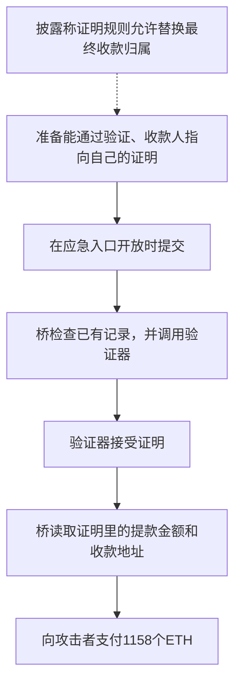

# Aztec 旧版桥：提款证明通过了，钱却付给了错误的人

按公开事件分析转述的披露，这个旧版桥验证提款证明时，所依据的规则没有把“这笔钱最终该归谁”限制完整。攻击者准备了能通过验证、却把收款人指向自己的证明。保管资金的合约看到验证通过，就按证明里的收款地址付出了 ETH。

当前资料可以直接核对证明被接受、随后支付 **1,158 ETH** 的过程。至于证明规则具体漏了哪一条，当前数据集没有原始规则代码；这部分原因来自披露转述，不能写成已经独立复现的事实。

## 这些合约分别是干什么的

这起事件涉及旧版 Aztec 在以太坊上的桥合约。它保管资金，并根据经过验证的交易结果处理存款和提款。

| 合约或入口 | 正常职责 |
| --- | --- |
| `RollupProcessor` | 保管和处理桥内资金；接收证明，检查记录，再执行存提款。 |
| `TurboVerifier` | 检查提交的证明是否满足系统事先规定的验证规则。 |
| `escapeHatch()` | 应急提交入口；在指定区块窗口开放，让用户可以直接提交证明。 |
| `withdraw()` | 按已接受的交易结果，实际向指定地址发送 ETH 或代币。 |

可以把证明理解为一张机器验证的提款凭证。正常情况下，这张凭证不但要能通过计算检查，还必须证明：这笔权益确实存在、能取出多少，以及钱应该交给谁。

## 漏洞具体在哪

**披露指出的问题在证明规则，而资金损失发生在后面的提款执行。** 两者需要连起来看。

第一部分是公开披露中的解释：处理 claim，也就是领取已有权益时，最终输出没有和合法接收人正确对应。攻击者因此能替换最终收款归属，同时让证明仍被接受。这里所说的“电路”，就是生成和验证这类证明时使用的一组计算约束；当前样本没有收录这部分原始代码。[事件分析中的披露转述](https://www.darknavy.org/web3/exploits/aztec-private-rollup-bridge-escape-hatch-claim-proof-drain/)

第二部分可以在本地代码直接看到：[processRollupProof()](../../dataset/benchmark_complete/20260618_aztecnetwork/contracts/RollupProcessor.sol#L390) 先调用验证器，验证通过后，[processDepositsAndWithdrawals()](../../dataset/benchmark_complete/20260618_aztecnetwork/contracts/RollupProcessor.sol#L538) 就读取证明写明的提款金额和接收人，再调用 `withdraw()` 付钱。

因此，一旦前面的证明规则接受了错误收款人，后面的资金合约就会照着这个错误结果执行。

## 攻击者怎样一步步利用

图中的虚线表示来自披露的原因解释；后面的实际调用和付款过程可以与代码、公开调用记录对应。

1. **提交一份要求向自己付钱的证明。** 攻击地址 `0x6952d9246e9afe8b887b2877225163436f78e97f` 调用 `escapeHatch()`。主交易中的证明要求向这个地址支付 **1,158 ETH**。
2. **通过入口条件。** 当时合约没有暂停，应急入口也处于允许使用的区块窗口。攻击者是从开放的正常入口提交，并没有直接调用内部付款函数。
3. **通过已有记录检查。** 桥检查证明引用的旧记录是否与自己保存的记录相符，以及批次编号、数据位置等信息是否正确。主交易的批次号为 4487，应急模式下处理一笔交易。
4. **验证器接受证明。** 桥实际调用了 `TurboVerifier`，该调用正常返回。随后桥更新自己保存的处理记录，继续处理资金。
5. **根据证明里的信息决定付款。** 代码读到的提款金额是 1,158 ETH，收款人是攻击者。这个记录没有要求在同一条处理记录中存入资金，但要求向外提款。
6. **真正把 ETH 转出去。** `withdraw()` 向攻击者地址发送 ETH。公开调用记录中，这一笔转账的 value 正是 **1,158 ETH**。[主交易调用记录](https://github.com/DarkNavySecurity/web3-exploit-analysis/blob/0dedb932869fff89899d75a3e6e2315cd87768bd/artifacts/analysis_0xab306cd2184d23b6ba3e151b10b3b9a0b81f211cc16f4f3b0c79f0b17a59c2b5/trace_callTracer.json)

## 为什么做了验证，还是会把钱付错

验证器能检查的是程序写下来的规则。如果规则少了一项，即使其他检查全部通过，也不能说明遗漏的那件事是正确的。

在这起事件的披露解释里，缺口正是最终资产归属。保管资金的合约把“证明通过”理解成可以按其中的金额和地址付款，因此错误从证明规则一路传到了真实转账。

阅读代码时还要分清下面几件事：

- **应急入口本来就允许用户使用。** 它有暂停和开放时间检查，不能仅因普通用户能调用，就把原因写成“少了管理员权限”。
- **验证器确实被调用了。** 代码在验证失败时会中止；本笔记录显示提交的证明被接受，因此需要继续检查证明规则为什么允许这种结果通过。
- **提款本来可以不伴随新的存款。** 所以当前记录没有存款金额，本身不能解释为什么钱会付错。关键仍是这次提款是否对应合法权益、收款人是否正确。

要确认并修复完整原因，需要拿到当时对应的 claim 证明规则，检查替换收款人、金额或领取权益后，证明是否一定失败。当前 L1 源码，也就是以太坊上的资金合约源码，足够解释钱怎么转出去，但不足以独立证明具体缺了哪条电路约束。

## 事件信息

| 项目 | 内容 |
| --- | --- |
| Case | `20260618_aztecnetwork`，原表第 100 行 |
| 网络、数据集日期 | Ethereum，`2026.06.18`，沿用原表日期 |
| L1 处理器 | [RollupProcessor：0x737901bea3eeb88459df9ef1be8ff3ae1b42a2ba](https://etherscan.io/address/0x737901bea3eeb88459df9ef1be8ff3ae1b42a2ba#code) |
| L1 验证器 | [TurboVerifier：0x48cb7ba00d087541dc8e2b3738f80fdd1fee8ce8](https://etherscan.io/address/0x48cb7ba00d087541dc8e2b3738f80fdd1fee8ce8#code) |
| 本文逐步展开的主交易 | [0xab306cd2…17a59c2b5](https://etherscan.io/tx/0xab306cd2184d23b6ba3e151b10b3b9a0b81f211cc16f4f3b0c79f0b17a59c2b5) |
| CSV 同时保存的相关交易 | [0x5c196c37…774705c3](https://etherscan.io/tx/0x5c196c37a109d74c9797254287a0331f30e0daa637af241bd28fdc43774705c3)、[0x9e1d6ab7…6f6b03ca](https://etherscan.io/tx/0x9e1d6ab7c20ae235409d7dd3a9cd47c04f07293585b3498b8beed82d6f6b03ca) |
| CSV 金额 | USD 2,170,000；中文 217 万美元，英文 2,170 千美元 |
| 源码性质 | 已验证的 L1 处理器、验证器、密码学库及验证密钥；不含原始链下 claim 电路 |

## 对应代码在哪里

下面的链接分别指向完整版和精简版，便于对照上面的操作步骤。

| 阅读点 | 完整版 | 精简版 |
| --- | --- | --- |
| 逃生入口及窗口 | [escapeHatch](../../dataset/benchmark_complete/20260618_aztecnetwork/contracts/RollupProcessor.sol#L347) | [对应入口](../../dataset/benchmark_simplified/20260618_aztecnetwork/contracts/RollupProcessor.sol#L174) |
| 验证到结算的顺序 | [processRollupProof](../../dataset/benchmark_complete/20260618_aztecnetwork/contracts/RollupProcessor.sol#L390) | [对应实现](../../dataset/benchmark_simplified/20260618_aztecnetwork/contracts/RollupProcessor.sol#L185) |
| 调用验证器并更新状态 | [verifyProofAndUpdateState](../../dataset/benchmark_complete/20260618_aztecnetwork/contracts/RollupProcessor.sol#L403) | [对应实现](../../dataset/benchmark_simplified/20260618_aztecnetwork/contracts/RollupProcessor.sol#L194) |
| 旧根、序号及逃生数量处理 | [validateMerkleRoots](../../dataset/benchmark_complete/20260618_aztecnetwork/contracts/RollupProcessor.sol#L483) | [对应实现](../../dataset/benchmark_simplified/20260618_aztecnetwork/contracts/RollupProcessor.sol#L247) |
| 真正执行密码学验证 | [TurboVerifier.verify](../../dataset/benchmark_complete/20260618_aztecnetwork/contracts/verifier/TurboVerifier.sol#L41) | [对应实现](../../dataset/benchmark_simplified/20260618_aztecnetwork/contracts/verifier/TurboVerifier.sol#L26) |
| 公开数据到提款 | [processDepositsAndWithdrawals](../../dataset/benchmark_complete/20260618_aztecnetwork/contracts/RollupProcessor.sol#L538) | [对应实现](../../dataset/benchmark_simplified/20260618_aztecnetwork/contracts/RollupProcessor.sol#L289) |
| 最终发送 ETH/ERC-20 | [withdraw](../../dataset/benchmark_complete/20260618_aztecnetwork/contracts/RollupProcessor.sol#L647) | [对应实现](../../dataset/benchmark_simplified/20260618_aztecnetwork/contracts/RollupProcessor.sol#L368) |

## 资料说明

本文逐步展开的是第一笔主交易的 1,158 ETH 提款。表中另外两笔相关交易仍保留链接，但不能直接套用主交易的金额和证明内容。数据集中的 2,170,000 美元沿用原表，没有在这里重新用 ETH 价格换算。

主交易的具体字段为 `rollupId = 4487`、`rollupSize = 0`；公开提款记录为 `proofId = 0`、`publicInput = 0`、`publicOutput = 1158 * 10^18`、`assetId = 0`，`outputOwner` 指向攻击者。

验证器正常返回，桥才继续付款。代码中的 `staticcall` 返回值表示调用成功；验证器自己的配对检查失败时会回滚。因此不能把这里简单解释成“桥没有读取返回布尔值，所以完全跳过验证”。

这是 `20260618_aztecnetwork` 旧版 RollupProcessor 事件，与仓库已有的 `20260614_aztecnetwork`、RollupProcessorV3 交易数量检查事件不同。当前样本包含以太坊上的处理器、验证器等源码，但缺少原始 claim 电路；本说明没有独立生成攻击证明或重放交易。

- [源码内容及缺失范围](../../dataset/benchmark_complete/20260618_aztecnetwork/SOURCE.md)。
- [固定版本主交易记录](https://github.com/DarkNavySecurity/web3-exploit-analysis/blob/0dedb932869fff89899d75a3e6e2315cd87768bd/artifacts/analysis_0xab306cd2184d23b6ba3e151b10b3b9a0b81f211cc16f4f3b0c79f0b17a59c2b5/trace_callTracer.json)：根节点 `0` 为应急入口，`0.0` 为验证器调用，`0.1` 为向攻击者发送 ETH。
- [原表告警](https://x.com/evilcos/status/2067488848788262957)；[DarkNavy 事件分析及披露转述](https://www.darknavy.org/web3/exploits/aztec-private-rollup-bridge-escape-hatch-claim-proof-drain/)。
