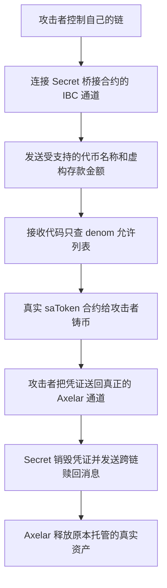

# Axelar / Secret：只认代币名字，不认消息来源，最后用空头凭证换走真钱

这个漏洞发生在 **Secret 链上的 `ics20-for-axelar` 桥接合约**。它本来应该在确认 Axelar 那边存入了真实资产之后，才在 Secret 这边发行对应凭证。实际代码只检查“这个代币名称在不在允许列表”，没有确认“这条存款消息是不是从真正的 Axelar 通道来的”。

攻击者因此可以从自己控制的链发送消息，取得没有资产支撑的凭证，再拿这些凭证通过真正的桥赎回资产。官方披露的受影响规模约为 **467 万美元**。本案例保存原始 Rust 源码；它不是 Solidity 合约漏洞。

## 1. 这个合约平时负责什么

跨链桥可以理解为两边配合的保管柜。用户把资产交到 Axelar 一侧保管，Secret 一侧给用户发一张可转让、可赎回的凭证。例如，`saUSDT` 是 Secret 上代表相应桥接资产的代币。

正常情况下，流程应该是：

1. 用户从真正的 Axelar 通道转入资产。
2. Secret 桥接合约收到 IBC 消息，确认来源可信、代币种类受支持。
3. 合约调用代币的 `Mint`，给指定收款人发行凭证。
4. 用户要回去时，把凭证交回桥接合约销毁，由真正的 Axelar 通道释放对应的托管资产。

**两边必须对得上：新增的凭证背后，要有等额资产。** 如果可以不存钱就拿到凭证，正常赎回功能反而会成为提款出口。

## 2. 程序具体在哪一步认错了

### 通道可以建立，但没有核对是不是指定的交易对手

`ibc_channel_open()` 和 `ibc_channel_connect()` 调用 `enforce_order_and_version()`。后者检查协议版本和通道排序方式，随后把通道的信息保存到 `CHANNEL_INFO`。

这些检查能回答“双方使用的消息格式能否通信”，不能回答“对面是不是我们授权的 Axelar 链”。在这份代码里，没有把对端的连接、端口和通道限定到可信来源。

IBC 验证消息确实来自其绑定的对端链，并不意味着这个对端链天然有权要求本合约发行有价值的资产。攻击者自己的链，也可以如实证明自己发出了一条内容虚假的“存款消息”。

### 收到消息后，只按代币名称查表，就执行铸币

`do_ibc_packet_receive()` 的关键顺序是：

1. 从 `packet.data` 解出 `denom`、`amount`、`receiver` 等字段。
2. 拒绝带 `/` 的 `denom`，留下类似 `uusdt` 的裸名称。
3. 把通道和金额保存到 `REPLY_ARGS`。
4. 调用 `check_allow_list()`，用 **`denom` 一个字段** 查 `ALLOW_LIST`。
5. 把消息中的金额和收款人交给 `mint_amount()`。

`mint_amount()` 最终生成真正的 `Cw20ExecuteMsg::Mint`。因此，拿到的并非攻击者自行部署的假币，而是**项目认可的真实凭证，只是它背后没有抵押资产**。

源码中还能看到原来的 `parse_voucher_denom()` 和 `reduce_channel_balance()` 调用已被注释。旧的托管模型换成铸币模型时，原有校验不适用，需要补上新的来源认证；当前实现只保留了代币允许列表。

## 3. 攻击者怎样把漏洞变成提款



**第一步，取得能够发消息的通道。** 攻击者不需要先控制允许列表管理员；缺少的是允许列表之外的来源认证。

**第二步，冒充合法存款。** 消息使用允许发行的代币名称，金额和收款人由攻击者安排。即使名称是真的，存款也可能是假的。

**第三步，拿到空头凭证。** 接收函数没有把来源通道与允许的代币绑定起来，因而调到真实代币合约的铸币入口。

**第四步，走正常赎回出口。** `execute_receive()` 接收代币回调，随后 `execute_transfer()` 查出代币对应的名称，生成发往选定已注册通道的 IBC 消息，并调用 `burn_amount()` 销毁凭证。攻击者在这一步选用真正的 Axelar 路线。

**第五步，拿到真实资产。** 对 Axelar 来说，赎回是从合法的 Secret 通道发来的。它无法仅靠这次赎回消息判断：凭证更早之前，是由另一条不可信通道诱导铸造的。

用示意数字理解：保管柜里原本有用户存入的 100 USDT。攻击者没放入资产，却骗到 100 张可赎回凭证。随后走正常流程销毁这 100 张凭证，保管柜里的 100 USDT 就付给攻击者，原用户的凭证失去对应资产。**这里的 100 是解释用例，不是实际交易金额。**

## 校验机制

**接收端不是只看“你交上来一份证明”，而是要检查：这份证明能不能对上它已经认可的、真正 Axelar 的链上状态。攻击者不能随便修改这个核对依据。**

这里的“证明”，具体要证明的是：

> **这条消息确实被真正的 Axelar 发送，并记录在它的链上状态中。**

它不是攻击者自己签一段“我存过钱了”的声明。

可以分成三步理解。

**第一，真正的 Axelar 会对自己的链上状态形成一个“总指纹”。**

这个“总指纹”通常叫**状态根**。你可以把它理解为整本账本经过密码学计算得到的摘要：账本里的内容变了，计算结果通常也会变。

Secret 上负责验证 Axelar 的轻客户端，会依据相应的共识验证规则，接受 Axelar 的状态更新。这样，Secret 就有一个独立核对依据，而不是拿攻击者随便提供的摘要当标准。[IBC 轻客户端与状态验证规范](https://github.com/cosmos/ibc/blob/main/spec/core/ics-002-client-semantics/README.md)

**第二，消息证明要说明“这条消息属于这个总指纹所代表的账本”。**

接收端不必下载整本 Axelar 账本。发送方可以提供一份较小的存在性证明，通常是 Merkle 证明。

简化理解，验证过程类似：

```text
收到的消息内容
    ＋
证明中提供的核对材料
    ↓
按照规定计算
    ↓
结果是否等于接收端认可的 Axelar 状态根？
```

实际 IBC 验证还会绑定消息所在的端口、通道、序号等位置，检查的是相应位置上的消息承诺。[IBC 消息接收验证规范](https://github.com/cosmos/ibc/blob/main/spec/core/ics-004-channel-and-packet-semantics/README.md#receiving-packets)

**第三，伪造消息会导致这套对应关系对不上。**

假设真正的 Axelar 记录了一条消息：

> 给甲发行相当于 **10 USDT** 的凭证。

攻击者想把它改成：

> 给攻击者发行相当于 **100 USDT** 的凭证。

这时：

| 攻击者尝试怎么做           | 为什么不行                                                                   |
| -------------------------- | ---------------------------------------------------------------------------- |
| 改金额或收款人，沿用原证明 | 消息内容改变，原证明就无法再把它对应到认可的状态根                           |
| 随便编一份新证明           | 在密码学正常工作的前提下，不能让一条不存在的记录通过对既定状态根的存在性验证 |
| 连状态根也一起伪造         | 接收端使用的是轻客户端认可的 Axelar 状态，不能由提交消息的人随意替换         |

所以，**“拿不出证明”不是指证明被藏起来了、攻击者没有权限下载，而是指：真正的 Axelar 根本没有这条虚构记录，因此不存在一份能与其已确认状态匹配的有效证明。** 真实记录对应的证明通常可以由其他人获取、生成和转交；它的可靠性来自能够被核验，而不是保密。

这就解释了为什么攻击者要使用自己控制的链：

- 对真正的 Axelar，攻击者不能随意把虚构消息写入它认可的状态。
- 对自己的链，攻击者可以让那条消息**确实被记录和确认**，于是能够提供针对自己这条链的有效证明。

**这个证明只能证明“攻击者的链发出了这条消息”，不能证明“Axelar 存入了对应资金”。** 本案的桥却没有要求发行请求必须来自可信 Axelar 通道，导致攻击者自己链上的有效消息证明，被错误地用于触发真实凭证的发行。[Secret 官方事件复盘](https://forum.scrt.network/t/security-incident-axelar-secret-ibc-bridge-exploit-june-10-2026/7995)

## 轻客户端

**如果 Secret 上只有真正 Axelar 对应的那个轻客户端，而且消息只能通过它验证，那么攻击者自己链的状态无法通过。**

我前面漏讲了一个必要前提：**攻击者接入自己的对端时，需要在 Secret 上建立或使用另一份对应的轻客户端实例，再通过绑定到这个实例的连接和通道发送消息。** 自建链的证明并不是拿给 Axelar 的轻客户端验证。

这里还需要分清“接收端”的两个部分：

- **Secret 链的 IBC 模块**：可以维护多个轻客户端，分别验证不同对端。
- **Secret 上的桥接合约**：处理 IBC 模块交过来的消息，决定是否发行 saUSDT 等凭证。

这个桥虽然用于 Axelar 资产桥接，但它运行在支持多对端连接的 IBC 系统上，不能仅凭自身用途就保证所有收到的消息都来自 Axelar。

**轻客户端也不一定意味着“为每条链安装一个新程序”。** 对于已经支持的客户端类型，可以复用验证代码，创建不同的客户端实例，每份实例保存各自的对端状态和验证依据。IBC 的 `createClient` 就用于根据客户端状态和初始共识状态创建新实例。[IBC 客户端创建规范](https://github.com/cosmos/ibc/blob/main/spec/core/ics-002-client-semantics/README.md#create)

因此，下面这种结构在机制上是成立的，A、B 都是示意名称：

| 对端             | Secret 上对应的客户端实例          | 对应连接                 | 对应通道                  |
| ---------------- | ---------------------------------- | ------------------------ | ------------------------- |
| 真正 Axelar      | Client A：保存 Axelar 的验证状态   | Connection A → Client A | Channel A → Connection A |
| 攻击者控制的对端 | Client B：保存攻击者对端的验证状态 | Connection B → Client B | Channel B → Connection B |

**收到消息时，IBC 是沿着消息所走的通道，找到对应客户端来验证。** 连接记录中有 `clientIdentifier`，验证消息证明时会查询这个连接绑定的客户端。[IBC 连接与客户端的绑定规则](https://github.com/cosmos/ibc/blob/main/spec/core/ics-003-connection-semantics/README.md#data-structures)

所以两条路径分别是：

```text
从 Channel A 收到消息
    → 找到 Connection A
    → 使用 Client A
    → 按真正 Axelar 的状态验证

从 Channel B 收到消息
    → 找到 Connection B
    → 使用 Client B
    → 按攻击者对端的状态验证
```

Client A 的状态没有被替换，也没有认可攻击者链的证明。**第二条路径使用的是 Client B。** 它最多证明“攻击者对端确实发过这条消息”。

接下来才到本案的漏洞：

**同一个桥接合约接收了另一条通道的消息，却没有要求“只有绑定真正 Axelar 的那条可信路线，才能触发这些资产的发行”。**

本地源码中：

- `ibc_channel_open()` 主要检查协议版本和通道排序方式；
- `ibc_channel_connect()` 保存新通道信息；
- 接收消息后，铸币路径只按 `denom` 查允许列表，没有把这次发行限定到可信 Axelar 来源。[通道接入代码](D:/code/vibe-coding/ai-auditing-benchmark/ai-auditing-benchmark/dataset/benchmark_complete/20260619_Axelar_Secret/ics20-for-axelar/contracts/cw20-ics20/src/ibc.rs:130)、[接收与铸币代码](D:/code/vibe-coding/ai-auditing-benchmark/ai-auditing-benchmark/dataset/benchmark_complete/20260619_Axelar_Secret/ics20-for-axelar/contracts/cw20-ics20/src/ibc.rs:216)

允许建立对端连接，解决的是“能否通信、如何验证这个对端”；是否允许它触发 saUSDT 发行，是桥接合约必须另行判断的业务权限。官方复盘确认，本案攻击者将自建链接入该合约，而合约缺少真正 Axelar 来源检查。[Secret 官方复盘](https://forum.scrt.network/t/security-incident-axelar-secret-ibc-bridge-exploit-june-10-2026/7995)

你提出的“没有自建链的轻客户端就过不了”这个条件是成立的。**完整解释必须补上对应客户端、连接和通道的建立，不能跳过这一步。** 我目前没有逐笔核对本案的客户端创建交易及具体 `client_id`，所以上面解释的是标准 IBC 所必需的绑定关系，没有把示意编号当成已核实的历史记录。


## 桥接合约校验问题

**桥接合约的代码接受了指向自己的新通道。通道建立后，IBC 就按已经确定的路由，把消息交给这个桥处理。**

前面还缺了一个关键环节：**桥合约本身会参与通道握手，它有机会拒绝连接。本案的桥没有利用这个机会限制对端必须是真正的 Axelar。**

先说为什么允许接入。

IBC 是跨链通信机制。在本案开放的接入方式下，符合客户端和连接规则的对端，可以申请建立通道，不需要先获得 Axelar 桥管理员的业务授权。官方复盘明确指出，这次事件中的通道建立是无许可的，接收合约必须自行核对来源。[Secret 官方复盘](https://forum.scrt.network/t/security-incident-axelar-secret-ibc-bridge-exploit-june-10-2026/7995)

**IBC 能验证“这个对端按所登记的规则发出了消息”，但不会因此保证“这个对端有权要求你的桥发行 saUSDT”。** 后一个权限要由桥来控制。

再说为什么消息能到这个桥。

桥接合约有一个绑定给自己的 **IBC 端口**。可以把它理解成“这个合约在 IBC 系统里的收件地址”。建立通道时，需要确定要连接对方的哪个端口；应用可以在握手回调中检查参数，不接受就返回错误，终止握手。[IBC 应用握手与端口路由规范](https://github.com/cosmos/ibc/blob/main/spec/core/ics-026-routing-module/README.md#module-callback-interface)

所以，这条路径并不是“接入 Secret 后，就随便把消息塞进任何合约”。它需要经过下面这些环节：

| 环节         | 发生了什么                       | 谁可以阻止                                 |
| ------------ | -------------------------------- | ------------------------------------------ |
| 申请通道     | 请求连接到这个桥绑定的 IBC 端口  | IBC 核对协议要求；桥检查是否接受该对端     |
| 桥处理握手   | 执行桥的通道回调                 | 桥可以因来源不可信而返回错误               |
| 通道建立     | 通道与桥的端口形成绑定关系       | 必须经过相应握手检查                       |
| 收到后续消息 | IBC 验证消息，再按目的端口交给桥 | IBC 拒绝无效证明；桥拒绝没有业务权限的请求 |

**本案最直接的问题，是桥的握手检查太宽了。**

源码中的 `ibc_channel_open()` 只有这样的核心逻辑：

```rust
enforce_order_and_version(msg.channel(), msg.counterparty_version())?;
Ok(())
```

它检查完版本和通道排序方式，就返回成功。被调用的函数实际检查的是：

- 版本是否符合预期的 ICS-20 版本；
- 对端版本是否兼容；
- 通道排序方式是否符合要求。

**它没有要求这个通道的连接必须对应真正的 Axelar。** 随后的 `ibc_channel_connect()` 又把通过握手的通道编号、对端端口和连接编号保存下来。[实际通道检查代码](D:/code/vibe-coding/ai-auditing-benchmark/ai-auditing-benchmark/dataset/benchmark_complete/20260619_Axelar_Secret/ics20-for-axelar/contracts/cw20-ics20/src/ibc.rs:130)

这里说“桥接受了”，指的是**代码自动返回 `Ok`**，并不表示有人手动批准了攻击者。

通道建立之后，消息投递就有了明确目的地：

```text
攻击者对端
    ↓
已建立的通道，目的端口属于这个桥
    ↓
Secret 的 IBC 模块验证该通道对应的消息证明
    ↓
按目的端口找到桥接合约
    ↓
调用桥的 ibc_packet_receive()
```

IBC 的路由规范就是按消息的 `destPort` 找到接收模块，在消息验证通过后调用其接收回调。**投递目标由端口和通道关系决定，与消息里的 `denom` 是否叫 `uusdt` 无关。**[IBC 消息投递规则](https://github.com/cosmos/ibc/blob/main/spec/core/ics-026-routing-module/README.md#packet-relay)

接下来，桥仍然可以拒绝这条消息。例如，即使允许某个对端建立通信通道，也可以在收到发行请求时检查：“这个通道有权触发 saUSDT 铸币吗？”

但本案的接收函数又只按 `denom` 查允许列表，随后发起铸币，没有补上可信来源检查。[接收与铸币代码](D:/code/vibe-coding/ai-auditing-benchmark/ai-auditing-benchmark/dataset/benchmark_complete/20260619_Axelar_Secret/ics20-for-axelar/contracts/cw20-ics20/src/ibc.rs:216)

因此，攻击能够继续，是因为**桥在建立通道时接受了这个对端，在处理资产消息时又没有限制它的发行权限**。IBC 把通过通信验证的消息送到了正确的收件合约；错误发生在桥把“可以跟我通信”进一步当成了“可以要求我发行有抵押的资产凭证”。

## 4. 日期、交易和损失怎样对应

| 项目                 | 本案例采用的记录                                                                                                                |
| -------------------- | ------------------------------------------------------------------------------------------------------------------------------- |
| 源表行号             | 2026-09-10 读取的第 102 行                                                                                                      |
| 目录与 CSV 日期      | 2026.06.19，沿用源表`date`                                                                                                    |
| 官方披露的实际攻击日 | 2026-06-10                                                                                                                      |
| 受影响合约           | `secret1yxjmepvyl2c25vnt53cr2dpn8amknwausxee83`                                                                               |
| 官方对应的部署版本   | Code ID 2446；`b2061822376a772da0e55bbf9436797b9d0356b7`                                                                      |
| 代表性铸币交易       | [Secret：第一笔 saUSDT 铸币](https://www.mintscan.io/secret/tx/01526FA5A35AB071ABF66F8F3F3F390EA62356EA2CF8B54B219F5DE974532DE6) |
| 代表性赎回交易       | [Axelar：接收前三种资产](https://www.mintscan.io/axelar/tx/C03B1FE0EEF40EB3765A6FD93F26FF1CCAF10B569C18B15A0D57B4324D8C2EC3)     |
| CSV 金额             | 467 万美元；英文 CSV 为 4,670 千美元                                                                                            |

上述交易角色和部署版本来自 [Secret 官方事件复盘](https://forum.scrt.network/t/security-incident-axelar-secret-ibc-bridge-exploit-june-10-2026/7995)。本轮完成了源码核对，没有重新运行 Secret/Axelar 节点，也没有独立重建整个跨链交易过程。

原表给出的三条 Axelar 交易链接保存在[源表快照](sources/20260910_sheet_rows_99_103.json)及目录的 `case_metadata.json` 中。本轮没有确认它们分别属于哪个攻击阶段，因此 CSV 使用官方复盘明确标注的铸币、赎回交易，不把原表链接直接当成首次利用交易。

467 万美元是事件整体记录口径。赎回、继续跨链、兑换成 ETH 和残留在账户里的资产，是同一批资金的不同阶段，不能再次相加；本轮也不把历史残余金额当作已追回金额或当前余额。

## 5. 从哪里开始读代码

| 要核对的问题                         | 完整版位置                                                                                                                                                                                                                                                                              |
| ------------------------------------ | --------------------------------------------------------------------------------------------------------------------------------------------------------------------------------------------------------------------------------------------------------------------------------------- |
| 通道建立时实际检查什么               | [ibc.rs：`ibc_channel_open`](../../dataset/benchmark_complete/20260619_Axelar_Secret/ics20-for-axelar/contracts/cw20-ics20/src/ibc.rs#L130)                                                                                                                                            |
| 收到消息后如何处理名称、金额和收款人 | [ibc.rs：`do_ibc_packet_receive`](../../dataset/benchmark_complete/20260619_Axelar_Secret/ics20-for-axelar/contracts/cw20-ics20/src/ibc.rs#L216)                                                                                                                                       |
| 允许列表是否绑定来源通道             | [ibc.rs：`check_allow_list`](../../dataset/benchmark_complete/20260619_Axelar_Secret/ics20-for-axelar/contracts/cw20-ics20/src/ibc.rs#L266)、[state.rs：`ALLOW_LIST`](../../dataset/benchmark_complete/20260619_Axelar_Secret/ics20-for-axelar/contracts/cw20-ics20/src/state.rs#L21) |
| 凭证是否由真实代币合约发行           | [ibc.rs：`mint_amount`](../../dataset/benchmark_complete/20260619_Axelar_Secret/ics20-for-axelar/contracts/cw20-ics20/src/ibc.rs#L351)                                                                                                                                                 |
| 凭证怎样被销毁并发起跨链赎回         | [contract.rs：`execute_transfer`](../../dataset/benchmark_complete/20260619_Axelar_Secret/ics20-for-axelar/contracts/cw20-ics20/src/contract.rs#L100)                                                                                                                                  |

[完整版来源说明](../../dataset/benchmark_complete/20260619_Axelar_Secret/SOURCE.md)记录下载版本与文件哈希；[精简版](../../dataset/benchmark_simplified/20260619_Axelar_Secret/SOURCE.md)只摘取同一源码的必要调用路径，并记录原始行段。

## 6. 这份说明能证明到哪里

原始代码直接支持“接收消息只按代币名称查允许列表，缺少可信来源绑定，然后发起铸币”这一缺陷。部署与历史交易的对应关系采用官方复盘。本地保存了其点名的提交，但未用原编译环境重新生成 Wasm 并对照 Code ID 2446 的链上字节码。

因此，这是一份有明确上游版本和官方事件对应关系的源码案例，不等于本轮已经复现跨链攻击。修复时应把接收资产的许可与可信连接、端口、通道绑定；仅限制代币名称，无法证明背后的存款真实存在。
