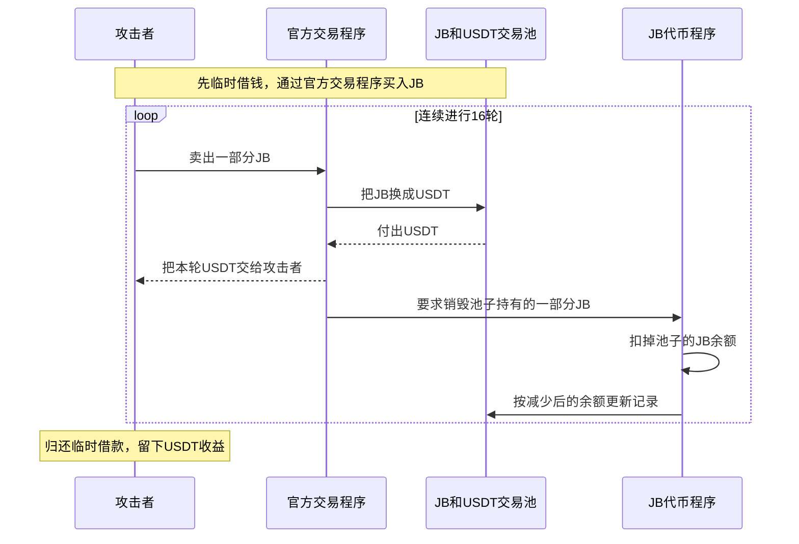
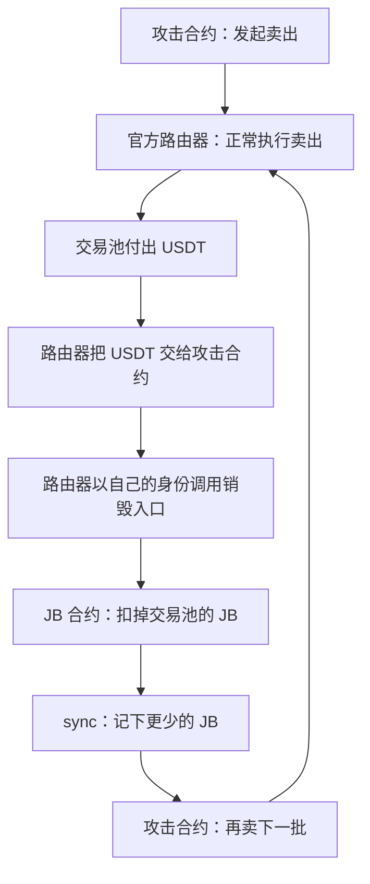

# JB：每次卖币拿到 USDT 后，程序又烧掉池子里的 JB

攻击者通过官方交易程序反复卖出 JB。每卖完一轮，程序都会额外烧掉交易池持有的一部分 JB，然后让池子按更少的 JB 更新记录。池子已经付出了 USDT，却又少了一批 JB；攻击者利用这个过程连续做了 16 轮交易，最后留下 USDT 收益。

这个样本的代码是从字节码反推出来的，部分内容没有完整还原。因此，下面把实际调用记录能确认的步骤写清楚，不根据不完整代码猜测精确收费比例。

## 这些合约分别是干什么的

| 合约              | 正常职责                                                                |
| ----------------- | ----------------------------------------------------------------------- |
| JB 代币合约       | 记录各地址有多少 JB，处理转账和销毁。销毁会直接减少相应地址的 JB 余额。 |
| JB 官方交易路由器 | 接收用户的买卖请求，处理代币分配和费用，再通过 PancakeSwap 完成兑换。   |
| JB/USDT 交易池    | 同时持有 JB 和 USDT；买家交 USDT 取 JB，卖家交 JB 取 USDT。             |

正常卖出后，交易池付出 USDT，同时得到用户交入的 JB。这些新收到的 JB 是池子保有的资产，也会参与之后的兑换报价。

## 漏洞具体在哪

JB 代币有一个只允许官方路由器调用的入口，识别号是 **`0xb1faeac6`**。原始函数名没有被确认，所以资料用这个识别号指代它。

[恢复代码中的这个入口](../../dataset/benchmark_complete/20260619_JB_decompiled/JBToken.recovered.sol#L182) 连着做两件事：

1. 从**交易池的 JB 余额**里销毁指定数量的币。
2. 调用池子的 `sync()`，让池子把减少后的余额记下来，供之后报价使用。

而 [官方路由器的卖出流程](../../dataset/benchmark_complete/20260619_JB_decompiled/context/TradeRouter.recovered.sol.txt#L249) 会在已经把 USDT 交给卖家之后调用这个入口。这样，一笔正常交换已经结束，池子又额外损失了 JB，却没有收到对应补偿。

这两个设计接到一起，才形成攻击机会：**用户可以反复发起卖出，官方程序就会反复替用户触发池内销毁。**

## 用一组数字看懂池子为什么吃亏

下面只演示额外销毁的影响，数字不是实际交易金额，也没有展开手续费：

| 时点                               | 池子有多少 JB | 池子有多少 USDT |
| ---------------------------------- | ------------- | --------------- |
| 开始                               | 1,000         | 1,000           |
| 用户卖入 100 JB，拿走约 90 USDT 后 | 1,100         | 910             |
| 程序又烧掉池子里 80 JB 后          | 1,020         | 910             |

按刚完成的交换，池子本应保有 1,100 JB。额外销毁后只剩 1,020，但付给卖家的 USDT 没有退回来。池子再按 1,020 JB 与 910 USDT 更新报价，相比刚卖完那一刻，下一次卖 JB 面对的比例又更有利了一些。

实际能赚多少，还取决于销毁量、收费和借款成本。这个例子解释的是池子为什么额外吃亏；历史交易确认攻击者重复操作后取得了正收益。

## 攻击者怎样一步步利用



**这次攻击的关键，是“卖完币之后，程序又替卖家烧掉了池子里的 JB”。** 攻击者已经拿到了这一轮的 USDT，池子却又少了一批 JB。程序接着更新池子的数量记录，使下一轮卖出获得更有利的兑换条件。攻击者把这个过程连续做了 16 次。

我重新核对了仓库里的恢复代码和保存的公开调用记录。下面按你列出的步骤展开。需要先说明：**JB 和路由器的代码是从字节码反推的，原始源码没有得到验证。** 关键的调用顺序和余额变化有记录支持，但完整的收费公式、销毁数量公式还没有恢复。

先把几个合约的职责分清楚：

| 合约              | 通俗理解               | 负责什么                                                  |
| ----------------- | ---------------------- | --------------------------------------------------------- |
| JB 代币合约       | JB 的总账本            | 记录每个地址有多少 JB，执行转账和销毁                     |
| JB 官方交易路由器 | 买卖柜台               | 收下用户的币，处理分配和费用，再调用 PancakeSwap 完成兑换 |
| JB/USDT 交易池    | 同时装着两种币的资金池 | 用户交入 JB，池子付出 USDT；用户交入 USDT，池子付出 JB    |
| Venus             | 抵押借款平台           | 收下 WBNB 抵押品，借出 USDT                               |

**第一步，先借来大额资金，把它换成能买 JB 的 USDT。**

攻击合约临时借入约 **417,464.10 WBNB**，然后完成两件事：

1. 把 WBNB 存进 Venus，作为抵押品。
2. 用这批抵押品支持的借款额度，借出 **7,000 万 USDT**。

调用记录中的主要操作可以这样理解：

```text
临时借入 WBNB
    ↓
Venus.enterMarkets(...)       把相应市场中的存款用于抵押
    ↓
Venus 的 WBNB 市场.mint(...)   存入 WBNB，取得存款凭证
    ↓
Venus 的 USDT 市场.borrow(...) 借出 7,000 万 USDT
```

这里的 `mint()` 是 Venus 接收存款、发放存款凭证的操作。

这一步的作用是：**攻击者先取得足够多的购买力，用大额买单改变 JB 池子的资产比例，并拿到后面分批卖出的 JB。** 7,000 万 USDT 是必须归还的周转资金。[事件分析](https://www.darknavy.org/web3/exploits/jb-token-pair-burn-reserve-manipulation/)

**第二步，把 USDT 交给官方路由器，让它买入 JB。**

路由器的买入入口在 [TradeRouter.recovered.sol 第 187 行](D:/code/vibe-coding/ai-auditing-benchmark/ai-auditing-benchmark/dataset/benchmark_complete/20260619_JB_decompiled/context/TradeRouter.recovered.sol:187)。下面节选主要操作，省略了检查和授权清理：

```solidity
// 从调用者手里收取 USDT
_safeTransferFrom(USDT, msg.sender, address(this), amountInUsdt);

// 允许 PancakeSwap 路由器使用这笔 USDT
_safeApprove(USDT, pancakeRouter(), receivedUsdt);

// 用 USDT 买 JB，先把买到的 JB 收到官方路由器
IPancakeRouterLike(pancakeRouter())
    .swapExactTokensForTokensSupportingFeeOnTransferTokens(
        receivedUsdt,
        minOut,
        _path(USDT, JB_TOKEN),
        address(this),
        deadline
    );

// 中间还会处理 JB 分配和费用
// 最后把用户应得的 JB 交给调用者
_safeTransfer(JB_TOKEN, msg.sender, jbReturned);
```

这里的几个变量分别表示：

- `msg.sender`：调用买入功能的攻击合约。
- `address(this)`：正在执行代码的官方路由器。
- `_path(USDT, JB_TOKEN)`：兑换方向是“USDT 换 JB”。

实际记录显示，交易池转出了约 **119,907,137.39 JB**；经过路由器内部的分配后，攻击合约收到约 **116,309,923.27 JB**。

这笔大额买入也显著改变了池子的状态：

| 时点         |     池内 JB |  池内 USDT |
| ------------ | ----------: | ---------: |
| 大额买入之前 | 119,993,000 |     50,000 |
| 大额买入之后 |   85,862.61 | 70,050,000 |

也就是说，**池子收进了 7,000 万 USDT，绝大部分 JB 被买走。** 后面的卖出就在这个状态上开始。[本地保存的调用记录](D:/code/vibe-coding/ai-auditing-benchmark/ai-auditing-benchmark/.cache/import_99_104/jb_trace_docs_pinned.json)

**第三步，每次卖出，先按正常交易拿到 USDT。**

卖出入口在 [TradeRouter.recovered.sol 第 249 行](D:/code/vibe-coding/ai-auditing-benchmark/ai-auditing-benchmark/dataset/benchmark_complete/20260619_JB_decompiled/context/TradeRouter.recovered.sol:249)。恢复代码的关键顺序如下：

```solidity
// 1. 从卖家手里收取 JB
_safeTransferFrom(JB_TOKEN, msg.sender, address(this), amountInJb);

// 2. 计算用于分配、费用和实际兑换的数量
(parentAmount, secondaryAmount, feeAmount, swapAmount) =
    _splitAmountsForControllerAndFee(amountInJb, false);

// 中间处理控制器收款和费用转账……

// 3. 把剩下的 JB 换成 USDT
IPancakeRouterLike(pancakeRouter())
    .swapExactTokensForTokensSupportingFeeOnTransferTokens(
        swapAmount,
        minOut,
        _path(JB_TOKEN, USDT),
        address(this),
        deadline
    );

// 4. 算出这一轮实际收到多少 USDT
uint256 usdtAfter = IERC20Like(USDT).balanceOf(address(this));
usdtReturned = usdtAfter - usdtBefore;

// 5. 把 USDT 交给卖家
_safeTransfer(USDT, msg.sender, usdtReturned);

// 6. 付款后，再触发池内销毁
_maybePoolBurn(_derivePoolBurnAmount(amountInJb, swapAmount));
```

需要盯住最后两步的顺序：

```text
先把 USDT 付给攻击合约
    ↓
然后再烧掉交易池里的 JB
```

第一轮实际发生了这些操作：

| 操作                         |               数量 |
| ---------------------------- | -----------------: |
| 攻击合约交给官方路由器       |    2,326,198.47 JB |
| 经过分配后，实际用于兑换     |    1,907,482.74 JB |
| 交易池付出、最终交给攻击合约 | 67,025,386.41 USDT |

到这里，这笔交换已经完成：池子收到 JB，付出 USDT，攻击合约已经拿到钱。

**第四步，漏洞出现在付款之后：程序扣掉的是交易池的 JB。**

官方路由器随后调用 JB 的 `0xb1faeac6`。这是函数的链上识别号，原始函数名没有确认。

在 [JBToken.recovered.sol 第 182 行](D:/code/vibe-coding/ai-auditing-benchmark/ai-auditing-benchmark/dataset/benchmark_complete/20260619_JB_decompiled/JBToken.recovered.sol:182)，核心代码是：

```solidity
function func_0xb1faeac6(uint256 amount)
    external
    onlyTradeRouter
    returns (bool)
{
    // 直接从交易池地址扣掉 JB
    _burn(slot_4_ammPair, amount);

    address pair = slot_4_ammPair;

    // 0xfff6cae9 对应 sync()
    (bool ok, bytes memory ret) =
        pair.call(abi.encodeWithSelector(bytes4(0xfff6cae9)));

    // 后面检查调用是否成功……
}
```

最关键的一行是：

```solidity
_burn(slot_4_ammPair, amount);
```

`slot_4_ammPair` 保存的是 **JB/USDT 交易池的地址**。因此，这一行的意思是：

> 从交易池名下销毁 `amount` 个 JB。

继续看 [_burn，第 274 行](D:/code/vibe-coding/ai-auditing-benchmark/ai-auditing-benchmark/dataset/benchmark_complete/20260619_JB_decompiled/JBToken.recovered.sol:274)：

```solidity
function _burn(address from, uint256 amount) internal {
    if (slot_14_balances[from] < amount)
        revert("JBToken: burn balance");

    unchecked {
        slot_14_balances[from] -= amount;
        slot_3_totalSupply -= amount;
    }

    emit Transfer(from, address(0), amount);
}
```

逐行翻成白话：

- 先检查这个地址有没有足够的 JB 可供销毁。
- 从这个地址的 JB 余额中减掉 `amount`。
- 从 JB 总发行量中减掉同样的数量。
- 记录一条“从这个地址转到零地址”的销毁事件。

**它为什么能直接扣交易池的币？因为交易池持有多少 JB，本来就记录在 JB 代币合约的账本里。** JB 合约执行自己的内部 `_burn()`，直接修改这个账本，不需要走交易池授权的 `transferFrom()`。

第一轮中，实际被销毁的是约 **1,525,986.19 JB**。把销毁前后的余额放在一起，就很直观：

| 时点             |              池内 JB |              池内 USDT |
| ---------------- | -------------------: | ---------------------: |
| 第一轮交换刚完成 |         1,993,345.35 |           3,024,613.59 |
| 随后销毁池内 JB  | **467,359.16** | **3,024,613.59** |

**JB 少了约 152.60 万个，USDT 一分也没有补回来。** 这两组余额可以直接从第一轮 `swap()` 和后续 `sync()` 内部读取余额的调用结果中对照出来。

**接下来的 `sync()`，让这个损失影响下一轮报价。**

交易池有两类数字：

- **实际余额**：代币合约的账本上，池子现在有多少币。
- **储备记录**：池子记下来、供后续兑换计算使用的数量。

`sync()` 会把实际余额写入储备记录。把标准实现简化成容易读的伪代码，就是：

```solidity
记录中的JB数量   = JB.balanceOf(交易池);
记录中的USDT数量 = USDT.balanceOf(交易池);
```

因此，额外烧掉 JB 后再执行 `sync()`，池子以后就会按更少的 JB 计算兑换结果。标准实现可以对照 [PancakePair 的 sync() 和 _update()](https://github.com/pancakeswap/pancake-smart-contracts/blob/master/projects/exchange-protocol/contracts/PancakePair.sol)。

先忽略手续费，卖出 JB 能换到多少 USDT，可以用下面的式子理解：

```text
可换出的 USDT
    = 池内 USDT × 本次实际交入的 JB
      ÷（池内原有 JB + 本次实际交入的 JB）
```

这个式子来自正常的交易池兑换关系。**池内 USDT 不变、本次交入的 JB 不变时，池内原有 JB 越少，分母越小，能换出的 USDT 就越多。** [PancakeSwap 兑换计算代码](https://github.com/pancakeswap/pancake-smart-contracts/blob/master/projects/exchange-protocol/contracts/libraries/PancakeLibrary.sol)

用第一轮的真实池子余额做一个对照计算：假设下一笔有 **10 万 JB 实际进入池子**，暂时忽略手续费和路由器的分配机制：

| 使用哪一种池子状态计算           | 这 10 万 JB 约能换出多少 USDT |
| -------------------------------- | ----------------------------: |
| 保留交换完成后的 1,993,345.35 JB |                    144,487.08 |
| 额外销毁后，只剩 467,359.16 JB   |          **533,103.86** |

这是为了比较额外销毁的影响而做的计算，**不是实际第二轮的成交金额**。

这也解释了攻击者为什么要分批卖：**每一批先拿到 USDT，然后触发销毁；下一批就能利用上一批销毁后的兑换条件。**

**第五步，“只允许官方路由器调用”为什么没有挡住攻击？**

权限检查在 [JBToken.recovered.sol 第 70 行](D:/code/vibe-coding/ai-auditing-benchmark/ai-auditing-benchmark/dataset/benchmark_complete/20260619_JB_decompiled/JBToken.recovered.sol:70)：

```solidity
modifier onlyTradeRouter() {
    require(
        msg.sender == slot_6_tradeRouter,
        "JBToken: not trade router"
    );
    _;
}
```

这条检查确实限制了直接调用者。但实际调用关系是：



当官方路由器调用 JB 合约时，JB 合约看到的 `msg.sender` 正是官方路由器，所以检查会通过。

问题在于：**已经能使用卖出功能的攻击合约，可以让官方路由器反复替自己执行损害池子资产的操作。**

路由器的恢复代码里还包含上级绑定、黑名单和截止时间等检查。这笔交易中的攻击合约成功通过了相应调用条件；不能据此断言任意新地址都能不做准备直接复现。能确认的是，这笔交易连续成功执行了 **16 次卖出、16 次销毁入口调用、16 次紧接着的 `sync()`**。

**第六步，把周转资金还掉，剩下的才是收益。**

我把调用记录里 16 轮实际交给攻击合约的 USDT 相加，结果是：

```text
16 轮卖出合计收回：70,049,958.056380441202939144 USDT
偿还 Venus 借款： 70,000,000.000000000000000000 USDT
剩余：                49,958.056380441202939144 USDT
```

之后攻击合约从 Venus 取回 WBNB 抵押品，完成临时 WBNB 借款的归还，并把上述剩余 USDT 转给攻击者地址。

还有一个能对应上的数字：**交易池在大额买入前有 50,000 USDT，最后只剩约 41.94 USDT。** 两者差额约为 **49,958.06 USDT**，与攻击合约最后转出的金额一致。这是代币收支层面的收益，未扣攻击者支付的链上交易费。[公开事件分析](https://www.darknavy.org/web3/exploits/jb-token-pair-burn-reserve-manipulation/)

因此，审查代码时最需要连起来看的三个位置是：**路由器付款后的 `_maybePoolBurn()` → JB 合约的 `_burn(slot_4_ammPair, amount)` → 紧接着的 `sync()`。** 单看其中一处，很容易漏掉“用户卖出能反复触发池内扣币，并改变下一次兑换条件”这条完整路径。

本次是代码与历史记录核对，没有重新运行攻击。恢复文件中的 `_derivePoolBurnAmount()` 仍有未还原部分，所以不能仅凭这些文件给出所有情况下的精确销毁比例。

[调用记录](https://github.com/DarkNavySecurity/web3-exploit-analysis/blob/0dedb932869fff89899d75a3e6e2315cd87768bd/artifacts/analysis_0x54e120b8d62a9d7cef94bf51f1f5b8aa13565d76d8797a79afeeb25ed0e1dc25/trace_callTracer.json)、[事件分析](https://www.darknavy.org/web3/exploits/jb-token-pair-burn-reserve-manipulation/)

## 事件信息

| 项目             | 内容                                                                                                                    |
| ---------------- | ----------------------------------------------------------------------------------------------------------------------- |
| Case             | `20260619_JB_decompiled`，原表第 99 行                                                                                |
| 网络、数据集日期 | BNB Smart Chain，`2026.06.19`，沿用原表日期                                                                           |
| 漏洞代币         | [JB：0xcf92e7ef4a63d52dc15f45a24f4f815f00f299a7](https://bscscan.com/address/0xcf92e7ef4a63d52dc15f45a24f4f815f00f299a7) |
| 官方交易路由器   | `0x1b5732eb98911c25acf7bdfaffb9409782cae6d7`                                                                          |
| JB/USDT 交易对   | `0x43932cbb49c363f68655b5ad2950ed4630cb49f8`                                                                          |
| 攻击交易         | [0x54e120b8…ed0e1dc25](https://bscscan.com/tx/0x54e120b8d62a9d7cef94bf51f1f5b8aa13565d76d8797a79afeeb25ed0e1dc25)       |
| CSV 金额         | USD 50,000；中文 5 万美元，英文 50 千美元                                                                               |
| 源码性质         | **选择性反编译恢复，非已验证原始源码**；主代币 medium，路由器及控制器 low                                         |

## 对应代码在哪里

下面的链接分别指向完整版和精简版，便于对照上面的操作步骤。

| 阅读点                   | 完整版                                                                                                              | 精简版                                                                                                                |
| ------------------------ | ------------------------------------------------------------------------------------------------------------------- | --------------------------------------------------------------------------------------------------------------------- |
| 实际直接调用者限制       | [onlyTradeRouter](../../dataset/benchmark_complete/20260619_JB_decompiled/JBToken.recovered.sol#L70)                 | [代币关键切片](../../dataset/benchmark_simplified/20260619_JB_decompiled/JBToken.recovered.sol)                        |
| 销毁 pair 余额并同步储备 | [0xb1faeac6 恢复函数](../../dataset/benchmark_complete/20260619_JB_decompiled/JBToken.recovered.sol#L182)            | [对应恢复函数](../../dataset/benchmark_simplified/20260619_JB_decompiled/JBToken.recovered.sol#L70)                    |
| 恢复文件中的余额扣减     | [_burn](../../dataset/benchmark_complete/20260619_JB_decompiled/JBToken.recovered.sol#L274)                          | [对应依赖](../../dataset/benchmark_simplified/20260619_JB_decompiled/JBToken.recovered.sol)                            |
| 卖出后如何触发池内销毁   | [路由器卖出代码](../../dataset/benchmark_complete/20260619_JB_decompiled/context/TradeRouter.recovered.sol.txt#L249) | [相同路由器代码](../../dataset/benchmark_simplified/20260619_JB_decompiled/context/TradeRouter.recovered.sol.txt#L249) |

## 资料说明

JB 主代币的恢复代码置信度为 medium，路由器和控制器为 low。可以据此辅助理解关键调用，但不能把恢复出的存储槽名称、返回类型和所有分支当作已确认的原始实现。路由器里还有没有恢复出来的费用和销毁数量计算，保存在 `.sol.txt` 文件中。

恢复代码把池内销毁写成 `_burn(slot_4_ammPair, amount)`，随后调用识别号 `0xfff6cae9`，即 `sync()`。历史记录支持的是这条卖出后烧掉池内 JB 的路径，不能把控制器收取 JB 的过程解释成它向攻击者增发了 JB。

本说明没有重放攻击，也没有证明恢复代码和部署字节码完全一致。主代币恢复文件能够编译，并不能证明全部行为都还原正确。

- [源码性质与恢复限制](../../dataset/benchmark_complete/20260619_JB_decompiled/SOURCE.md)、[机器可读来源记录](../../dataset/benchmark_complete/20260619_JB_decompiled/SOURCE.json)、[原始恢复材料](https://github.com/DarkNavySecurity/web3-exploit-analysis/tree/main/artifacts/analysis_0x54e120b8d62a9d7cef94bf51f1f5b8aa13565d76d8797a79afeeb25ed0e1dc25)。
- [固定版本调用记录](https://github.com/DarkNavySecurity/web3-exploit-analysis/blob/0dedb932869fff89899d75a3e6e2315cd87768bd/artifacts/analysis_0x54e120b8d62a9d7cef94bf51f1f5b8aa13565d76d8797a79afeeb25ed0e1dc25/trace_callTracer.json)：第一轮卖出为 `0.1.0.1.9`，销毁入口为其子路径 `.23`，更新池子记录为 `.23.0`。
- [原表告警](https://x.com/audit_911/status/2067943961327763788)；[DarkNavy 事件分析](https://www.darknavy.org/web3/exploits/jb-token-pair-burn-reserve-manipulation/)。
