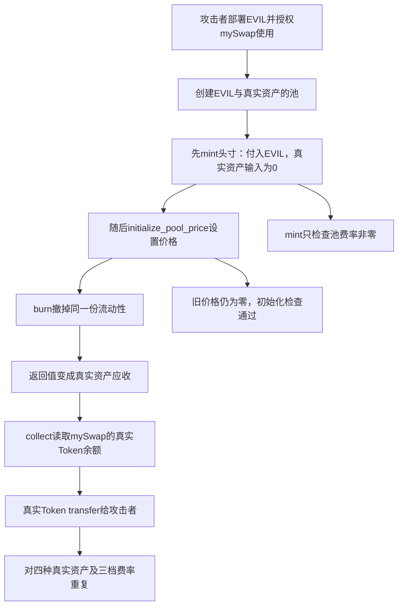

# mySwap CL：先用自造代币取得流动性头寸，初始化价格后却领出真实资产

**这笔交易可以直接核对的关键，是添加流动性和初始化价格的顺序。** 攻击者先建池、添加流动性，再初始化池的价格，最后撤出并领取。添加时要求支付的是攻击者自己创建的 EVIL，真实资产一侧的数量是 0；初始化后，撤出同一份流动性却产生真实资产应收，`collect` 随后实际转出了 ETH、STRK、USDC.e 和 USDT。

本文现在同时依据链上 Sierra 程序、反编译结果和原始 RPC 调用跟踪。**已经取得攻击区块执行的合约类，本地重算的类哈希与历史查询一致。** 完整版保存 425 个函数、50,567 条 Sierra 指令；精简版保留攻击相关的 5 个入口及其完整内部依赖，共 276 个函数、29,303 条指令。状态为 `decompiled_sierra`。原始 Cairo 仍未公开验证，恢复结果使用保留指令编号的伪 Cairo 表达，不能直接当作原始 Cairo 工程编译。

## 这些合约正常是做什么的

mySwap CL 是 Starknet 上的集中流动性交易协议。普通用户把两种代币提供给协议，让其他人兑换；提供资金的人叫流动性提供者，简称 LP。与始终覆盖所有价格的简单池子不同，集中流动性允许 LP 选择一个价格区间。头寸代表“我在这个区间提供了多少流动性”，以后退出时，协议根据当前价格和头寸状态计算应退回的两种代币数量。[官方产品说明](https://docs.myswap.xyz/)

| 本交易中的入口 | 可以从名称、入参及返回值理解的职责 |
| --- | --- |
| `create_pool(token0, token1, fee)` | 登记交易对和费率，返回用于识别池子的 `pool_key`。本交易中 token0 都是 EVIL，token1 是真实资产。 |
| `mint(pool_key, recipient, tick_lower, tick_upper, amount)` | 为接收人建立或增加指定价格区间的头寸，计算需要收取的两种代币，再调用代币转账。这里的 `amount` 是流动性数量，不直接等于某一种代币数量。 |
| `initialize_pool_price(pool_key, sqrt_price_x96)` | 设置池的初始价格。本交易把它放在 `mint` 后面调用。 |
| `burn(pool_key, tick_lower, tick_upper, amount)` | 撤掉指定数量的流动性，返回两种资产对应的应收数量。实际转账还要看后续领取。 |
| `collect(..., amount0_requested, amount1_requested)` | 领取应收资产；本交易中它调用真实 Token 的 `balanceOf`、`transfer`，把资产付给攻击者。 |

这些公开函数名已通过 ABI 的 selector 哈希与链上入口对应。内部函数原名没有完整保留，因此反编译文件沿用 `fn_117` 等编号。集中流动性下，一侧资产数量为零本身可以是正常情况；本案的问题是同一头寸在价格初始化前就能建立，之后又无偿变成另一种资产的应收权益。

## 反编译定位到了什么检查

最关键的区别是：**创建一个池，只是登记它交易哪两种币、收多少手续费；初始化价格，才是确定这些流动性应该由哪种资产构成。合约把第一件事当成了足以添加流动性的条件。**

`mint` 的路径为 `mint__entry_14 → fn_68 → fn_124`。`fn_68` 处理锁；`fn_124` 在指令 `L15504` 调用 `fn_117` 读取池参数。`fn_117` 解开 `PoolParams` 后，拿第三个字段 `fee` 与 0 比较。ABI 的 `PoolParams` 字段顺序是 `token0、token1、fee、tick_spacing`，公开的 `pool_params` 入口也返回同一读取函数 `fn_155` 的结果，因此这个字段对应可以交叉核对。[ABI](../../dataset/benchmark_complete/20260619_mySwap/onchain/abi.json)、[池参数检查](../../dataset/benchmark_complete/20260619_mySwap/mySwap.decompiled.cairo#L19615)

检查失败时返回 `PNI`，容易让人仅凭错误文字以为它检查了“价格已初始化”。但指令实际比较的是 **fee 是否为 0**。池一旦通过 `create_pool` 写入非零费率，这个检查就能通过。后续 `fn_201` 读取当前 tick 和平方根价格并修改头寸；`mint` 的完整内部调用依赖中没有公开价格查询所使用的零价格拒绝函数 `fn_109`。

另一边，`initialize_pool_price` 的主体 `fn_92` 调用 `fn_108` 取得旧价格，在 `L12335–L12343` 把它与由两个 0 组成的 `u256` 比较；旧价格不为 0 时返回 `AlreadyInit`。旧价格为 0 时，路径继续计算 tick，并调用 `fn_159` 写入 tick 和价格。它没有先要求已建立的头寸为空。[旧价格检查](../../dataset/benchmark_complete/20260619_mySwap/mySwap.decompiled.cairo#L16438)、[价格写入调用](../../dataset/benchmark_complete/20260619_mySwap/mySwap.decompiled.cairo#L16511)

| 已恢复的环节 | 原始 Sierra 指令位置 | 对攻击的意义 |
| --- | --- | --- |
| `mint` 读取池参数并进入头寸修改 | `L15504`、`L15525` | 池创建后即可进入，允许早于价格初始化。 |
| `fn_117` 比较 `PoolParams.fee` 与 0 | `L15138–L15183` | 检查的是非零费率，不能证明价格已初始化。 |
| `fn_92` 比较旧价格与 0 | `L12325–L12374` | 先前 mint 没有把旧价格改成非零，因此后续初始化仍可通过。 |
| `fn_201` 按当前 tick 相对上下界分支计算资产数量 | `L24357`、`L24398`、`L24403`；两侧区间分别到 `L24944`、`L24429` | 同一流动性在初始化前后走到不同资产侧的计算路径。 |
| `burn` 同样调用 `fn_201`，然后更新应收 | `L16531`、`L16689`、`L16804` | 退出时采用初始化后的价格状态，并把结果记入可领取金额。 |
| `collect` 读取头寸并进入真实代币付款 | `L15947`、`L16017`、`L16130` | 链上原始跟踪进一步确认实际 Token 调用和转出金额。 |

这里的 `L` 是链上 Sierra 的零起始指令编号，不是原始 Cairo 源码行号。两套反编译都保留同样的编号；精简版保留整段函数及其依赖，没有把失败分支、范围检查或转账结果检查删掉。

## 攻击对象、攻击工具和收款人要分开

| 角色 | 地址与证据 |
| --- | --- |
| 保管并支付资金的 mySwap 合约 | [0x01114c7103e12c2b2ecbd3a2472ba9c48ddcbf702b1c242dd570057e26212111](https://voyager.online/contract/0x01114c7103e12c2b2ecbd3a2472ba9c48ddcbf702b1c242dd570057e26212111)，Voyager 标记为 `mySwap: CL AMM Swap` |
| 攻击者账户、最终收款人 | [0x029f9de5cafb30f55e4a6f4f032e8774958520c1649b3a0441f1354c0b330518](https://voyager.online/contract/0x029f9de5cafb30f55e4a6f4f032e8774958520c1649b3a0441f1354c0b330518) |
| 攻击者创建的 EVIL Token | [0x028c9acd8eb7dc1cd7e3da98da3997cb57beca3c39d425e90780195df3a9a49e](https://voyager.online/token/0x028c9acd8eb7dc1cd7e3da98da3997cb57beca3c39d425e90780195df3a9a49e)，在这笔交易开始时通过 Universal Deployer 创建 |
| 本次实际执行的 mySwap 类 | [0x008fade1a36f2bfcaa55b53c96dfb615e8e60110b87765cf449d09b6e0397b17](https://voyager.online/class/0x008fade1a36f2bfcaa55b53c96dfb615e8e60110b87765cf449d09b6e0397b17)，Cairo V2+，源码状态 `UNVERIFIED` |

因此，原表里的 `malicious_address` 是攻击者，不能填进“漏洞合约地址”；EVIL 是攻击者创建的工具，也不能拿它的代码代替 mySwap 的受害代码。

## 攻击是怎样一步步完成的

交易步骤由原始 RPC 调用树核对；右侧的检查条件来自与历史执行类匹配的反编译程序。

1. **准备自己能大量持有的 EVIL。** 交易从攻击者账户发出，经 Universal Deployer 创建 EVIL Token，再对 mySwap 执行 `approve`。这个动作让 mySwap 在后续添加流动性时能够从攻击者账户取走 EVIL。部署并授权可以从交易前两个调用直接核对；无需假定攻击者先盗取了管理员密钥。
2. **建立 EVIL/ETH 池。** 第一轮 `create_pool` 的 token0 是 EVIL，token1 是 Starknet 的 ETH Token，费率参数为 `0x2710`。它返回新的 `pool_key`，后面四个动作都使用同一个键。
3. **在调用价格初始化之前先取得头寸。** 第一轮 `mint` 指定攻击者为接收人，区间为 `tick_lower = 0xd7278`、`tick_upper = 0xda158`，流动性数量为 `0xb10300a3eb05da515`。返回的两种代币数量为 `(124286986121882537474, 0)`，即 token0 的 EVIL 有数量，token1 的 ETH 为 0。内部调用 `0.3.1` 进一步确认，ETH `transferFrom` 的 `amount` 就是 0，而且正常返回。
4. **把初始价格设置放到已经建立头寸之后。** 攻击者随后调用 `initialize_pool_price`，同一池的 `sqrt_price_x96` 入参为 `0x015d080b1c91b9f00000000000`。这笔交易被成功执行，说明观察到的这一轮没有在“先 mint、后初始化价格”的顺序上回滚。
5. **撤掉同一个区间、同一数量的流动性。** `burn` 使用与 `mint` 完全相同的池、上下界和流动性数量，但结果变成 `(0, 124286986121882537473)`。现在 EVIL 应收为 0，ETH 应收为 124.286986121882537473。需要解释的异常正是：真实 ETH 没有在第 3 步进入这个新头寸，却在第 5 步成为可以领取的资产。
6. **用 collect 把应收数变成实际到手的币。** 攻击者把两种资产的申请上限都设为 `2^128 - 1`，要求把可领取的部分付给自己。`collect` 下的内部调用 `0.6.0` 查询 mySwap 合约持有的 ETH，返回 **138.096651246520515535 ETH**；`0.6.1` 随后调用 ETH `transfer`，向攻击者支付 **124.286986121882537473 ETH**，返回成功。这里的余额来源和转账对象都是真实的 ETH Token，金额也与 `burn`、`collect` 返回值对应。
7. **把相同的生命周期用于其他池。** 同笔交易共进行 12 轮：EVIL 分别与 ETH、STRK、USDC.e、USDT 配对，每种资产使用 `10000`、`3000`、`500` 三个费率参数。每轮都呈现“`mint` 的真实资产数量为 0；之后初始化价格；`burn` 和 `collect` 产生真实资产数量”的模式。前三轮取 ETH，接着三轮 STRK，再接三轮 USDC.e，最后三轮 USDT。[主交易及其内部调用](https://voyager.online/tx/0x1c15c4064cb3d72df27a35dfcd2da17c108abfb8e671428cb9d457f698f588#internalCalls)

这里所有数值都来自实际交易字段或其整数换算，没有使用示意金额。`tick` 保留浏览器显示的无符号编码；本文没有假定其内部偏移编码方式。

## 为什么能从新建池领走原有资金

正常的集中流动性记账需要把“这个头寸存入了什么”“当前价格下能换成什么”“该头寸合法应收多少”连在一起。初始化价格是确定头寸资产构成的基础步骤，不能让已经建立的头寸在没有等价资金流入的情况下凭空获得另一种资产。

反编译与交易证据现在能连起来：`mint` 通过非零费率检查，在价格尚未初始化时取得头寸；`initialize_pool_price` 随后改变 tick 和价格；`burn` 使用这个新状态计算同一头寸的资产数量。`fn_201` 的 tick 比较分支决定计算哪一侧的数量；它在区间一侧构造 token0 数量为 0 的结果，另一侧构造 token1 数量为 0 的结果，中间区间则分别计算两种资产。**攻击者没有通过真实兑换把 EVIL 换成 ETH，而是利用初始化前后的记账状态改变，让同一头寸的可领取资产换了种类。** 具体整数结果由原始调用跟踪确认，而非只凭反编译函数名推测。

真钱之所以确实能够付出，是因为 `collect` 读到 mySwap 地址本来就持有真实 Token，然后发出了真实 Token 的 `transfer`。例如首轮收取 ETH 为 0，但领取时 mySwap 的总 ETH 余额仍有 138.096651246520515535，因此能够支付 124.286986121882537473 ETH。同一 mySwap 地址又为其他不同池键执行其他真实币的付款，支持“多个池的资产由同一合约地址保管”的理解；这不等于已经检查完其内部共享资金账本或逐个 LP 的损失分摊。

原始跟踪中的 EVIL `transferFrom` 是 `mint` 的子调用，后续价格初始化、`burn`、`collect` 都是攻击者账户发起的同级调用。全部 60 次 mySwap 调用都是攻击者执行入口的直接子调用，没有 EVIL 再进入 mySwap 的回调层。反编译还保留了 `mint`、`burn`、`collect` 外层的 `LOK` 锁检查。本案的利用顺序不需要 Token 回调重入，也无需断言 EVIL 伪造了 `balanceOf` 返回值。

## 金额、日期和损失口径

| 资产 | 本笔交易 3 次 collect 返回值的精确合计 | GoPlus 告警 / 原表显示 |
| --- | ---: | ---: |
| ETH | 137.958554595289620965 | 137.96 |
| STRK | 230167.876276552306932968 | 230167.88 |
| USDC.e | 45123.913123 | 45123.91 |
| USDT | 19945.24299 | 19945.24 |

合计使用整数逐项相加，再按 ETH/STRK 的 18 位、USDC.e/USDT 的 6 位精度换算。[本地金额记录](../../dataset/benchmark_complete/20260619_mySwap/evidence/amounts.json)保留每一轮和总量。新增的[原始跟踪核对记录](../../dataset/benchmark_complete/20260619_mySwap/evidence/raw-trace-verification.json)逐轮确认：真实 Token 的 `transferFrom` 入参为 0，随后 `transfer` 向攻击者付款，金额等于该轮 `collect` 返回值，转账返回成功。完整 RPC receipt 也已保存，包含 128 条事件。

数据集日期是 **2026.06.19**，沿用当前源表第 103 行；主交易时间为 **2026-06-19 07:15:46 UTC**，区块为 **10951100**。CSV 的 **305000 美元**沿用原表估值，中文写 30.5 万美元，英文写 305 千美元。Voyager 页面显示的现时美元价格没有用于回算事发损失。

项目公告称，新增流动性的前端入口此前已关闭半年以上，但仍有分散在十万多个 LP 头寸中的剩余资金，此次几乎清空了剩余流动性；公告还提到跨链和 Railgun。[项目原公告](https://x.com/mySwapxyz/status/2067941891010711560)通过 [GoPlus 公开镜像中的引用](https://nitter.kareem.one/GoPlusSecurity?cursor=DAAHCgABHNAcqKt__-wLAAIAAAATMjA3MDM0NDQ3OTQwNDU5NzQ4MwgAAwAAAAIAAA)读取。本文没有继续重建跨链、隐私协议、追回或赔付路径，因此上述 305000 美元应读作公开事件估值，不能视为已经核算追回后的最终净损失。

## 本地材料在哪里，缺少什么

| 阅读目的 | 完整版 | 精简版 |
| --- | --- | --- |
| 链上类定义、Sierra felt 程序和原始 ABI 字符串 | [完整链上类 JSON](../../dataset/benchmark_complete/20260619_mySwap/onchain/mySwap.contract_class.json) | [同一链上类的逐字节副本](../../dataset/benchmark_simplified/20260619_mySwap/onchain/mySwap.contract_class.json) |
| 保留指令编号和分支的反编译代码 | [425 个函数](../../dataset/benchmark_complete/20260619_mySwap/mySwap.decompiled.cairo) | [276 个函数](../../dataset/benchmark_simplified/20260619_mySwap/mySwap.decompiled.cairo) |
| 标准文本形式的完整 Sierra | [mySwap.sierra](../../dataset/benchmark_complete/20260619_mySwap/onchain/mySwap.sierra) | 使用左侧完整文本；精简审计输入为上行代码。 |
| 调用次序、pool_key、mint/burn/collect 参数及返回值 | [12 轮记录](../../dataset/benchmark_complete/20260619_mySwap/evidence/rounds.json) | [首轮 ETH 记录](../../dataset/benchmark_simplified/20260619_mySwap/evidence/rounds.json) |
| 第一次真实 ETH 入账为 0、余额读取、真实转出 | [选定内部调用](../../dataset/benchmark_complete/20260619_mySwap/evidence/first-round-internal-calls.json) | [保留相同证据](../../dataset/benchmark_simplified/20260619_mySwap/evidence/first-round-internal-calls.json) |
| 执行类、源码验证状态和缺口 | [来源状态](../../dataset/benchmark_complete/20260619_mySwap/evidence/source-status.json) | [来源状态](../../dataset/benchmark_simplified/20260619_mySwap/evidence/source-status.json) |
| 获取方式与本地哈希 | [SOURCE](../../dataset/benchmark_complete/20260619_mySwap/SOURCE.md) | [SOURCE](../../dataset/benchmark_simplified/20260619_mySwap/SOURCE.md) |

`rounds.json` 等早期材料仍保留浏览器字段转录的来源标签。新增的 [class 响应](../../dataset/benchmark_complete/20260619_mySwap/evidence/class-response.cartridge.json)、[历史类绑定和 receipt](../../dataset/benchmark_complete/20260619_mySwap/evidence/history-response.json)、[完整调用跟踪](../../dataset/benchmark_complete/20260619_mySwap/evidence/trace-response.json)则是从 Cartridge Starknet 主网 RPC 直接取得的原始响应。它们没有与浏览器转录混为同一种证据。

恢复时按 Cairo 2.2.0 的 Sierra 序列化规则解压、解码，保留所有函数、参数、分支输出和跳转目标。解码后重新编码、压缩，能精确还原全部链上 felt；另与固定版本的公开转换器样例逐字比较，2,224 条指令和 36 个函数的标准 Sierra 文本完全一致。随后使用原始 ABI 字符串和链上 Sierra 重算类哈希，结果与攻击区块的类哈希一致。[恢复与校验报告](../../dataset/benchmark_complete/20260619_mySwap/evidence/recovery.json)、[独立样例核对](../../dataset/benchmark_complete/20260619_mySwap/evidence/decoder-validation.json)

仍未完成的是原始 Cairo 工程的恢复、原作者仓库版本的对应，以及本地执行环境中的攻击重放。序列化头记录 Sierra 1.3.0、编译器 2.2.0；这不代表取得了原始依赖和完整编译设置。当前反编译可以用于静态审计和攻击原理分析，但不能宣称它是已验证的原始 Cairo 源码或已经运行通过的复现工程。
