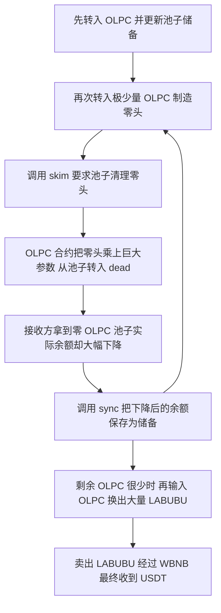

# BnbLabubu：清理池子里的一点零头，却扣掉了大量 OLPC

这起攻击的关键是：**交易池只要求转出多出来的一点 OLPC，OLPC 合约却把这个数量乘上一个极大的参数，从池子余额里扣走。** 攻击者反复触发这个处理，再让池子按剩下的少量 OLPC 更新储备记录，最后用少量 OLPC 换走大量 LABUBU，并卖成 USDT。漏洞位于 OLPCToken 的转账规则和无上限的参数配置，现有证据支持的是储备操纵。

## 这些合约负责什么

OLPC 和 LABUBU 是两种不同的代币。各自的代币合约负责记账、转账，以及执行项目设置的税费和销毁规则。OLPC/LABUBU 交易池同时存放两种币，用户把一种币交进去，再按照池内两种资产的比例换出另一种。

| 对象                 | 地址                                           | 本次事件中的作用                                             |
| -------------------- | ---------------------------------------------- | ------------------------------------------------------------ |
| OLPCToken            | `0x58815CDF9955121a6274680ab396a36FC9e00000` | 实际漏洞合约；出池转账会触发放大的扣款。                     |
| OLPC/LABUBU 池       | `0xedB7DCB4cDFEc957F8Df5cBf5E94229a6CC9F365` | 储备被操纵的受影响池。                                       |
| LABUBUToken          | `0x3494dfE19b721DAC6c5c8d7470c8F89548177777` | 池子另一侧资产，攻击者将其换出后出售；随代码保留作为上下文。 |
| 攻击者／交易执行地址 | `0x18D6c39aE9E537F948AA2212d44D8c23944fc188` | 发起交易并最终收到 USDT。                                    |
| 报告列出的攻击合约   | `0x5Cf9d217729FeC8d08998B29e91216439791791B` | 攻击方地址；不是漏洞合约，未填入 CSV 的漏洞合约列。          |

池子有两套容易混淆的数字：`balanceOf(pair)` 是代币合约记下的实际余额，`reserve` 是池子上次保存的余额。直接给池子转币后，实际余额会暂时多于保存的储备。`skim(to)` 把多出来的部分转给指定接收方；`sync()` 则把当前实际余额保存为新储备。二者都可以由普通地址调用。

## 漏洞具体在哪

正常入口是 [ERC20.transfer](../../dataset/benchmark_complete/20260620_BnbLabubu/contracts/OLPCToken.sol#L406)，它经过 `_transfer()`，最终进入 OLPCToken 重写的 [_update()](../../dataset/benchmark_complete/20260620_BnbLabubu/contracts/OLPCToken.sol#L1403)。真正出错的分支是：

```solidity
if (
    from != address(0) &&
    swapPair != address(0) &&
    from == swapPair &&
    to != swapPair &&
    !isTaxExempt[to]
) {
    super._update(from, BURN_ADDRESS, value * decimalsValue);
    value = 0;
}
```

这段代码把“指定池子向外转币”视为特殊操作。只要接收方不是池子本身、也不在免税名单里，它就把 `value × decimalsValue` 从池子转到 `0x…dEaD`，然后把真正应转给接收方的 `value` 清零。函数末尾仍执行 `super._update(from, to, value)`，但这时接收方得到的是 0。

这里所谓“销毁”是转到 `BURN_ADDRESS = address(0xdEaD)`。它会减少池子可用余额，但不是调用 `_burn()` 把 ERC20 的 `totalSupply` 减掉；[基类 `_update()`](../../dataset/benchmark_complete/20260620_BnbLabubu/contracts/OLPCToken.sol#L483)只有在收款地址为零地址时才减少总供应量。

`decimalsValue` 是放大扣款的普通整数，和代币本身的 18 位小数不是一回事。它初始为 1；[setDecimalsValue()](../../dataset/benchmark_complete/20260620_BnbLabubu/contracts/OLPCToken.sol#L1773)要求 `onlyOwner`，却没有数值上限：

```solidity
function setDecimalsValue(uint256 decimalsValue_) external onlyOwner {
    decimalsValue = decimalsValue_;
}
```

因此，这里不能写成“攻击者可以随便设置管理员参数”。危险参数已经存在时，攻击者只需调用公开的池子方法就能使用它。[GoPlus 的分析](https://x.com/GoPlusSecurity/status/2068705989365530729)称，管理员在 2026 年 5 月 5 日把参数设成了 `7326680472586200649`。本次没有拿到那笔历史设置交易；这个日期属于报告口径。下面的攻击回执则能独立核对实际扣款比例与该数值一致。

池子的 [skim()](../../dataset/benchmark_complete/20260620_BnbLabubu/contracts/PancakePair.sol#L487)仅计算 `balanceOf(pair) - reserve`，并要求代币转出这部分零头。它不会预先知道 OLPC 会多扣几百万、几千万枚。后续 [sync()](../../dataset/benchmark_complete/20260620_BnbLabubu/contracts/PancakePair.sol#L495)又会把已经被扣低的实际余额写入储备，于是下一次兑换会采用这个失衡的比例。

## 攻击者怎样一步步利用



以下数字来自已保存的[成功交易回执](../../dataset/benchmark_complete/20260620_BnbLabubu/evidence/transaction-receipt.json)和[事件解码结果](../../dataset/benchmark_complete/20260620_BnbLabubu/evidence/decoded-events.json)。事件中的 `log_index` 是原始回执编号。

这段攻击的关键是：**攻击者让池子“只转出一点零头”，OLPC 合约却从池子里扣掉了几千万枚币；随后再把这个缩水后的余额更新成储备，用极少的 OLPC 换走池子原有的大量 LABUBU。**

整个过程要连起来看：**异常扣款发生在 OLPC 合约，储备更新发生在交易池，最终获利发生在后续兑换。** 我重新核对了本地源码和事件数据，最后换出 LABUBU 的数量也能用池子的兑换公式精确算到最小单位。

先弄清楚池子里的两套数字。

| 数字                          | 通俗理解                                       | 什么时候变化                                 |
| ----------------------------- | ---------------------------------------------- | -------------------------------------------- |
| `balanceOf(pair)`，实际余额 | OLPC 合约账本上，这个池子现在真正持有多少 OLPC | 每次转入、转出或异常扣款时变化               |
| `reserve`，保存的储备       | 池子上一次记下的余额，用于计算兑换和检查交易   | 池子执行`sync`，或兑换等操作更新储备时变化 |

例如，池子上次保存了 100 OLPC，又有人直接转入 1 OLPC，那么：

```text
实际余额：101 OLPC
保存储备：100 OLPC
多出来的部分：1 OLPC
```

`skim(to)` 的职责是把这多出来的 1 OLPC 转给 `to`；`sync()` 的职责是把当前实际余额记成新的储备。它们是普通地址可以调用的公开函数。[池子的 skim 和 sync 实现](D:/code/vibe-coding/ai-auditing-benchmark/ai-auditing-benchmark/dataset/benchmark_complete/20260620_BnbLabubu/contracts/PancakePair.sol:487)

下面按你给出的六步展开。

**第一步，转入 1 OLPC，再更新储备，让后续的“零头”可以准确算出来。**

攻击者向池子转入 1 OLPC 时，OLPC 合约会进入卖出处理分支，因为接收地址是它配置的交易池。该分支先计算基础税：

```text
基础税 = 转账数量 × 1000 ÷ 10000
       = 转账数量的 10%
```

这次没有出现额外的动态税扣款，回执记录的是：

```text
攻击者支出：       1 OLPC
转入 dead：        0.05 OLPC
转入分配地址：     0.05 OLPC
池子实际收到：     0.9 OLPC
```

随后更新储备，`log_index=3` 的 `Sync` 记录：

```text
LABUBU 储备：720,372.009849017508169693
OLPC 储备：  51,928,295.152453531310626131
```

**这里更新储备的作用，是让实际余额和保存储备重新相等。** 从这一刻开始，攻击者再直接转入多少 OLPC，池子实际余额就会比储备多出多少，后面的 `skim` 就会尝试转出这个差额。[OLPC 卖出税处理](D:/code/vibe-coding/ai-auditing-benchmark/ai-auditing-benchmark/dataset/benchmark_complete/20260620_BnbLabubu/contracts/OLPCToken.sol:1450)

**第二步，用极小的一笔转入，制造一个非零的余额差。**

OLPC 有 18 位小数，所以：

```text
1 OLPC = 1,000,000,000,000,000,000 个最小单位
```

第一轮小额转入的原始数量，可以从三条转账事件相加得到：

```text
总转入：      7,087,561 个最小单位
转入 dead：     354,378 个最小单位
转入分配地址：  354,378 个最小单位
池子收到：    6,378,805 个最小单位
```

因此池子实际增加：

```text
6,378,805 ÷ 10^18
= 0.000000000006378805 OLPC
```

由于这次转入之后尚未更新储备，池子的状态变成：

```text
保存储备 R：仍然是上一步的数值
实际余额 B：R + 0.000000000006378805 OLPC
余额差 δ：  0.000000000006378805 OLPC
```

这笔钱的作用是**触发一次金额非零的池子出账**。它不是后面几千万枚 OLPC 的资金来源。

**第三步，`skim` 让池子自己调用 OLPC 转账，进入放大扣款分支。**

调用关系可以这样理解：

```text
攻击者调用池子的 skim(辅助接收方)
    ↓
池子计算：实际余额 − 保存储备
    ↓
池子调用 OLPC.transfer(辅助接收方, 余额差)
    ↓
OLPC 发现：转出方正是指定交易池
    ↓
OLPC 按巨大倍数，从池子余额中扣款
```

这里不需要攻击者拿到池子的私钥，也不需要池子给攻击者额外授权。**`skim` 本身就会让池子以自己的身份调用代币的 `transfer`。**

OLPC 的关键分支是：

```solidity
if (
    from != address(0) &&
    swapPair != address(0) &&
    from == swapPair &&
    to != swapPair &&
    !isTaxExempt[to]
) {
    super._update(from, BURN_ADDRESS, value * decimalsValue);
    value = 0;
}
```

函数最后还会执行：

```solidity
super._update(from, to, value);
```

两段连起来的意思是：

1. 从池子向 dead 转入 `value × decimalsValue`。
2. 把原本应该付给接收方的 `value` 改成 0。
3. 再向接收方执行一笔金额为 0 的转账。

所以，**接收方拿到 0，不能说明池子没有损失。池子的大额损失发生在前面那笔“池子 → dead”的转账里。** [异常扣款源码](D:/code/vibe-coding/ai-auditing-benchmark/ai-auditing-benchmark/dataset/benchmark_complete/20260620_BnbLabubu/contracts/OLPCToken.sol:1441)

本次交易对应的放大倍数是：

```text
D = 7,326,680,472,586,200,649
```

注意，`decimalsValue` 虽然名字里有 `decimals`，这里却是直接参与乘法的整数。代码没有在乘完后除以 `10^18`。

第一轮计算全部使用最小单位：

```text
要求转出的零头：
6,378,805

实际从池子转入 dead：
6,378,805 × 7,326,680,472,586,200,649
= 46,735,466,031,935,219,630,844,445 个最小单位
= 46,735,466.031935219630844445 OLPC
```

这个结果与 `log_index=8` 的金额完全一致。

于是，第一轮扣款后的池子余额为：

```text
51,928,295.152453531310626131
+        0.000000000006378805
−46,735,466.031935219630844445
= 5,192,829.120518311686160491 OLPC
```

**池子原本只要求转出约六万亿分之一枚 OLPC，却实际损失了约 4673.55 万枚 OLPC。**

池子没有在 `skim` 中检查“自己的余额是否只减少了要求转出的数量”。其 `_safeTransfer` 主要检查底层调用是否成功、返回值是否表示成功，因此这种异常扣款仍然可以完成。[池子的转账成功检查](D:/code/vibe-coding/ai-auditing-benchmark/ai-auditing-benchmark/dataset/benchmark_complete/20260620_BnbLabubu/contracts/PancakePair.sol:341)

另外两条零金额事件也能解释：

- **0 LABUBU：** `skim` 会分别处理两种代币；LABUBU 没有多出来的余额，所以转账参数为 0。
- **0 OLPC 给辅助接收方：** OLPC 在大额转入 dead 后，把接收方应得的 `value` 清零了。

这里说的“烧掉”是转到 `0x…dEaD`，池子的可用余额确实减少；这段逻辑没有通过零地址销毁来减少 ERC20 的 `totalSupply`。

**第四步，每次扣款后调用 `sync`，让缩水后的余额成为下一轮计算和兑换的依据。**

第一轮异常扣款结束时，两套数字已经出现很大差距：

```text
实际 OLPC 余额：约 519.28 万
保存的 OLPC 储备：约 5192.83 万
```

`sync()` 会读取实际余额，并把储备改成约 519.28 万。

这一步有两个作用：

- 让实际余额和保存储备再次相等，下一轮小额转入又能制造一个明确的正数差额。
- 让后面的兑换采用已经降低的 OLPC 储备。

如果一直不更新储备，实际余额已经低于旧储备，后续 `skim` 在计算 `balance − reserve` 时就可能因减法下溢而回滚。源码里的 `sync` 正好把这种差距消除了。

我逐轮核对得到：

| 轮次        | 攻击者总转入，最小单位 | 扣税后进入池子，最小单位 |        本轮更新后的 OLPC 储备 |
| ----------- | ---------------------: | -----------------------: | ----------------------------: |
| 起点        |                     — |                       — | 51,928,295.152453531310626131 |
| 第 1 轮     |              7,087,561 |                6,378,805 |  5,192,829.120518311686160491 |
| 第 2 轮     |                708,756 |                  637,881 |    519,278.853984553430613603 |
| 第 3 轮     |                 70,875 |                   63,788 |     51,924.559999224863678979 |
| 第 4 轮     |                  7,087 |                    6,379 |      5,187.665264597489745387 |
| 第 5 轮     |                    708 |                      638 |        513.243123087493731963 |
| 第 6 轮     |                     70 |                       63 |         51.662253314563091139 |
| 第 7 轮     |                      7 |                        7 |          0.375490006459686603 |
| 第 8—20 轮 |                      0 |                        0 |     保持 0.375490006459686603 |

这几轮为什么大致每次只剩十分之一，也可以从数字看出来：**前 7 轮的总转入额，都与“当前池子 OLPC 余额除以放大倍数，再向下取整”相等。** 转入时再扣约 10% 基础税，约 90% 的小额输入进入池子；这部分乘回巨大倍数后，就接近池子原余额的 90%。

到最后几轮，整数取整的影响变得明显。例如第 7 轮总共只有 7 个最小单位，基础税：

```text
7 × 1000 ÷ 10000
```

在 Solidity 整数运算中向下取整为 0，因此 7 个最小单位全部进入池子，随后触发约 51.28676 OLPC 的扣款。

**后 13 轮为零，也有明确的数值原因。** 这个倍数意味着，池子只要尝试转出 **1 个最小单位**，就会被扣：

```text
1 × D ÷ 10^18
= 7.326680472586200649 OLPC
```

但池子当时只剩约 **0.37549 OLPC**。继续尝试一次最小的非零出账，所需扣款就已经超过池子余额。回执中后 13 轮的实际输入和转入 dead 数量都是 0，储备没有继续下降。

因此，20 条相关 `Transfer` 事件表示进行了 20 轮对应操作，**其中只有 7 轮产生了非零的储备削减**。以上每轮余额都满足：

```text
本轮结束余额
= 上轮余额 + 本轮实际输入 − 本轮转入 dead 的数量
```

[逐轮事件和储备记录](D:/code/vibe-coding/ai-auditing-benchmark/ai-auditing-benchmark/dataset/benchmark_complete/20260620_BnbLabubu/evidence/decoded-events.json)

**第五步，输入 8.1 OLPC，在已经失衡的池子里换出约 95.56% 的 LABUBU。**

经过前面的处理，池子变成：

```text
OLPC：          0.375490006459686603
LABUBU：  720,372.009849017508169693
```

LABUBU 一侧始终没有被前面的异常扣款消耗。

攻击者随后转入 9 OLPC，扣除基础税后，池子实际收到 8.1 OLPC。这笔输入是池子原有 OLPC 储备的约 **21.57 倍**，在兑换公式里已经是很大的一笔输入。

这里有两层费用，需要分开：

```text
OLPC 转账税：9 OLPC → 池子实际收到 8.1 OLPC

池子兑换费：再按实际输入 8.1 OLPC 计算 0.25% 的兑换费
```

设：

- `x` 为兑换前的 OLPC 储备；
- `y` 为兑换前的 LABUBU 储备；
- `a` 为池子实际收到的 OLPC。

根据这份 PancakePair 的手续费检查，能换出的 LABUBU 数量为：

$$
\text{LABUBU 输出}
=
\frac{y \times (a \times 0.9975)}
{x + a \times 0.9975}
$$

把上述储备和 `a = 8.1` 代入，并按链上的整数规则向下取整，结果恰好是：

```text
688,380.902509080087370095 LABUBU
```

**这与 `log_index=152` 的转出数量精确一致。** 兑换后：

```text
LABUBU：
720,372.009849017508169693
−688,380.902509080087370095
= 31,991.107339937420799598

OLPC：
0.375490006459686603 + 8.1
= 8.475490006459686603
```

作为同一公式下的对照，如果仍使用最开始约 5192.83 万 OLPC 的储备，8.1 OLPC 只能换出约 **0.112086 LABUBU**。前面的储备削减改变了兑换结果。

**池子的 `K` 检查为什么没有阻止这次兑换，也由此能解释：它使用的是最近保存的储备。** 前面的 `skim` 发生异常扣款，`sync` 又把较低的余额写入储备；最后 `swap` 检查的是这组新储备下的乘积关系。此次兑换符合这组储备的计算结果。[兑换及手续费、K 检查](D:/code/vibe-coding/ai-auditing-benchmark/ai-auditing-benchmark/dataset/benchmark_complete/20260620_BnbLabubu/contracts/PancakePair.sol:456)

**第六步，把换出的 LABUBU 经后续交易池卖成 USDT。**

攻击者此时获得的是 LABUBU，还需要经过后续转账和兑换，把它变成最终收到的资产。

回执记录的数量变化是：

```text
从目标池换出：
688,380.902509080087370095 LABUBU

后续两笔转入 dead：
 34,419.045125454004368504 LABUBU
 89,833.707777434951401798 LABUBU

两笔合计：
124,252.752902888955770302 LABUBU

真正进入 LABUBU/WBNB 池：
564,128.149606191131599793 LABUBU
```

对应的守恒关系是：

```text
688,380.902509080087370095
−124,252.752902888955770302
=564,128.149606191131599793
```

后续资产流为：

```text
564,128.149606191131599793 LABUBU
    ↓ LABUBU/WBNB 池
2,041.288163818878836174 WBNB
    ↓ WBNB/USDT 池
1,115,903.663412131721557252 USDT
    ↓
攻击者地址
```

这两笔 LABUBU 转入 dead 的合计，是**本次转账路径下观察到的扣款**。LABUBU 源码还包含基础税、动态税及相关条件，不能据此写成“所有卖出永远收取同一个固定比例”。[LABUBU 卖出处理](D:/code/vibe-coding/ai-auditing-benchmark/ai-auditing-benchmark/dataset/benchmark_complete/20260620_BnbLabubu/contracts/LABUBUToken.sol:1302)

这里不同阶段的资产数量也不能相加：烧掉的 OLPC、换出的 LABUBU、中间经过的 WBNB、最终收到的 USDT，描述的是同一条攻击链上的不同环节。最终这笔 **1,115,903.6634 USDT** 是交易中实际转入攻击者的数量，尚未扣除最初取得 OLPC 的成本和 gas。

还需要把漏洞成立的条件说清楚：`setDecimalsValue()` 是 `onlyOwner`，攻击者不能通过普通地址随意设置这个倍数。它的问题是没有上限约束，而转账分支又直接用它放大池子的扣款。**当危险参数已经存在、接收方又不在免税名单时，公开的 `skim` 和 `sync` 就能把异常扣款接到兑换流程上。** [参数设置函数](D:/code/vibe-coding/ai-auditing-benchmark/ai-auditing-benchmark/dataset/benchmark_complete/20260620_BnbLabubu/contracts/OLPCToken.sol:1773)

上述金额、零金额转账和储备变化来自已保存的成功回执；调用链由源码及已保存的公开复现说明共同支持。本次核对没有执行攻击交易，也没有运行本地分叉复现或完整 `debug trace`。可以继续对照[原始交易回执](D:/code/vibe-coding/ai-auditing-benchmark/ai-auditing-benchmark/dataset/benchmark_complete/20260620_BnbLabubu/evidence/transaction-receipt.json)和[金额汇总](D:/code/vibe-coding/ai-auditing-benchmark/ai-auditing-benchmark/dataset/benchmark_complete/20260620_BnbLabubu/evidence/transaction-summary.json)逐项检查。

## 解释说明

这段攻击可以概括为：**攻击者利用 OLPC 的异常转账规则，把池子里的 OLPC 大量转到 dead，再让池子按缩水后的储备重新报价，最后用几枚 OLPC 换走池子里绝大部分 LABUBU。**

这里最需要理解的是两件事：**为什么“清理一点零头”会扣掉池子的大量资产，以及扣款后为什么还能通过正常兑换把另一种资产拿走。** 我重新核对了本地源码和回执，也用整数重算了最后一笔兑换，结果与回执中的 LABUBU 输出完全一致。

**1. 池子的“实际余额”和“储备记录”，分别管什么。**

假设我们只看池子的 OLPC 一侧：

| 数字                        | 存在哪里      | 含义                                          |
| --------------------------- | ------------- | --------------------------------------------- |
| 实际余额`balanceOf(pair)` | OLPC 代币合约 | 这个池子地址现在实际持有多少 OLPC             |
| 储备`reserve`             | 交易池合约    | 池子上一次保存了多少 OLPC，兑换计算以它为依据 |

直接向池子地址转入代币，只会先改变 OLPC 合约里的实际余额。池子的储备记录不会因为收到一次普通转账而自动更新。

因此，直接转币后，可能出现：

```text
实际余额：1000.001 OLPC
储备记录：1000.000 OLPC
多出的余额：0.001 OLPC
```

池子提供两个公开方法来处理这类差异：

- `skim(to)`：要求代币合约把“实际余额减去储备”的部分转给 `to`。
- `sync()`：读取两种代币的实际余额，把它们保存成新的储备。

对应代码见 [PancakePair.sol 的 skim 和 sync](D:/code/vibe-coding/ai-auditing-benchmark/ai-auditing-benchmark/dataset/benchmark_complete/20260620_BnbLabubu/contracts/PancakePair.sol:487)。

**2. 最开始转入 1 OLPC，是把后面的余额差明确下来。**

这笔转入经过 OLPC 的卖出税处理：

```text
攻击者支出：1 OLPC

转入 dead：       0.05 OLPC
转入分配地址：    0.05 OLPC
真正进入池子：    0.90 OLPC
```

随后一次 `sync()` 将实际余额写入储备。此时，OLPC 一侧的状态是：

```text
实际余额 = 储备记录
         = 51,928,295.152453531310626131 OLPC
```

LABUBU 一侧则是：

```text
720,372.009849017508169693 LABUBU
```

这个步骤的关键作用，是使实际余额和储备相等。这样，下一次直接转入多少 OLPC，就会产生多少“可被 `skim` 清理的余额差”。

这些都是同一笔攻击交易内部的操作。`log_index` 表示该交易回执里的事件编号，不代表每一步都是一笔独立交易。

**3. 攻击者只制造极小的余额差，因为这个差额随后会被放大。**

OLPC 使用 18 位小数：

```text
1 OLPC = 1,000,000,000,000,000,000 个最小单位
```

第一轮小额转入的总支出是 `7,087,561` 个最小单位。基础税按整数计算，扣除 `708,756` 个最小单位后，池子实际收到：

```text
δ = 6,378,805 个最小单位
  = 0.000000000006378805 OLPC
```

这里用 `δ` 表示新增加的余额差。

此时池子的储备还没有变化，所以：

```text
实际余额 = 原储备 + δ
储备记录 = 原储备
```

正常情况下，调用 `skim(to)` 应该只把这点零头转走，池子最终回到原来的余额。

但 OLPC 的转账规则改变了这个结果。

**4. 真正的漏洞：要求转出 δ，池子却被扣掉 δ × 巨大倍数。**

OLPC 在 `_update()` 中有这样一段处理：

```solidity
if (
    from != address(0) &&
    swapPair != address(0) &&
    from == swapPair &&
    to != swapPair &&
    !isTaxExempt[to]
) {
    super._update(from, BURN_ADDRESS, value * decimalsValue);
    value = 0;
}
```

随后函数末尾还会执行：

```solidity
super._update(from, to, value);
```

意思是：**只要指定池子向一个非免税地址转出 OLPC，就把请求数量乘以 `decimalsValue`，从池子转到 dead；给原接收人的数量则改为 0。** 见 [OLPC 异常扣款分支](D:/code/vibe-coding/ai-auditing-benchmark/ai-auditing-benchmark/dataset/benchmark_complete/20260620_BnbLabubu/contracts/OLPCToken.sol:1441)。

`skim` 正好可以触发这个条件：

```text
攻击者调用池子的 skim(to)
    ↓
池子调用 OLPC.transfer(to, δ)
    ↓
OLPC 看到转出方是 swapPair
    ↓
从池子扣除 δ × decimalsValue，转给 dead
    ↓
原接收方收到 0 OLPC
```


## 为什么这样能拿到钱

攻击者得到的价值来自池子原本持有的 LABUBU，而不是从 dead 地址取回被“销毁”的 OLPC。池子的报价依赖两边储备：一边 OLPC 被异常扣到接近零，另一边 LABUBU 仍然很多。攻击者之后交入几枚 OLPC，就足以在这个被改变的比例下换出大量 LABUBU。

可以用一个简化例子理解，数字不是实际交易：假设池里记录着 1,000 OLPC，攻击者又送入 1 OLPC，`skim()` 本来只该清理多出的 1。但若放大参数为 900，OLPC 就从池里扣掉 900，实际只剩 101。再调用 `sync()` 后，下一次换币就按 101 计算，池子原有持币人承担了这笔额外扣款。实际事件使用的放大参数远大于这个例子。

池子的锁仍然限制同一次调用过程中的重入。这里的攻击链不需要绕过这把锁：公开操作按顺序执行，错误发生在 OLPC 转账的扣款金额和随后保存的储备之间。仅因为合约出现 `ReentrancyGuard`、或者攻击包含多次调用，不能把本事件归类为重入漏洞。

## 日期和金额分别是什么口径

| 项目                       | 本次采用的数据及含义                                                                              |
| -------------------------- | ------------------------------------------------------------------------------------------------- |
| 数据集日期                 | 保留源表`2026-06-20`，目录名为 `20260620_BnbLabubu`。                                         |
| 链上时间                   | 区块`105326393`，`2026-06-20 11:31:03 UTC`，北京时间同日 19:31:03。                           |
| CSV 损失金额               | 保留源表`1,115,000 美元`，即中文 CSV 的 `111.5 万美元`、英文 CSV 的 `1115 千美元`。         |
| 本笔交易攻击者 USDT 净流入 | `1,115,903.663412131721557252 USDT`；没有减去最初准备 OLPC 的成本和 BNB gas。                   |
| 池子转入 dead 的 OLPC      | `51,928,294.776963524858027089 OLPC`；这是代币数量，不是等额美元损失，也不是攻击者收到的 OLPC。 |
| 目标池流出的 LABUBU        | `688,380.902509080087370095 LABUBU`；扣除后续卖出途中转入 dead 的部分，才进入下一交易池。       |

这几种数字描述的是不同资产和不同阶段，不相加。本次也没有把后续追赃、归还或受害者最终净损失视为已经完成核验。

## 代码、来源和验证范围

| 需要查看的逻辑                | 完整源码                                                                                              | 精简源码                                                                                               |
| ----------------------------- | ----------------------------------------------------------------------------------------------------- | ------------------------------------------------------------------------------------------------------ |
| OLPC 转账分支、相关查询和配置 | [OLPCToken.sol](../../dataset/benchmark_complete/20260620_BnbLabubu/contracts/OLPCToken.sol#L1403)     | [OLPCToken.sol](../../dataset/benchmark_simplified/20260620_BnbLabubu/contracts/OLPCToken.sol#L482)     |
| 池子的清理、储备更新和兑换    | [PancakePair.sol](../../dataset/benchmark_complete/20260620_BnbLabubu/contracts/PancakePair.sol#L456)  | [PancakePair.sol](../../dataset/benchmark_simplified/20260620_BnbLabubu/contracts/PancakePair.sol#L270) |
| LABUBU 转账和卖出税上下文     | [LABUBUToken.sol](../../dataset/benchmark_complete/20260620_BnbLabubu/contracts/LABUBUToken.sol#L1257) | [LABUBUToken.sol](../../dataset/benchmark_simplified/20260620_BnbLabubu/contracts/LABUBUToken.sol#L408) |

OLPCToken 和 LABUBUToken 来自 [OLPC 的 Sourcify 源码包](https://sourcify.dev/server/v2/contract/56/0x58815CDF9955121a6274680ab396a36FC9e00000?fields=all)及 [LABUBU 的 Sourcify 源码包](https://sourcify.dev/server/v2/contract/56/0x3494dfE19b721DAC6c5c8d7470c8F89548177777?fields=all)。两者的 `creationMatch` 和 `runtimeMatch` 均为 `match`，未声称 metadata exact match。完整源码按原始内容保存，必要接口和基类都已包含在 flattened 文件内。

目标池自身在 Sourcify 没有匹配源码。因此池子上下文来自 [已验证的 WBNB/USDT 参考池](https://sourcify.dev/server/v2/contract/56/0x16b9a82891338f9ba80e2d6970fdda79d1eb0dae?fields=all)，并将它的完整链上 runtime 与读取时目标池的完整 runtime 逐字节比较，结果相同，见[比对记录](../../dataset/benchmark_complete/20260620_BnbLabubu/evidence/pair-runtime-comparison.json)。这一项比对使用 `latest` 状态；没有把它说成目标池在攻击前区块的独立历史字节码核验，也没有把参考池列为漏洞合约。

本地用 Solidity `0.8.33+commit.64118f21` 分别编译了 OLPC 和 LABUBU 的完整、精简版本，四项均无编译错误。精简版按 AST 保留完整函数及其依赖，并核对保留函数内容；Pair 精简版只删除整段无关函数。Pair 原编译器为 `0.5.16+commit.9c3226ce`，本地没有该版本，未重新编译 Pair。精简版本不用于复现部署字节码。

成功回执、事件解码、金额汇总和源码哈希已经保存。回执能证明事件顺序与金额，但不直接展示每一层内部函数调用；本次未取得完整 debug trace，也未运行本地链上分叉攻击复现。管理员 5 月 5 日调参的历史交易，以及攻击前 `decimalsValue`、`isTaxExempt`、价格更新开关等完整存储状态，均未独立读取。上述攻击路径以已验证源码、成功回执中的实际扣款和零到账事件、公开复现记录共同支持，不能声称从默认部署参数就能无条件复现。

相关公开材料包括：[源表](https://docs.google.com/spreadsheets/d/1ENyVv94OaHW2BesbrSaiIluwjHMjuYrSR1aFk_LxS3Y/edit?gid=0)、[源表原报告](https://x.com/f12sec/status/2068325913935122673)、[GoPlus 根因说明](https://x.com/GoPlusSecurity/status/2068705985011851465)、[BlockSec 周报](https://blocksec.com/blog/web3-security-jaredfromsubway-aztec-more)、[攻击交易](https://bscscan.com/tx/0x8dabb60a94e5124462e5f494a25c14bcd52f6f4d1f7c665a249496f4c6c24764)。[公开复现材料](https://github.com/BackwardLabs/Q1-2026/blob/12beb4db9880788deb49ce39cc5659a4b8bb2510/test/2026-06/pancakeswap_v2/README.md)固定在提交 `12beb4db9880788deb49ce39cc5659a4b8bb2510`，只用于辅助理解调用步骤；其中 PoC 未当作漏洞合约源码收录。
