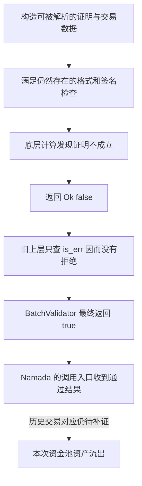

# Namada：验证器说“证明不成立”，调用者却把它当成通过

原表记录 Namada 的多资产隐私池流出约 **60 万美元**。本次查到的官方源码中，有一个可以具体定位的证明验证错误：底层返回 `Ok(false)`，表示“验证运算完成了，但证明不成立”；上层却只看有没有 `Err`，把这个否定结果漏掉了。

**代码缺陷有直接证据，和这笔历史攻击的逐笔对应仍有缺口。** 源表没有提供攻击交易哈希；官方 `masp-drain-fix` 修复和假证明回归测试支持这一调查方向，但本轮没有拿到足以完整复原当时交易的材料。以下会把代码能说明的原理与事件已知情况分开写。

## 1. Namada 和 MASP 平时负责什么

Namada 是一条使用 Rust 实现的链。MASP 是它的多资产隐私池：用户可以在同一个池子里持有不同资产，同时用零知识证明隐藏部分交易细节。

可以把它理解为一个不公开每个人明细的账本。用户花钱时，系统虽然不公开全部来龙去脉，却仍必须检查：用户是否有权花这笔钱、金额是否对得上、是否重复花费。零知识证明承担其中关键的真实性检查。

Namada 的 `verify_shielded_tx()` 会先解析交易与签名相关数据，再把证明交给 MASP 库的 `BatchValidator`。后者分别处理花费、资产转换、新隐私输出三类证明，再验证签名。

这不是 EVM 上某个地址的 Solidity 合约。这里收录的是实际的 Rust 库和 Namada 调用它的源码；CSV 不用攻击者地址冒充“漏洞合约地址”。

## 2. 一个返回值里，其实有两层意思

底层 `Batch::verify()` 返回的是 `Result<bool, SynthesisError>`。普通语言可以这样理解：

| 返回值        | 真正含义                             | 应有处理 |
| ------------- | ------------------------------------ | -------- |
| `Ok(true)`  | 验证过程完成，而且证明成立           | 允许继续 |
| `Ok(false)` | 验证过程完成，但证明不成立           | 拒绝     |
| `Err(...)`  | 验证过程出错，例如验证密钥结构不合法 | 拒绝     |

旧版 `BatchValidator::validate()` 对三类证明都用了类似检查：

```rust
if verify_proofs(&self.spend_proofs, &prepared_spend_key).is_err() {
    return false;
}
```

`is_err()` 只能识别第三行。第二行虽然答案是 `false`，外层仍是 `Ok`，所以不会被这条判断拦下来。三次检查走完，函数最终返回 `true`。

这就像机器认真算完后回答“这张凭证是假的”，接收结果的程序却只确认“机器没有死机”，随后同意付款。

这里不是底层根本没验证。保存的 `nam-bellperson` 源码确实计算证明是否成立，并返回比较结果；错误在上层读取结果的方式。

## 3. 为什么还有签名检查，仍然不够

`check_bundle()` 还会解析证明中的曲线点、处理承诺和公开输入；`validate()` 也会验证签名。随便填一串乱码，不一定能走到这个缺陷，更不等于一定能提现。

但签名能证明“某个私钥签过这份数据”，不能单独证明“这笔隐私资产真的存在、花费条件都满足”。攻击者可以为自己构造的数据签名；资产真实性还需要证明验证来约束。

官方新增的回归测试正是把这两件事拆开：它构造可解析的假证明，同时保留真实的承诺和绑定签名，并要求 `verify_shielded_tx()` 拒绝。这为“签名通过不能替代证明成立”提供了直接代码证据。

## 4. 从源码可以推导出的利用链路

下面描述的是**该验证缺陷能够造成的路径**，不是声称已经拿到并重放了本次攻击的完整参数。




这五步的核心是：**底层已经算出“证明不成立”，但上层只检查“验证过程有没有报错”，丢掉了真正的验证结论，最后向 Namada 返回了“验证通过”。**

这里有两个容易混淆的地方：**数据能解析，不代表证明成立；签名正确，也不代表签名所描述的资产真实存在。** 下面按实际代码把这条链路拆开。

1. **“准备能被程序处理的数据”：先通过格式检查，让证明进入待验证列表。**

   隐私交易中的证明不是一句文字，而是一段有规定格式的二进制数据。程序需要先把它读成证明对象，才能进行后面的数学计算。

   例如，花费证明在 `check_bundle()` 中先经过：

   ```rust
   let zkproof = match groth16::Proof::read(&spend.zkproof[..]) {
       Ok(p) => p,
       Err(_) => return false,
   };
   ```

   这一步主要回答：**“这些字节能不能被读成一个证明对象？”**

   随便塞入乱码，可能在这里就被拒绝。能够读出来，说明它符合解析要求；还不能说明它证明的事情是真的。可以类比一张填写完整的申请表：字段和格式都正确，里面的内容仍可能是假的。

   随后，代码还会检查一些基础条件。例如，花费描述中的价值承诺和签名公钥不能是特定的不合格曲线点；输出描述中的临时公钥也必须能够解析，并通过相应检查。

   **关键在于：这一阶段并没有完成证明的数学验证。** 批量验证模式下，传入的回调实际上只是把证明和公开输入加入列表：

   ```rust
   |this, proof, public_inputs| {
       this.spend_proofs.queue(proof, public_inputs.to_vec());
       true
   }
   ```

   这里的 `true` 表示这一步顺利完成、证明已经加入待验证列表。程序打算在后面的 `validate()` 中统一验证。因此，`check_bundle()` 成功和“零知识证明成立”之间，还隔着一次真正的验证。

   这一流程可以直接查看 [check_bundle 的解析与入队代码](D:/code/vibe-coding/ai-auditing-benchmark/ai-auditing-benchmark/dataset/benchmark_complete/20260620_Namada/masp/masp_proofs/src/sapling/verifier/batch.rs:78)，以及[基础条件与公开输入的处理](D:/code/vibe-coding/ai-auditing-benchmark/ai-auditing-benchmark/dataset/benchmark_complete/20260620_Namada/masp/masp_proofs/src/sapling/verifier.rs:36)。
2. **“证明在数学意义上不成立”：格式合法，但无法证明交易声称的事实。**

   以花费一笔隐私资产为例，系统不能只听提交者说“我有这笔钱”。证明需要把交易中公开的字段，与提交者掌握的秘密信息联系起来。

   可以通俗地理解为：提交者需要在不公开全部隐私信息的情况下，证明某笔非零资产确实对应有效的隐私记录，自己满足花费条件，而且交易中的承诺等字段与这笔记录相符。

   这里有三种不同的东西：

   | 内容       | 通俗含义                                                             |
   | ---------- | -------------------------------------------------------------------- |
   | 公开输入   | 交易对外给出的条件，例如树根、价值承诺、花费标识、公钥等             |
   | 秘密信息   | 用来支持这些条件的隐藏数据，例如隐私记录的内容、相关密钥和树中的路径 |
   | 零知识证明 | 让验证器确认“存在符合条件的秘密信息”的数学凭证                     |

   攻击者提交的证明，可以在格式上是一个合法对象，却无法支持对应的公开输入。**这不需要把密码学算法破解成“假证明也能算出 true”；漏洞恰恰允许底层算出 false。**

   保存的底层批验证代码最终返回：


   ```rust
   Ok(actual == y)
   ```

   `actual == y` 是数学验证结果。当等式不成立时，返回值就是：

   ```rust
   Ok(false)
   ```

   含义是：**“验证运算完成，结论为不成立。”** 这是一次正常完成的否定判断，所以外层可以是 `Ok`。只有运算过程遇到接口定义的错误，例如公开输入长度与验证密钥不匹配，才会返回 `Err(...)`。

   对应代码在[底层批验证的最终比较](D:/code/vibe-coding/ai-auditing-benchmark/ai-auditing-benchmark/dataset/benchmark_complete/20260620_Namada/nam-bellperson/src/groth16/verifier.rs:274)。
3. **“利用调用者漏看布尔值”：否定结论在这里被丢掉。**

   底层返回类型是：

   ```rust
   Result<bool, SynthesisError>
   ```

   它有两层信息。外层 `Result` 表示计算有没有正常完成，内层 `bool` 表示证明是否成立。

   漏洞版本却这样处理：

   ```rust
   if verify_proofs(&self.spend_proofs, &prepared_spend_key).is_err() {
       return false;
   }
   ```

   把三种结果代进去，就能看到问题：

   | 底层返回值              | `.is_err()` 的值  | 这条代码的行为 | 正确行为       |
   | ----------------------- | ------------------- | -------------- | -------------- |
   | `Ok(true)`            | `false`           | 继续           | 继续           |
   | **`Ok(false)`** | **`false`** | **继续** | **拒绝** |
   | `Err(...)`            | `true`            | 拒绝           | 拒绝           |

   `Ok(false)` 的内层虽然是 `false`，外层仍属于 `Ok`，所以 `.is_err()` 也是 `false`。拒绝分支完全不会执行。

   而且，这个错误在三处重复出现：


   - `spend_proofs`：花费证明。
   - `convert_proofs`：资产转换证明。
   - `output_proofs`：新隐私输出证明。

   三次检查结束后，函数直接返回 `true`。因此，只要签名等先前检查通过，而且证明验证没有返回 `Err`，**即使某一类证明明确返回 `Ok(false)`，整个 `BatchValidator::validate()` 仍可能返回 `true`。**

   这里还要说明实际顺序：`validate()` **先验证签名，再验证这三类证明**。签名失败仍会被拒绝。这也解释了为什么“随便提交任何假数据”不等于能利用成功。

   `.is_err()` 本身没有问题。对于“成功只有一个结果”的 `Result<(), Error>`，检查有没有错误可以判断成败；但对于这里的 `Result<bool, Error>`，还必须读取里面的布尔值。

   三处漏检及最后的 `true`，都在 [BatchValidator::validate](D:/code/vibe-coding/ai-auditing-benchmark/ai-auditing-benchmark/dataset/benchmark_complete/20260620_Namada/masp/masp_proofs/src/sapling/verifier/batch.rs:201)。
4. **“把错误的通过结果交给链上入口”：上层按照验证器的错误结论继续执行。**

   Namada 的调用入口依赖 `BatchValidator` 给出最终结论：

   ```rust
   if !ctx.validate(spend_vk, convert_vk, output_vk, OsRng) {
       return Err(Error::new_const("Invalid proofs or signatures"));
   }

   Ok(())
   ```

   假设一笔交易的其他检查通过，但花费证明不成立，返回值会这样传递：

   ```text
   check_bundle()
       → true：格式和相关基础条件通过，证明进入待验证列表

   signatures.verify()
       → 成功：签名检查通过

   spend_proofs.verify()
       → Ok(false)：花费证明不成立

   旧版 validate()
       → 只检查 is_err()，没有拒绝 Ok(false)
       → 其余检查也没有触发拒绝
       → 返回 true

   verify_shielded_tx()
       → 收到 true
       → 不进入“Invalid proofs or signatures”分支
       → 返回 Ok(())
   ```

   **攻击者不需要直接控制 `ctx.validate()` 的返回值。** 攻击者提交交易数据，程序自身的错误处理逻辑把底层的否定结果变成了上层的通过结果。

   `verify_shielded_tx()` 返回 `Ok(())`，具体表示“这一层证明与签名验证没有拒绝交易”。整笔交易是否最终被链接受，还取决于其他交易规则和状态检查。

   入口代码在 [verify_shielded_tx 的最终判断](D:/code/vibe-coding/ai-auditing-benchmark/ai-auditing-benchmark/dataset/benchmark_complete/20260620_Namada/namada_context/crates/shielded_token/src/validation.rs:168)。
5. **“为什么会影响资产真实性”：账面关系能够配平，不等于输入资产真实存在。**

   这里最值得展开的是：**为什么还有签名和金额相关检查，却仍然需要零知识证明？**

   它们负责的事情不同。

   **签名检查**确认相应密钥对本笔交易应签名的数据作出了授权。攻击者可以拥有自己的密钥，也可以对自己组织的数据生成真实签名。但这份签名不会自动证明“这些数据描述的隐私资产，确实是池子里一笔合法可花费的资产”。

   **绑定签名与价值承诺检查**把交易中的金额承诺、公开的价值变化和签名联系起来。它们能约束部分记账关系，但仍需要证明把这些承诺与真实的隐私记录、资产类型及相应条件联系起来。仅仅生成一个数学上有效的价值承诺，不等于已经向资金池存入了对应金额。

   用一个只说明原理的例子：

   > 一笔交易声称“花费 100 单位隐私资产，产生 100 单位新资产”。
   > 两边写成同样的数，可以让账面关系看起来配平；提交者也可能对自己组织的数据作出有效签名。
   > 但系统还必须确认：“输入的这 100 单位，究竟有没有真实、可合法花费的来源？”
   > 这个关系需要相应的证明来支持。证明不成立时，交易应当被拒绝。
   >

   漏洞使“证明不成立”失去了应有的阻断作用，于是系统可能接受没有有效证明支持的资产状态变化。**如果这种无效状态变化还能满足后续提款、转账或其他结算条件，就可能进一步消耗池中真实资产。**

   这里的 100 单位是原理示意，不是已经还原出的历史攻击参数。代码能直接证明的是验证结果被漏检；从这个错误到某笔真实提款，中间仍需要具体交易输入和链状态来连接。

   绑定签名如何根据价值承诺与 `value_balance` 计算验证公钥，可以查看 [final_check](D:/code/vibe-coding/ai-auditing-benchmark/ai-auditing-benchmark/dataset/benchmark_complete/20260620_Namada/masp/masp_proofs/src/sapling/verifier.rs:173)。

官方回归测试也特意区分了“格式、承诺和签名正常”与“证明成立”：它构造可解析的假证明，保留真实的价值承诺和绑定签名，再要求 `verify_shielded_tx()` 返回 `Invalid proofs or signatures`。**这个测试构造的是透明输入转成隐私输出的测试交易，用于检查验证入口是否拒绝假证明；它本身没有复现资金池被提空或 IBC 转出。** 这些细节可以在本地保存的[官方测试补丁](D:/code/vibe-coding/ai-auditing-benchmark/ai-auditing-benchmark/.cache/import_99_103_20260910/namada/proof_validation_test.patch:254)中核对。

修复则把接受条件写清楚：**只有 `Ok(true)` 才通过。**

```rust
let mut verify_proofs = |batch: &Batch, vk| {
    matches!(batch.verify(vk, &mut rng), Ok(true))
};

if !verify_proofs(&self.spend_proofs, &prepared_spend_key) {
    return false;
}
```

同样的处理用于转换证明和输出证明，`Ok(false)` 与 `Err(...)` 都会被拒绝。这与[官方 MASP 修复 PR #114](https://github.com/namada-net/masp/pull/114)及本地保存的修复版本一致。

以上是对保存的漏洞版本、底层验证器和官方测试内容的重新核对。**可以确定的根因是“漏检证明验证返回的 false”；现有材料仍不足以把它与该次约 60 万美元流出的每笔交易、提款步骤和 IBC 路径逐一对应。** 这一限制来自历史交易证据缺口，不影响对上述代码缺陷的确认。

为什么这可能导致资金损失：隐私池里的资产由很多用户共同提供，而每笔支出是否真实有效，依赖证明约束。如果上层把“不成立”的证明当成通过，账本就可能批准本来无权发生的资产操作。**本轮并未证明任意假证明都能直接提款，也没有把单独的单元测试说成历史攻击复现。**

## 5. 这个版本和官方修复怎样对应

| 证据                   | 核对结果                                                                                                         |
| ---------------------- | ---------------------------------------------------------------------------------------------------------------- |
| 事发前 Namada 上游提交 | `6714f3a363d7a2eb23fec00209ac1604acb5f205`，2026-01-14                                                         |
| 该提交的依赖           | `Cargo.toml` / `Cargo.lock` 指向 `masp_proofs 3.0.9`                                                       |
| 收录的 MASP 源码提交   | `7fcae1072d692221a0620469da7815e6d388ba54`；关键文件与发布包逐字节一致                                         |
| 修复前包校验           | `masp_proofs 3.0.9` 与 `nam-bellperson 0.26.6-nam.1` 的下载 SHA-256 都与锁文件一致                           |
| MASP 修复              | [官方 PR #114](https://github.com/namada-net/masp/pull/114)，2026-08-03 合并                                      |
| Namada 接入修复        | [官方 PR #5026](https://github.com/namada-net/namada/pull/5026)，分支名 `tiago/masp-drain-fix`，2026-08-07 合并 |
| 官方回归测试           | [假证明测试提交](https://github.com/namada-net/namada/commit/24d5490cf79828cabcbd48aa6f5dd72256cca1b7)            |

修复后的关键条件改成只接受 `Ok(true)`：

```rust
matches!(batch.verify(vk, &mut rng), Ok(true))
```

这样 `Ok(false)` 和 `Err(...)` 都不会放行。这里只展示修复原理；数据集中的待审计源码仍保留修复前的行为。

## 6. 历史事件目前知道什么，还有什么不知道

[Namada 官方 2026-06-20 声明](https://x.com/namada/status/2068265932368347358)确认协议发生了利用事件并在调查。[原始 F12 告警](https://x.com/f12sec/status/2068065239187218505)及[本次源表快照](sources/20260910_sheet_rows_99_103.json)记录了约 60 万美元的规模，以及链上资产已转出、索引器仍显示旧余额的现象。

“资产经 IBC 转走”和“索引器显示旧余额”分别说明资产去向和监控问题。它们本身不足以证明底层一定是 IBC 验证漏洞，也不足以证明上述证明校验错误就是当时每笔转出的唯一原因。

本次没有核实的项目包括：代表性攻击交易哈希、攻击时节点的实际二进制版本、完整交易输入、逐笔资金结算过程。因此 CSV 的攻击交易、漏洞合约地址留空，项目名与漏洞详情明确注明历史对应关系待核实；不填一个看似完整但没有依据的地址。

目录和 CSV 使用源表日期 **2026.06.20**。60 万美元是源表估算，英文 CSV 写 **600 千美元**，不表示本轮重新估值或确认了最终净损失。

## 7. 代码从哪里读

| 问题                             | 位置                                                                                                                                                                                                                                 |
| -------------------------------- | ------------------------------------------------------------------------------------------------------------------------------------------------------------------------------------------------------------------------------------ |
| `Result<bool, ...>` 从哪里返回 | [batch.rs：`Batch::verify`](../../dataset/benchmark_complete/20260620_Namada/masp/masp_proofs/src/sapling/verifier/batch.rs#L24)                                                                                                    |
| 哪三处漏看了`false`            | [batch.rs：`BatchValidator::validate`](../../dataset/benchmark_complete/20260620_Namada/masp/masp_proofs/src/sapling/verifier/batch.rs#L201)                                                                                        |
| 底层如何给出真假结果             | [nam-bellperson：单证明比较](../../dataset/benchmark_complete/20260620_Namada/nam-bellperson/src/groth16/verifier.rs#L103)、[批验证入口](../../dataset/benchmark_complete/20260620_Namada/nam-bellperson/src/groth16/verifier.rs#L107) |
| Namada 如何调用验证器            | [validation.rs：`verify_shielded_tx`](../../dataset/benchmark_complete/20260620_Namada/namada_context/crates/shielded_token/src/validation.rs#L122)                                                                                 |
| 当时源码依赖什么版本             | [Namada Cargo.toml](../../dataset/benchmark_complete/20260620_Namada/namada_context/Cargo.toml#L194)                                                                                                                                  |

[完整版来源说明](../../dataset/benchmark_complete/20260620_Namada/SOURCE.md)保存版本、哈希和证据限制；[精简版来源说明](../../dataset/benchmark_simplified/20260620_Namada/SOURCE.md)说明裁剪范围。精简版适合沿着返回值和调用链阅读，不是一个独立可运行的 Namada 节点。

本轮做了源文件一致性、发布包校验、调用链与修复差异核对，没有运行 Rust 全套测试、下载证明参数或重放主网交易。
