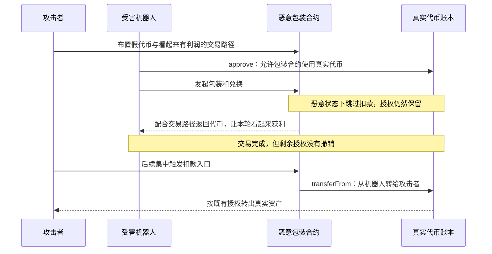

# JaredFromSubway：交易赚了小钱，却给对手留下了以后扣款的权限

这次事件的关键是**交易结束了，授权没有跟着结束**。公开分析指出，JaredFromSubway 的自动交易机器人把真实代币的使用权限交给了攻击者控制的假包装合约。对方让部分交易看起来有利润，却没有消耗这些权限，最后再凭留下的授权转走机器人的资产。[BlockSec 分析](https://blocksec.com/blog/web3-security-jaredfromsubway-aztec-more)、[CertiK 分析](https://www.certik.com/blog/jaredfromsubway-mev-bot-incident-analysis)

**本条已保存受害机器人的链上运行时字节码，原始源码和可信反编译尚未取得。** 下面把报告支持的机制、便于理解的假设例子和仍缺的证据分开说明。两套目录保存同一份完整机器码，并提供固定历史区块的 RPC 取证材料；具体 Solidity 函数和源码行号仍不能确认。

## 这些合约分别是干什么的

| 对象                       | 正常职责或事件中的角色                                                           |
| -------------------------- | -------------------------------------------------------------------------------- |
| Jared 的 MEV 机器人        | 自动寻找交易机会，使用自己的资金执行兑换。这里的受害资金合约是`0x1f2f…f387`。 |
| WETH、USDC、USDT 代币合约  | 记录各地址的真实代币余额，以及谁被允许替谁转走多少代币。                         |
| 包装合约，通常叫 wrapper   | 正常情况下收进一种真实代币，再给调用者相应的包装代币；赎回时执行反向过程。       |
| 攻击者的假包装代币与交易池 | 构造看起来能赚钱的兑换路线，诱使机器人与之交互。它们是攻击设施。                 |
| 攻击者的批量执行合约       | 最后集中调用假包装合约，利用留下的授权收走资产。                                 |

受害 bot 地址由 [BlockSec](https://blocksec.com/blog/web3-security-jaredfromsubway-aztec-more) 和 [CertiK](https://www.certik.com/blog/jaredfromsubway-mev-bot-incident-analysis) 共同指认。真实资产与包装凭证要分开理解：一个新合约即使把自己取名为“Wrapped Ether”，也不会因此成为真正的 WETH。ERC-20 的 `name()`、`symbol()` 是显示信息，不是身份认证。[ERC-20 标准](https://eips.ethereum.org/EIPS/eip-20)

## 漏洞具体在哪里

问题落在受害机器人使用不可信 wrapper 时的**授权生命周期**。报告描述的正常意图是：先批准 wrapper 使用一笔真实代币，再调用 `wrapTo()`；机器人预期 wrapper 会通过 `transferFrom` 把这笔币收走。恶意 wrapper 却可以跳过收款，让授权留到以后，而机器人没有核对或撤销剩余额度。[BlockSec 对授权路径的说明](https://blocksec.com/blog/web3-security-jaredfromsubway-aztec-more)

这里有三本不同的账，不能只看第一本：

| 需要看的状态             | 它回答的问题                             |
| ------------------------ | ---------------------------------------- |
| 机器人的真实代币余额     | 这次交易后，我手上的钱有没有增加？       |
| 机器人收到的包装代币     | 对方给了我多少凭证？这些凭证由谁兑现？   |
| 真实代币合约中的授权余额 | 对方以后还可以从我这里拿走多少真实代币？ |

`approve` 是给某个 spender 的使用权限。`transferFrom` 才是第三方使用权限、把代币从授权者名下转走的操作。权限保存在真实代币合约的账本里，并没有“本次套利结束就自动失效”的标准规则。[ERC-20：approve、allowance 与 transferFrom](https://eips.ethereum.org/EIPS/eip-20#methods)

**具体受害源码函数名和行号尚不能确认。** `wrapTo()`、`getStatus()`、`withdraw()` 等名称在本说明中来自安全报告，不代表已经取得这些合约的原始实现。尤其是恶意 wrapper 的 `withdraw()`，属于攻击端的扣款入口，不能拿来代替受害机器人的漏洞代码。

## 攻击者怎样一步步利用

下面是公开分析支持的核心路径；图中省略了中间交易池和资金调度合约。




**这条攻击链的关键，是机器人把“允许对方花钱”误当成了“对方已经把这笔钱花完”。** 攻击者让机器人每次都获得一点真实收益，同时把没有用掉的扣款权限保留下来。等权限覆盖了足够多的资产，再统一扣款。[CertiK 事件分析](https://www.certik.com/blog/jaredfromsubway-mev-bot-incident-analysis)

理解它，先把三个东西分清楚：

| 对象                                 | 它控制什么                                           |
| ------------------------------------ | ---------------------------------------------------- |
| 机器人 B                             | 持有真实 WETH、USDC、USDT，并主动发起交易和授权      |
| 恶意包装合约 W，也就是 wrapper       | 控制包装代币的发行、包装和赎回逻辑，以及后续扣款入口 |
| 真实代币合约 T，例如真正的 WETH 合约 | 保存机器人的真实余额，以及机器人给 W 的授权额度      |

**钱和授权都记在真实代币 T 的账本里。** 恶意 wrapper 自己发行的“包装代币”，只是攻击者能控制的一种凭证。

先看机器人为什么会主动进入这条路线。

机器人会寻找一组可以连续执行的兑换，期待最后收到的真实资产比开始投入的更多。攻击者因此布置了假包装代币和交易池，让某些路线看起来存在价差。

例如，CertiK 报告描述过这样的路线：

```text
真实 WETH
    ↓ 包装
攻击者发行的 fWETH
    ↓ 在攻击者布置的池子兑换
另一种代币 fCAP
    ↓ 再兑换
真实 WETH
```

攻击者向部分池子放入真实资产，并安排兑换比例，让机器人早期确实能够赚到一点真实 WETH。这样，机器人执行这条路径时，交易可以成功结束，资产余额也可以增加。[CertiK 对交易路线的分析](https://www.certik.com/blog/jaredfromsubway-mev-bot-incident-analysis)

这里不需要攻击者控制机器人的私钥。攻击者控制的是**机器人接触到的代币、交易池和报价环境**；机器人按照自己的策略，主动决定交易。

而且，“交易赚到了真实 WETH”只能证明这次交易有收益，不能证明对方的合约今后不会使用其他权限。

接下来，为什么包装操作需要机器人先授权？

因为这里采用的是“wrapper 来收币”的流程。

假设机器人准备包装 100 个真实代币 T。机器人先调用：

```text
机器人 B → 真实代币 T：
approve(W, 100)
```

这相当于让真实代币合约记下：

```text
机器人 B 允许包装合约 W，最多从 B 的余额中转走 100 个 T。
```

对应的授权状态可以写成：

```text
T.allowance(B, W) = 100
```

**这一步没有转走任何币。** 如果机器人原来有 1,000 个 T，授权后仍然有 1,000 个 T，只是 W 获得了扣款权限。

随后，机器人才调用 wrapper：

```text
机器人 B → 包装合约 W：
wrapTo(...)
```

正常 wrapper 会在内部继续调用：

```text
包装合约 W → 真实代币 T：
transferFrom(B, W, 100)
```

此时，真实代币合约看到的直接调用者是 **W**。它检查的是机器人有没有授权 **W**，而不是有没有授权发起整个交易的某个外部账户。[ERC-20 的授权与转账规则](https://eips.ethereum.org/EIPS/eip-20#methods)

正常情况下，这 100 个 T 被收进 wrapper，机器人得到对应的包装凭证；对于这里假设的有限授权，这笔扣款也会用掉相应额度。

真正的转折发生在 `wrapTo()` 内部。

机器人能够决定“我要调用 `wrapTo()`”，但**不能仅凭函数名，就保证对方一定会收取真实代币**。

恶意 wrapper 可以按照自己的代码执行下面这类行为：

```text
接受机器人发来的包装请求
    ↓
没有向真实代币合约发起 transferFrom
    ↓
仍然配合发放包装代币、执行兑换或赎回
    ↓
让整条交易路线向机器人支付一点真实资产
```

包装代币由攻击者控制。对方完全可以发出没有对应真实资产存入的凭证，再通过自己控制的其他环节，让交易看起来正常结束。BlockSec 报告指出，在恶意状态下，`wrapTo()` 跳过了扣款，而后续 `unwrap()` 仍向机器人支付攻击者安排的真实代币收益。[BlockSec 对包装与赎回流程的分析](https://blocksec.com/blog/web3-security-jaredfromsubway-aztec-more)

**由于 `transferFrom` 没有发生，真实代币合约中的授权额度就没有被用掉。**

下面用一组假设数字比较。数字只是解释账本变化，不是历史交易金额；忽略手续费，假设最初余额是 1,000，每次授权 100。

| 阶段         | 正常流程：机器人余额 | 正常流程：W 的剩余授权 | 恶意流程：机器人余额 | 恶意流程：W 的剩余授权 |
| ------------ | -------------------: | ---------------------: | -------------------: | ---------------------: |
| 开始         |                1,000 |                      0 |                1,000 |                      0 |
| 授权 100     |                1,000 |                    100 |                1,000 |                    100 |
| 执行包装     |                  900 |                      0 |                1,000 |                    100 |
| 整条路线结束 |                1,001 |                      0 |                1,001 |          **100** |

这张表假设：

- 正常流程收走 100，最终返回 101。
- 恶意流程没有收走那 100，只向机器人支付 1。

两个结果看起来都是“机器人赚了 1”，但恶意流程还留下了 **100 的后续扣款权限**。

因此，只看交易前后余额，会漏掉另一项状态变化：**对手现在还有权从这里拿走多少钱。**

区块状态开关的作用，是让同一套包装逻辑在不同时间表现不同。

按照 BlockSec 的描述，协调合约保存了一个激活区块号，`getStatus()` 比较它与当前区块号：

```text
记录的激活区块号 == 当前区块号 → 状态为 1
否则                         → 状态为 0
```

对应行为是：

| 状态 | `wrapTo()` 的行为                | 授权结果             |
| ---- | ---------------------------------- | -------------------- |
| 0    | 正常调用真实代币的`transferFrom` | 授权按实际扣款被消耗 |
| 1    | 跳过`transferFrom`               | 授权保留下来         |

这让攻击者可以先让交易正常运行，再在选定的区块切换行为。[BlockSec 对 `getStatus()` 的说明](https://blocksec.com/blog/web3-security-jaredfromsubway-aztec-more)

这里有两个细节。

**第一，执行顺序有影响。** 按这种设计推导，要让机器人的某次调用读到激活状态，激活操作必须先发生，机器人的调用随后发生，而且两者处于对应的同一区块。激活操作如果排在机器人之后，就不能倒过来改变机器人已经执行过的调用。

这也解释了为什么“此前模拟正常”“前几次实盘正常”，都不足以保证下一次行为相同：合约读取的状态可能已经变化。这里不需要假设合约能够神奇地识别自己正在被模拟。

**第二，区块开关的有效期和授权的有效期是两回事。** 到了下一个区块，`getStatus()` 可以重新返回 0，但它不会自动替机器人去真实代币合约里撤销授权。留下的额度仍然存在。

最后，集中扣款是怎样发生的？

攻击者此前已经在 wrapper 中准备了自己能够调用的扣款入口。到最后阶段，执行关系变成：

```text
攻击者
    ↓ 触发扣款入口
已经获得授权的 wrapper W
    ↓ 调用真实代币合约
T.transferFrom(机器人 B, 攻击者收款地址, 扣款数量)
```

这里最重要的是：**调用真实代币 `transferFrom` 的，仍然是此前获授权的 W。**

如果只有 W 获得授权，攻击者直接用自己的地址调用 `transferFrom`，并不能自动使用 W 的额度。因此，攻击者需要通过自己控制的 W 来完成这次扣款。

对于普通 ERC-20 转账，相关的核心条件包括：

```text
机器人 B 的真实余额足够；
直接调用者 W 的剩余授权足够。
```

真实代币合约不会额外询问：

```text
这是不是上一次包装操作？
机器人当初为什么给这个授权？
这次收款人是不是机器人原本期待的对象？
上一次套利是不是已经结束？
```

普通 `approve` 给出的是某个 spender 的额度，**没有把这项权限限定为“只能在接下来的那一次 wrapTo 中使用”**。[ERC-20 标准](https://eips.ethereum.org/EIPS/eip-20#approve)

继续前面的例子：机器人交易结束时有 1,001 个 T，W 仍有 100 的额度。W 后来扣走 100，机器人就剩下 901。先前赚到的 1 并不会阻止这次扣款。

原来的获利交易已经成功提交。后面的扣款是另一笔交易，不会重新进入原来那次套利的盈利检查。

“多次交互后积累授权”也需要准确理解。

**对同一个真实代币、同一个机器人、同一个 wrapper，重复执行 `approve(W, 100)`，标准语义是把额度设为 100，并不会自动变成 200、300。**

攻击者可以积累的是不同组合上的剩余额度，例如：

| 真实代币 | 获权合约  | 剩余额度，假设值 |
| -------- | --------- | ---------------: |
| WETH     | Wrapper A |         100 WETH |
| WETH     | Wrapper B |          80 WETH |
| USDC     | Wrapper C |      50,000 USDC |
| USDT     | Wrapper D |      30,000 USDT |

还可能通过后续更大的交易，让某个 wrapper 最后一次获得的额度变大。所以，**不能把所有 `Approval` 事件的金额直接相加，作为最后能盗走的钱**；必须看每个组合最终还剩多少授权，以及机器人当时实际持有多少资产。

Blockaid 统计了 42 笔交易中的 423 次授权事件，并描述了最终批量调用 66 个诱饵合约的扣款过程；CertiK 补充，其中 60 个持有目标机器人的授权。这些计数反映了多次授权与多合约扣款的过程，不等于存在 423 份可以直接相加的有效额度。[Blockaid 事件报告](https://blockaid.io/blog/the-predator-becomes-the-prey-how-a-counter-mev-honeypot-drained-75m-from-jaredfromsubway)、[CertiK 事件分析](https://www.certik.com/blog/jaredfromsubway-mev-bot-incident-analysis)

这里应检查的交易结束条件，除了实际资金收付和收益，还包括**本次授予不可信合约的权限是否已经清除，或是否符合明确允许保留的额度**。即使只授权本次所需的精确数量，只要对方没有使用、机器人也没有撤销，这笔有限授权仍然能被留到以后使用。

以上具体攻击机制依据公开报告；账本数字和部分调用表示是为了讲清原理而作的示意。当前本地案例尚未取得受害机器人的原始源码，因此这里没有把报告结论写成已经核实的受害源码行号。

[BlockSec 攻击分析](https://blocksec.com/blog/web3-security-jaredfromsubway-aztec-more)

Blockaid 报告统计了 42 笔交易中的 423 次授权事件，最终批量调用 66 个假合约。CertiK 对最后阶段补充说，被调用的 66 个诱饵合约中有 60 个持有目标机器人的授权。这些数字是报告统计，本次没有下载完整调用记录重新计数。[Blockaid](https://blockaid.io/blog/the-predator-becomes-the-prey-how-a-counter-mev-honeypot-drained-75m-from-jaredfromsubway)、[CertiK](https://www.certik.com/blog/jaredfromsubway-mev-bot-incident-analysis)

## 用一组假设数字说明为什么能拿走钱

下面是解释授权账本的**假设例子，不是历史交易重放**。为便于观察，只设一个真实代币 T 和一个恶意 wrapper W，忽略交易费。

开始时，机器人 B 有 1,000 个 T。它想通过 W 做一笔交易，于是允许 W 使用 100 个 T：

```text
B 的余额 = 1,000
W 可以从 B 转走的额度 = 100
```

这一步还没有把 100 个 T 转出去。假设 W 接下来没有真正收取这 100 个 T，却让整条路线向 B 返回了 1 个 T，那么结束时账本可能是：

```text
B 的余额 = 1,001
W 可以从 B 转走的额度 = 100
```

只检查余额，B 看到自己增加了 1 个 T。但 W 仍有权拿走 100 个 T。之后，W 调用真实代币的 `transferFrom(B, 攻击者, 100)`，余额变成 901；攻击者付出的小额诱饵与最终可提取的授权额度是不对称的。这是用标准授权语义推导的示意，不是在断言机器人历史代码只检查了某一个变量。[ERC-20 授权语义](https://eips.ethereum.org/EIPS/eip-20)

还需要避免一个常见误读：**对同一个 spender 重复 `approve(100)`，标准语义通常是把授权设成 100，不是每次都再加 100。** 因此，报告所说“积累授权”，不能直接理解为把所有 Approval 事件金额相加。多个 wrapper、不同真实代币以及各自最后剩下的额度，都必须分别查看；最后能转出的金额还受机器人真实余额约束。若要复算历史损失，需要历史授权状态和实际转账记录。

## 日期和金额采用什么口径

| 项目               | 本条记录                                                                                                                              |
| ------------------ | ------------------------------------------------------------------------------------------------------------------------------------- |
| 数据集目录         | `20260621_JaredFromSubway`                                                                                                          |
| 源表               | 本次抓取的[当前第 99 行](https://docs.google.com/spreadsheets/d/1ENyVv94OaHW2BesbrSaiIluwjHMjuYrSR1aFk_LxS3Y/edit?gid=0#range=A99:N99) |
| 数据集日期         | `2026.06.21`，保留源表 `date`                                                                                                     |
| 报告给出的扣款时间 | `2026-06-20 18:49:11 UTC`，区块 `25360696`                                                                                        |
| 对应北京时间       | `2026-06-21 02:49:11`；UTC 的 6 月 20 日与源表 6 月 21 日可以对应同一笔交易                                                         |
| 代表交易           | [0x2be8704f…bcf3e65](https://etherscan.io/tx/0x2be8704f5a59b69e0b71f64aefdb99eb0e8ae9fb3926147c581910d71bcf3e65)                      |
| 数据集损失         | USD 7,500,000；中文 750 万美元，英文 7,500 千美元                                                                                     |

时间和代表性资产转移来自 [Blockaid 的事件报告](https://blockaid.io/blog/the-predator-becomes-the-prey-how-a-counter-mev-honeypot-drained-75m-from-jaredfromsubway)。金额保持源表口径，不能用今天的币价回算后直接覆盖历史估值。

| 来源     | 报道资产或金额                                                      | 使用限制                                                     |
| -------- | ------------------------------------------------------------------- | ------------------------------------------------------------ |
| Blockaid | 1,474.58 WETH、2,870,573 USDC、2,035,760 USDT，约 750 万美元        | 这是报告给出的集中转出数字，本次未独立按 receipt 重算。      |
| CertiK   | 1,474 WETH、2,869,812.43 USDC、2,032,769.62 USDT，同样约 750 万美元 | 与 Blockaid 的逐币数字不完全一致；不能拼成一份所谓精确账本。 |
| BlockSec | 事件总损失约 1,500 万美元                                           | 这是另一报道口径，未与本条代表交易逐钱包、逐交易对齐。       |

[Blockaid 金额](https://blockaid.io/blog/the-predator-becomes-the-prey-how-a-counter-mev-honeypot-drained-75m-from-jaredfromsubway)、[CertiK 资金流](https://www.certik.com/blog/jaredfromsubway-mev-bot-incident-analysis)、[BlockSec 总额](https://blocksec.com/blog/web3-security-jaredfromsubway-aztec-more)。

**本条保留约 750 万美元，不把 750 万与 1,500 万相加，也不声称单笔代表交易转出了 1,500 万美元。** 本次没有实测攻击利润、逐笔确认诱饵成本或对更大范围的损失归并；这些与报道的受影响资金规模是不同问题。

## 地址不要填反

| 地址                                                                                                                 | 角色                                                  |
| -------------------------------------------------------------------------------------------------------------------- | ----------------------------------------------------- |
| [0x1f2f10d1c40777ae1da742455c65828ff36df387](https://etherscan.io/address/0x1f2f10d1c40777ae1da742455c65828ff36df387) | 受害 MEV 机器人资金合约；本条受害合约字段只填它。     |
| [0x4ee0b6e9f9c4886beeef2ebd7fc27223169531ce](https://etherscan.io/address/0x4ee0b6e9f9c4886beeef2ebd7fc27223169531ce) | 攻击者的假 WETH 包装合约，也是获授权的 spender 示例。 |
| [0x3e37f4a10d771ba9de44b6d301410b1bedea65d0](https://etherscan.io/address/0x3e37f4a10d771ba9de44b6d301410b1bedea65d0) | 攻击者及收款地址。                                    |
| [0xb84db016324e8f2bfdd8dd9c260338aee0a8df52](https://etherscan.io/address/0xb84db016324e8f2bfdd8dd9c260338aee0a8df52) | 攻击方集中执行与状态协调合约。                        |

角色依据 [CertiK 地址表](https://www.certik.com/blog/jaredfromsubway-mev-bot-incident-analysis)及 [Blockaid 的扣款路径](https://blockaid.io/blog/the-predator-becomes-the-prey-how-a-counter-mev-honeypot-drained-75m-from-jaredfromsubway)。源表的 `malicious_address` 是恶意对象信息，不能原封不动搬进“漏洞合约地址”。

## 已保存的受害机器人链上字节码

受害地址的 Ethereum 运行时字节码现已存入两个 dataset 视图，长度为 **13,835 字节**。完整和精简目录各有 `.hex` 文本与 `.bin` 二进制，两份内容一致。由于本次保存的是机器码，没有对它做函数级裁剪。

| 文件 | 完整版 | 精简版 |
| --- | --- | --- |
| 运行时字节码文本 | [JaredFromSubway.runtime.hex](../../dataset/benchmark_complete/20260621_JaredFromSubway/onchain/JaredFromSubway.runtime.hex) | [JaredFromSubway.runtime.hex](../../dataset/benchmark_simplified/20260621_JaredFromSubway/onchain/JaredFromSubway.runtime.hex) |
| 原始二进制 | [JaredFromSubway.runtime.bin](../../dataset/benchmark_complete/20260621_JaredFromSubway/onchain/JaredFromSubway.runtime.bin) | [JaredFromSubway.runtime.bin](../../dataset/benchmark_simplified/20260621_JaredFromSubway/onchain/JaredFromSubway.runtime.bin) |
| 区块、哈希、获取方式 | [bytecode.json](../../dataset/benchmark_complete/20260621_JaredFromSubway/bytecode.json) | [bytecode.json](../../dataset/benchmark_simplified/20260621_JaredFromSubway/bytecode.json) |

读取时固定了攻击区块 **25360696** 和前一区块 **25360695** 的区块哈希，并用明确区块号再次查询；四次历史结果一致。另一个公开节点返回的当前 runtime 也相同，但它只是交叉检查，历史样本依据固定区块查询。

这些原始字节的 SHA-256 是 `204a4fde84952e40b97a2841629b35e0abf6d7a3070a6fa7b87d4df6ae044708`。攻击交易的[原始 receipt](../../dataset/benchmark_complete/20260621_JaredFromSubway/evidence/rpc/receipt-response-drpc.json)确认成功执行、区块和时间一致，并包含 50 条从受害地址转出的真实代币 Transfer 事件。这里只核对地址与交易关联，没有用事件数代替诱饵合约调用数，也没有重建前序全部授权。

## 对应材料、代码定位与尚缺证据

| 阅读入口               | 完整版                                                                                    | 精简版                                                                                           |
| ---------------------- | ----------------------------------------------------------------------------------------- | ------------------------------------------------------------------------------------------------ |
| 来源状态               | [SOURCE.md](../../dataset/benchmark_complete/20260621_JaredFromSubway/SOURCE.md)           | [SOURCE.md](../../dataset/benchmark_simplified/20260621_JaredFromSubway/SOURCE.md)                |
| 机制与角色             | [事实索引](../../dataset/benchmark_complete/20260621_JaredFromSubway/evidence/claims.json) | [最小路径](../../dataset/benchmark_simplified/20260621_JaredFromSubway/evidence/attack_path.json) |
| 原始源码、反编译与行号 | **没有取得，不能给源码定位**                                                        | **没有取得，不做猜测性裁剪**                                                               |

要把本条升级为可审计的代码样本，仍需要取得受害 bot 的真实源码或有明确来历的反编译材料，并核对部署版本、依赖、授权入口和交易结束时的处理。代表交易的原始回执已保存；仍需前序授权交易的原始回执、完整调用轨迹和授权状态，才能检查报告中的全部金额和计数。

Etherscan 网页直接读取仍失败；链上字节码、区块和交易回执现已通过只读 RPC 取得。此前未获授权的 GitHub 版本元数据请求没有重试。原始 Solidity 和可信反编译仍未取得，不能把保存机器码说成已经恢复源码。

本条没有编译 Solidity、重放攻击或证明反编译与字节码等价。历史字节码已按固定区块查询核对，文件 SHA-256 用于验证保存内容；这两项校验不能替代源码分析或交易重放。完整尝试和明确缺口保存在[检索记录](../../dataset/benchmark_complete/20260621_JaredFromSubway/evidence/source_search.json)中。
