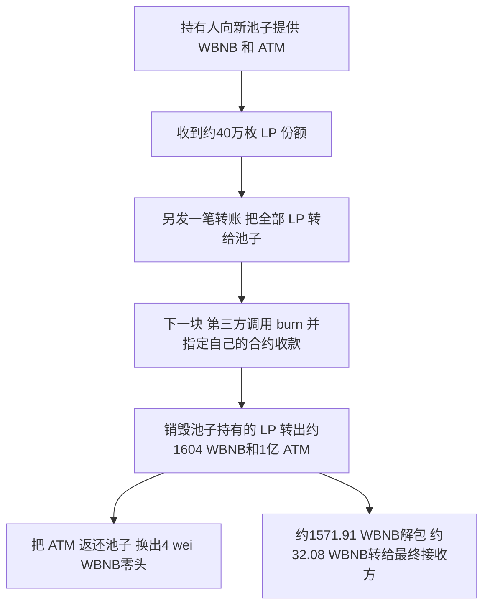

# ATM：LP 先转进池子，别人随后把它换成了池内资产

> 收录状态：2026-09-15 已从两套 dataset 目录及中英文 CSV 移除。本篇说明和引用资料继续保留，用于解释 LP 分步操作风险，不计入数据集样本。

**这次能独立核实的资金流出，来自一笔 LP 赎回：流动性持有人先把 LP 凭证单独转进交易池，另一个地址随后调用公开的 `burn(to)`，把这些 LP 对应的 WBNB 和 ATM 领到了自己的合约。** 池子在赎回时读取的是“池子自己持有多少 LP”，收款地址由调用方指定；它没有为上一笔转入记录一个专属领取人。

还有一处必须说明：源表列出的 `0x939f…` 并不是这里实际拿走资金的交易。它与提款交易在同一区块，但排在后面，成功回执没有任何日志。真正的 LP 销毁和大额 WBNB 转出，出现在 `0x4e9f…`。因此本案例保留源表日期、损失和交易链接，同时补上独立核实的提款交易，不能把两者混成同一笔。

## 合约做什么，哪些资产容易混淆

ATM/WBNB 池子用来让用户兑换 ATM 与 WBNB。向池子同时提供两种资产的人，会收到 LP 代币。LP 相当于份额凭证，代表持有人可以按比例取回两种底层资产。这里有三种不同的代币：ATM、WBNB，以及池子合约自己发行的 LP。

| 对象                  | 地址                                           | 作用                                               |
| --------------------- | ---------------------------------------------- | -------------------------------------------------- |
| ATM/WBNB 池暨 LP 合约 | `0x9753a64fb7c233fdc43f04dab9cca88e1e229eba` | 保管底层资产，也记录 LP 份额；实际赎回入口在这里。 |
| ATM                   | `0xFdC76B8b2F775656E8A867FcC3282c969D2d86b0` | 池子的一侧资产；本次未取得其原始源码。             |
| WBNB                  | `0xbb4CdB9CBd36B01bD1cBaEBF2De08d9173bc095c` | 池子另一侧资产，是主要移出价值。                   |
| 原 LP 持有人          | `0xbe8351c14e5108a57a545dfa8669fa31aa6adc68` | 先加池，再把收到的全部可转让 LP 转给池子。         |
| 提款交易发起方        | `0x0eb4075c87ccd23a7ae1e00d77b043e4e8cc5894` | 发起实际资金移出交易。                             |
| 提款执行合约          | `0x48b549e6b551c151bd392bb9acab1f88263adf48` | 作为`burn` 的调用方及底层资产接收方。            |
| 最终 WBNB 接收方      | `0xfba52f861e79c46333a308ba8f86bf136a44b2d3` | 收到约 32.08 WBNB；不代表全程净收益。              |

池子地址作为本条记录的受影响合约保存。现有证据没有证明 PancakeSwap 标准实现出现了新的代码缺陷，也没有证明 ATM 的转账规则是此次提款的根因。更准确的分类是：**LP 单独交到池子后，公开赎回入口被第三方使用。** “误转”是公开研究对持有人行为的解释；链上能直接证明的是那笔转入以及随后由其他地址领取，无法证明持有人当时的主观意图。

## 问题出在哪里

先看 LP 的普通转账。原始源码中的 [`transfer`](sources/20260622_ATM/complete/contracts/PancakePair.sol#L173) 调用 [`_transfer`](sources/20260622_ATM/complete/contracts/PancakePair.sol#L162)，只是把发送方的 LP 余额减掉，再给接收方增加。接收方可以是池子自己。

因此，把 LP 发送到池子地址后：

```text
原持有人的 LP 余额减少
池子自己的 LP 余额增加
池内 WBNB 和 ATM 的余额此时不因这笔 LP 转账而减少
没有建立“这些 LP 只能由原持有人取回”的记录
```

随后，[`burn(address to)`](sources/20260622_ATM/complete/contracts/PancakePair.sol#L431) 执行的关键代码是：

```solidity
uint liquidity = balanceOf[address(this)];
bool feeOn = _mintFee(_reserve0, _reserve1);
uint _totalSupply = totalSupply;
amount0 = liquidity.mul(balance0) / _totalSupply;
amount1 = liquidity.mul(balance1) / _totalSupply;
_burn(address(this), liquidity);
_safeTransfer(_token0, to, amount0);
_safeTransfer(_token1, to, amount1);
```

`balanceOf[address(this)]` 指的是池子地址在 LP 账本里的余额，并非调用者的 LP 余额。`to` 是调用者传入的收款地址。这里只要求确实有 LP 可销毁、能算出正的赎回量；代码没有把领取权绑定到上一笔 LP 转入的发送者。`lock` 修饰符防止同一池子重入，不负责判断谁有权领取上一笔留下来的 LP。

这段设计要求上层调用把“送入 LP”和“调用 burn 领取资产”连在一个安全的流程里。若先发一笔普通 LP 转账，再等待另一笔交易领取，中间留下的 LP 可以被其他人使用。把 LP 交给池子，也不是销毁 LP 或锁定流动性：真正减少 LP 总供应量的是之后执行的 [`_burn`](sources/20260622_ATM/complete/contracts/PancakePair.sol#L151)。

本次保存的是完整标准池源码，并保留 `_mintFee` 等计算依赖，避免把赎回公式简化成一个缺少供应量变化背景的伪代码合约。源码来自已验证参考池；目标池当前完整运行时代码与参考完全一致，历史运行时代码未取到，详见后文边界。

## 交易怎样一步步把钱转走

下述区块、顺序和数量来自[本地原始回执](sources/20260622_ATM/complete/evidence/attack_receipt.json)、[解码事件](sources/20260622_ATM/complete/evidence/decoded-events.json)和[区块内顺序](sources/20260622_ATM/complete/evidence/block-and-order.json)。数字按 18 位小数展示，原始整数也一并保存；ATM 的 18 位小数展示未通过其源码独立核实。



**第一步，加池并取得 LP。** 在区块 `105692719` 的[加池交易](https://bscscan.com/tx/0x2bb7f486730d7d6a271a2a0c18cec45c89f447a95e956415f18d2a0671ec789c)中，持有人向新建池子转入 `1603.989214300816940000 WBNB` 和 ATM 原始整数 `100000000000000000000000000`（按 18 位展示为 1 亿枚）。池子给持有人铸造 `400498.341357466415661652 LP`，另有 `1000` 个 LP 最小单位永久留在零地址。这符合原始 [`mint`](sources/20260622_ATM/complete/contracts/PancakePair.sol#L407) 中首次加池保留 `MINIMUM_LIQUIDITY` 的处理。

**第二步，把收到的全部 LP 单独发送给池子。** 在区块 `105692847` 的[LP 转账交易](https://bscscan.com/tx/0x5c27edc326e38641d8ce6093cd7f15ae5fca039f5fb988b7f10cb432e6e3a056)中，唯一的日志是持有人向池子转出上述 `400498.341357466415661652 LP`。这与第一步给持有人铸造的数值完全相等。底层 WBNB 和 ATM 仍放在池子里，但可赎回的 LP 凭证已经挂在池子自己的账上。

**第三步，第三方先执行赎回。** 下一块 `105692848` 的交易索引 `1`，也就是[实际资金移出交易](https://bscscan.com/tx/0x4e9f3dc3ce3c0a6aa19dae0f1384ff46e801b433b7e3bc4c780de486db6c950a)，先从池子自身 LP 余额销毁全部上述份额。接着池子向 `0x48b5…` 转出：

- `1603.989214300816939995 WBNB`；
- ATM 原始整数 `99999999999999999999750311`，按 18 位展示为 `99999999.999999999999750311 ATM`。

紧接着的 `Burn` 事件把调用方和接收方都记录为 `0x48b5…`，与上述转账对应。事件顺序是 LP 销毁、WBNB 转出、ATM 转出、`Sync`、`Burn`。其中 `Sync` 把赎回后的储备记录为 WBNB `5` wei、ATM `249689` 个最小单位。

这能解释为何几乎所有底层资产都能被取走：被单独送到池子的 LP 几乎等于全部 LP 供应量，只比总量少锁在零地址的 `1000` 个最小单位。将已保存的 LP 数量、总供应量以及原始池内余额代入 `floor(liquidity × balance / totalSupply)`，两种资产的赎回结果都与回执逐整数相同。这里没有先制造巨额新 LP，也没有靠价格公式把价值凭空放大。

**第四步，返还 ATM，清理 WBNB 零头。** 执行合约把刚收到的 ATM 全部转回池子，再通过 `swap` 向 `0xa447…` 换出 `4` wei WBNB。后一个 `Sync` 记录 WBNB 储备只剩 `1` wei，ATM 回到原始整数 `100000000000000000000000000`。因此，大额 WBNB 流出发生在第三步的 `burn`，后续 `swap` 只移出了极小零头。看到 `Sync` 日志不能直接推出有人单独调用过 `sync()`；原始 `burn` 和 `swap` 内部都会调用 `_update` 发出这个事件。

**第五步，提款后分配 WBNB。** 回执显示 `0x48b5…` 将 `1571.909430014800601194 WBNB` 解包成原生 BNB，并向 `0xfba5…` 转出 `32.079784286016338801 WBNB`。两项相加，恰好等于第三步赎回的 WBNB。中间还有一次合约给自己转账的 `Transfer`，不能重复算作新增收益。

公开研究把解包后的大额 BNB 解释为向构建者付款，但普通 ERC20 回执无法说明原生 BNB 后续支付给谁。本次历史 `debug_traceTransaction` 返回 `missing trie node`，所以只把“解包数额”写为链上已验证，把“构建者付款归属”保留为研究口径。约 `32.08 WBNB` 是最终接收方在这笔交易里的 WBNB 流入，没有扣 gas，也没有覆盖整个行动的成本和其他地址余额，不能直接叫作全程净利润。

## 详细说明

**持有人把代表提款份额的 LP 代币，实际转到了 Pair 的账户名下；但这笔交易没有执行赎回，所以池里的 WBNB 和 ATM 还没有付出来。**

这里的“尚未赎回”只是描述当时的状态，**并不意味着 Pair 为原持有人建立了一个“待处理提款申请”**。理解这一点，就能明白为什么后来别人可以取走资产。

**先分清两种不同的东西。**

这个池子里有两类资产：

| 对象                | 作用                                                   |
| ------------------- | ------------------------------------------------------ |
| **WBNB、ATM** | 池子实际保管的底层资产。                               |
| **LP 代币**   | 代表池子份额的凭证，可以按比例兑换池里的 WBNB 和 ATM。 |

PancakePair 同时承担两个角色：它既管理交易池，也实现这个池子的 LP 代币。因此，**Pair 地址自己也可以成为 LP 的持有人**。代码中的 `balanceOf[address(this)]`，读的就是“这个 Pair 地址名下有多少 LP”。

本例中，LP 持有人是 `0xbe8351…dc68`，Pair 是 `0x9753a6…9eba`。

**第一步：持有人添加流动性，取得 LP。**

在区块 **105692719**，持有人通过 Router 向池子投入：

- 约 **1,603.989214 WBNB**；
- **100,000,000 ATM**。

池子随后给这个持有人铸造了：

```text
400,498.341357466415661652 LP
```

此时，WBNB 和 ATM 已在池里，持有人钱包里拿着 LP，作为兑换池内资产的份额凭证。金额与事件保存在[添加流动性的原始回执](sources/20260622_ATM/complete/evidence/setup_receipt.json)。

**第二步：持有人单独把这批 LP 转给了 Pair。**

在区块 **105692847**，另一笔独立交易成功执行，转移了上述全部这批 LP：

```text
发送方：原 LP 持有人 0xbe8351…dc68
接收方：Pair 自己    0x9753a6…9eba
数量：  400,498.341357466415661652 LP
```

这笔交易的回执只有一条日志，就是 LP 的 `Transfer`，没有赎回所对应的 `Burn` 和底层资产付款事件。[这笔 LP 转账的原始回执](sources/20260622_ATM/complete/evidence/lp_receipt.json)

标准 LP 转账的核心代码只做余额加减：

```solidity
balanceOf[from] = balanceOf[from].sub(value);
balanceOf[to] = balanceOf[to].add(value);
emit Transfer(from, to, value);
```

对应[本地源码第 162 行](sources/20260622_ATM/complete/contracts/PancakePair.sol#L162)。

所以，这笔转账造成的变化是：

| 账目                       | 变化                   |
| -------------------------- | ---------------------- |
| 原持有人的 LP 余额         | 减少约 40.05 万 LP     |
| Pair 自己的 LP 余额        | 增加同样数量           |
| LP 总供应量                | 不变，因为只是转账     |
| 池内 WBNB、ATM 数量        | 不因这次 LP 转账而变化 |
| 为原持有人登记的待领取资产 | 没有创建这样的记录     |

**关键就在这里：代码只记住“Pair 现在持有这些 LP”，没有另外记住“这批 LP 是替某个用户暂存的，只能替他赎回”。**

`Transfer` 日志确实留下了原发送方，供我们事后调查。但 `burn()` 不会根据这条历史日志来确定收款人。

**第三步：另一笔交易赎回了 Pair 名下的 LP。**

到下一个区块 **105692848**，第三方的交易调用了赎回逻辑。`burn()` 读取：

```solidity
uint liquidity = balanceOf[address(this)];
```

随后销毁的是 Pair 自己持有的 LP，再把对应的底层资产转给本次调用指定的 `to`。它没有从原 LP 持有人的钱包里再扣东西，所以也不需要原持有人再次授权。[赎回逻辑第 431 行](sources/20260622_ATM/complete/contracts/PancakePair.sol#L431)

本例的 `Burn` 事件显示，资产付给了第三方辅助合约 `0x48b549…df48`，包括约 **1,603.989214 WBNB** 和接近 **1 亿 ATM**。[资金流出交易的原始回执](sources/20260622_ATM/complete/evidence/attack_receipt.json)

**正常撤出流动性，为什么不会留下这个空档？**

官方 Router 把下面两件事放在同一个函数、同一笔交易里连续执行：

```text
从用户账户把 LP 转入 Pair
           ↓
立即调用 Pair.burn，把底层资产付给指定收款人
```

这笔交易执行期间，不会插入另一笔独立交易。若后面的赎回失败并导致整笔交易回滚，前面的 LP 转账也会一起回滚。[官方 Router 的 removeLiquidity 实现](https://github.com/pancakeswap/pancake-swap-periphery/blob/master/contracts/PancakeRouter.sol)

而本例的 LP 转账已经作为**上一笔成功交易**提交了。后续赎回没有进行，或者被别人先执行，都不会自动撤销此前的 LP 转账。

还要保留一个证据边界：**我们能确认“LP 被单独转进 Pair，随后被第三方赎回”，但不能仅凭这个过程确认持有人为什么这么做。** 他是手动转错、误以为这样能永久销毁 LP，还是使用了错误脚本，目前都没有核实。这也是为什么不能直接把标准 `burn()` 定为本例的源码漏洞。

## 为什么源表交易不能当成实际提款交易

源表给出的[交易 0x939f…](https://bscscan.com/tx/0x939fc92996c9205eac83b86817abe2ef5f7f1eeadfb43557e2cfb3123720b3f1)由 `0x66de…` 发起，调用 `0xdbf1…`。它的输入确实包含相同的池子、ATM 和 WBNB 地址，因此与这一池子相关。

但是它的区块内索引是 `68`，晚于上面的索引 `1`，而且[成功回执的 logs 是空数组](sources/20260622_ATM/complete/evidence/receipt.json)。这笔交易成功，只能证明执行没有整体回滚，不能证明它取走了约 95 万美元。现有证据也不足以确定它是竞争失败的机器人、无操作调用，还是其他行为。metadata 同时保存原表交易和实际提款交易，用文档解释两者的关系，没有改写源表。

源表金额仍保存为 **949900 美元**。它是事件报告金额，不是根据本次链上 WBNB 数量重新计算的美元估值，更不是后到交易发起方的净收益。

## 与 6 月 4 日 ATMToken 案例的关系

已有 `20260604_ATMToken` 的代币地址是 `0x986058ec93756E57b4e55b406dD0BeE24bcD95e3`，关联 ATM/USDT 池；本次 ATM 地址为 `0xFdC76B8b2F775656E8A867FcC3282c969D2d86b0`，关联 ATM/WBNB 池。代币地址、池子、日期和资金移出交易均不同，因此按两条事件保存，没有覆盖旧案例，也没有把旧 ATMToken 源码放进本次目录。同名项目是否属于同一团队，本次未独立证实。

## 已确认内容与验证边界

| 证据层       | 本次结果                                                                                                                                                                                                        |
| ------------ | --------------------------------------------------------------------------------------------------------------------------------------------------------------------------------------------------------------- |
| 源表         | 保留第 101 行日期、949900 美元和原交易链接；原披露正文未取得。                                                                                                                                                  |
| 交易回执     | 独立取得加池、LP 转入、实际赎回及原表交易的成功回执，核对数额、资产和区块顺序。                                                                                                                                 |
| 原始源码     | 保存参考 PancakePair 完整原始源码、ABI、编译配置、metadata 和哈希。目标池当前完整运行时代码与其一致。                                                                                                           |
| 目标源码边界 | 目标池和 ATM 在 Sourcify 均无直接匹配；ATM 原始源码未恢复；没有编造 ATM 合约替代品。                                                                                                                            |
| 本地静态验证 | 原始及简化版均用对应 solc 0.5.16 编译通过，零错误、零警告；完整版本地编译产物去除 Solidity metadata 尾部后与目标当前执行代码一致，metadata 尾部不同；简化版保留字节与原文映射相符；赎回两项整数公式与回执相符。 |
| 历史链上状态 | 历史代码和调用跟踪返回`missing trie node`；没有声称历史字节码等同或原生 BNB 支付归属已证实。                                                                                                                  |
| 执行复现     | 未运行 Foundry fork，也未执行攻击交易。                                                                                                                                                                         |

完整引用资料：[complete/SOURCE.md](sources/20260622_ATM/complete/SOURCE.md)；精简引用资料：[simplified/SOURCE.md](sources/20260622_ATM/simplified/SOURCE.md)。简化版删除了无关授权、permit、skim、独立 sync 等完整函数，保留 LP 转账、首次加池、赎回、费率计算、储备更新及最后零头兑换，并提供逐段原文映射。

原始及辅助资料：[TenArmor 披露链接](https://x.com/TenArmorAlert/status/2068993748936151209)、[固定版本 DeFiHackLabs 研究](https://github.com/SunWeb3Sec/DeFiHackLabs/blob/4962249351708c1b28d138d934f44e9f51a58430/src/test/2026-06/ATM_LP_Burn_exp.sol)、[Sourcify 参考池原始源码包](https://sourcify.dev/server/v2/contract/56/0x16b9a82891338f9ba80e2d6970fdda79d1eb0dae?fields=all)。研究提供了候选交易，本次上述链路已另外用公共 RPC 回执核实；研究 PoC 没有作为漏洞源码收录。
