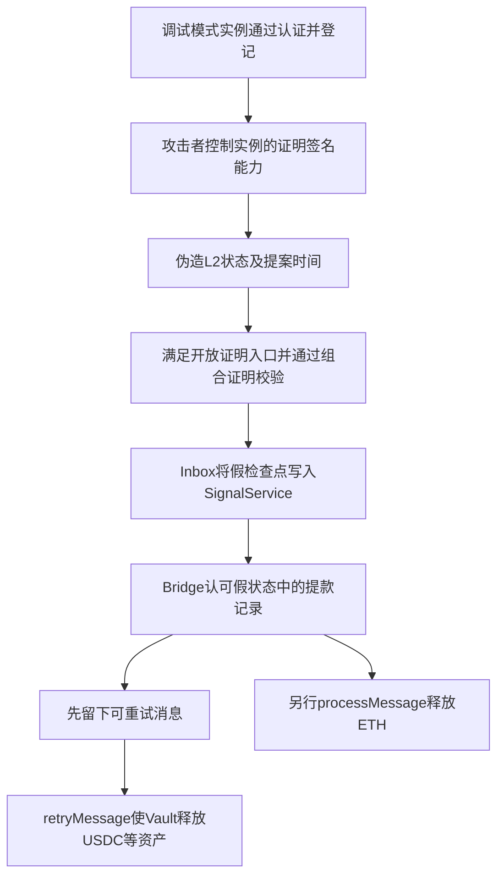

# Taiko：假证明如何让跨链桥释放真实资产

Taiko 的桥需要先确认“L2 上确实发生了提款”，才会释放 Ethereum 上的 ETH 或代币。此次攻击把错误推进到桥的上游：**证明系统接受了攻击者编造的 L2 状态，桥随后依据这个假状态批准提款。**

[Taiko 官方复盘](https://paragraph.com/@taiko-labs/taiko-security-incident-a-postmortem-and-next-steps)确认，公开暴露的 enclave 签名密钥和未拒绝调试模式的认证检查共同打开了伪造证明的路径。本文结合已保存的官方源码、两份实际 SGX verifier 的浏览器源码，以及三笔交易事件解释过程。源码来源和部署核实范围见[完整版 SOURCE.md](../../dataset_artifacts/benchmark_complete/20260622_Taiko/SOURCE.md)。

## 1. 事件信息

| 项目               | 内容                                                     |
| ------------------ | -------------------------------------------------------- |
| 本次源表位置       | 2026-09-14 读取的第 102 行                               |
| 数据集日期         | 2026.06.22，保留源表日期                                 |
| 准备交易的链上时间 | 2026-06-21 19:03:59 UTC                                  |
| 源表损失           | 1,700,000 美元，即中文 170 万美元、英文 1700 千美元      |
| 主要攻击者         | `0x7506DeA0c38ca0B55364B22424374c5A1ae1B76a`           |
| 桥的资产地址       | Bridge`0xd60247c6848B7Ca29eDdF63AA924E53dB6Ddd8EC`     |
| ERC20 资产地址     | ERC20Vault`0x996282cA11E5DEb6B5D122CC3B9A1FcAAD4415Ab` |
| 源码状态           | `verified_sgx_source_with_upstream_context`            |

原表把攻击者地址放在 `malicious_address`，不能把它填成受害合约。CSV 的相关漏洞合约字段使用实际证明组件地址，Bridge 和 Vault 的资产托管角色另行注明。原始五行见[源表快照](sources/20260914_sheet_rows_98_102.json)。

## 2. 这些合约平时各管什么

一次正常提款可以理解为：L2 先留下提款记录，证明系统确认整段 L2 执行正确，再把一个代表已确认状态的摘要写到 L1，桥检查这条提款记录确实包含在该状态中，最后付款。

| 组件                          | 通俗解释                                         | 本地代码入口                                                                                                                                                                   |
| ----------------------------- | ------------------------------------------------ | ------------------------------------------------------------------------------------------------------------------------------------------------------------------------------ |
| `SgxVerifier`               | 登记有资格签署执行证明的实例，再核对它的证明签名 | [登记与验签](../../dataset/benchmark_complete/20260622_Taiko/taiko-mono/packages/protocol/contracts/layer1/verifiers/SgxVerifier.sol#L113)                                      |
| `AutomataDcapV3Attestation` | 检查实例提供的硬件/程序认证材料                  | [认证入口及应用程序检查](../../dataset/benchmark_complete/20260622_Taiko/taiko-mono/packages/protocol/contracts/layer1/automata-attestation/AutomataDcapV3Attestation.sol#L379) |
| `Inbox`                     | 确认 L2 提案，并把最终状态交给下一环节           | [prove](../../dataset/benchmark_complete/20260622_Taiko/taiko-mono/packages/protocol/contracts/layer1/core/impl/Inbox.sol#L258)                                                 |
| `SignalService`             | 保存已认可的 L2 检查点，供跨链消息验证使用       | [保存检查点](../../dataset/benchmark_complete/20260622_Taiko/taiko-mono/packages/protocol/contracts/shared/signal/SignalService.sol#L153)                                       |
| `Bridge`                    | 核对跨链消息，管理未处理、可重试和已完成状态     | [processMessage](../../dataset/benchmark_complete/20260622_Taiko/taiko-mono/packages/protocol/contracts/shared/bridge/Bridge.sol#L217)                                          |
| `ERC20Vault`                | 根据已认可的桥消息释放代币                       | [onMessageInvocation](../../dataset/benchmark_complete/20260622_Taiko/taiko-mono/packages/protocol/contracts/shared/vault/ERC20Vault.sol#L292)                                  |

状态摘要通常叫“状态根”。它像给一整本账生成的指纹。指纹能帮助核对某条记录是否属于那本账，却不能自动保证那本账本来就是真实的。系统还得依靠上游证明，确认这本账由正确执行产生。

## 3. 第一个缺口：认证没有排除调试模式

这里要区分两把不同作用的密钥：一把用于签署 enclave 程序，另一把在运行实例里用于签署执行证明。官方披露的是前者曾公开暴露；攻击者利用调试模式对运行环境的控制，进一步控制后者。不能把两把密钥混成一个普通资金钱包私钥。

程序认证中有两个常见名字：`MRENCLAVE` 表示程序代码的度量，`MRSIGNER` 表示程序签署者的度量。核对这些值可以限制“什么程序、由谁签署”，但仍需要拒绝不具备预期保密保护的运行模式。

保存的源码在 [`_verifyParsedQuote()`](../../dataset/benchmark_complete/20260622_Taiko/taiko-mono/packages/protocol/contracts/layer1/automata-attestation/AutomataDcapV3Attestation.sol#L405) 在 `checkLocalEnclaveReport` 开启时，检查应用报告中的可信 `mrEnclave` 和 `mrSigner`；该分支没有检查应用实例的 DEBUG 位。本次未独立读取攻击时该开关状态。[`V3Parser.validateParsedInput()`](../../dataset/benchmark_complete/20260622_Taiko/taiko-mono/packages/protocol/contracts/layer1/automata-attestation/lib/QuoteV3Auth/V3Parser.sol#L69)负责结构和长度等检查，也不能替代拒绝应用 DEBUG 模式的策略。

文件里确实还有名叫 `attributesMatched` 的检查。它属于 [`_verifyQEReportWithIdentity()`](../../dataset/benchmark_complete/20260622_Taiko/taiko-mono/packages/protocol/contracts/layer1/automata-attestation/AutomataDcapV3Attestation.sol#L197)，检查的是出具认证报告的 QE 身份材料。**检查 QE 的属性，不等于检查被认证的应用实例是否运行在调试模式。** 把这两类报告混在一起，会误以为缺口已经被覆盖。

认证一旦返回成功，`registerInstance()` 就从报告中取出实例地址并登记。后续 `verifyProof()` 检查登记有效期和签名是否来自这个实例。此时攻击者已经控制了被信任的证明签署者，签名“真的来自登记实例”也就不能保证被签署的 L2 状态真实。

## 4. 第二个缺口：决定能否跳过白名单的时间也来自证明

协议为长时间没人证明的提案保留开放入口，避免链一直停住。官方说明当时的等待阈值是五天；源码把它作为配置值 `_permissionlessProvingDelay`。

`Inbox.prove()` 的关键计算是：

```text
proposalAge = block.timestamp - commitment.transitions[offset].timestamp
```

然后 [`_checkProver()`](../../dataset/benchmark_complete/20260622_Taiko/taiko-mono/packages/protocol/contracts/layer1/core/impl/Inbox.sol#L722)要求非白名单调用者提供的提案年龄大于配置阈值。问题在于，参与计算的时间戳来自待验证证明所描述的 transition。攻击者有能力伪造证明以后，也能伪造这个时间值，让新提案看起来已经等了很久。

因此，白名单记录不需要被修改。攻击者满足的是“等待太久，可以由其他人证明”的例外入口。上游可信证明这个前提已经失效，依赖证明时间戳的限制也随之失效。

这一版本的 [`MainnetVerifier.areVerifiersSufficient()`](../../dataset/benchmark_complete/20260622_Taiko/taiko-mono/packages/protocol/contracts/layer1/mainnet/MainnetVerifier.sol#L35)允许 `SGX-GETH + SGX-RETH` 的两份证明组合。两份证明都可能落在相同类别的认证缺口上，因此数量为二并不自动形成有效的独立保护。本地代码与官方描述吻合；本次没有执行 SGX 硬件认证或伪造证明。

## 5. 从假状态到真钱：完整链路



## 上下文

**用户想把 Taiko 上的资产提回 Ethereum，Ethereum 上的桥需要确认“这笔提款确实在 Taiko 上合法发生了”，才能放钱。**

**1. L2 是什么？在这里就是 Taiko 这条链。**

L2 是 **Layer 2，第二层网络**。在这次事件里：

| 名字 | 可以怎样理解                                       | 本次对应谁       |
| ---- | -------------------------------------------------- | ---------------- |
| L1   | 底层主链，负责最终结算等事情                       | Ethereum，以太坊 |
| L2   | 在主链之外处理大量交易，再把结果交给主链确认的网络 | Taiko            |

可以把它理解为：**Ethereum 是总账，Taiko 在旁边处理交易、维护自己的账，再按协议把处理结果交给 Ethereum 确认。**

Taiko 的账里会记录“谁有多少钱、谁向谁转了钱、哪些合约发生了什么变化”。这些记录在某个时刻的整体情况，就叫**状态**。

所以，我前面说的：

> “某批 L2 提案经过正确执行，得到某个最终状态”

用直白的话说就是：

> **把 Taiko 上这一批交易按规则算完，得到一份更新后的账本。**

Ethereum 要确认这份新账本可靠，需要相应的证明机制。

**2. SGX 是什么？在这里负责为“核账程序”提供受保护的运行环境。**

SGX 是英特尔处理器提供的一种安全技术，全名是 **Software Guard Extensions**。

它可以在计算机里建立一个受保护的区域，让指定程序在里面运行。设计目标是：即使有人管理外面的操作系统，也不能随意读取或修改这个区域里的程序数据。

可以把它想成一个**受保护的核账室**：

- 核账程序在里面检查 Taiko 的交易执行结果。
- 核账室里保存一个用于签名的秘密。
- 核算完成后，程序用这个秘密给结果签名。
- 链上的验证合约检查这个签名，判断结果是否来自已认可的运行实例。

**签名相当于核账室盖出的章。系统相信这个章，是因为它预期核账室里的程序和签名秘密受到保护。**

本次问题在于，认证环节接受了攻击者可以控制的调试环境。于是攻击者能够控制证明的签名能力，让错误的账本结果也带上一个会被系统接受的签名。这是官方披露的攻击链路的一部分。[Taiko 官方复盘](https://paragraph.com/@taiko-labs/taiko-security-incident-a-postmortem-and-next-steps)

因此：

> “被攻击者控制的 SGX 证明路径接受了假结果”

可以改成：

> **系统原本信任一个受保护的核账程序，但攻击者控制了这个程序所处的环境，使假的核账结果也通过了检查。**

**3. “上下文”是什么？这里有背景和程序数据两种意思。**

如果你问的是**整件事的背景**，就是下面这条关系：

```text
用户在 Taiko 上提出提款
        ↓
Ethereum 需要确认这笔提款真实、合法
        ↓
证明系统确认 Taiko 的相关账本状态
        ↓
跨链桥核对提款记录
        ↓
Ethereum 上的 Bridge 或 Vault 释放资产
```

以从 Ethereum 跨入 Taiko 的 USDC 为例，Ethereum 一侧的原始 USDC 由 Vault 保管。提回时，Vault 要根据被认可的跨链消息付款。**因此，Taiko 的账本虽然在另一条链上，其真实性会直接影响 Ethereum 这边是否放出真币。**

如果你问的是前面代码里的 **`context`，也就是“调用上下文”**，它指的是：**当前这次操作附带的背景信息。**

在这条付款链路里，主要包括：

| 上下文字段     | 通俗意思                         |
| -------------- | -------------------------------- |
| `msgHash`    | 当前处理的是哪一条跨链消息       |
| `srcChainId` | 这条消息来自哪条链               |
| `from`       | 这条消息在来源链上由哪个地址发起 |

Bridge 调用 Vault 时，会让 Vault 查到这些信息。Vault 据此判断：

> “现在是谁让我付款？处理的是哪条消息？这条消息声称来自哪条链上的哪个合约？”

例如，Vault 可以检查：调用者确实是认可的 Bridge，消息里的来源地址也确实填写了 Taiko 上对应的 Vault 地址。

但这些检查依赖前面的消息认证。**如果 Bridge 已经依据假账本接受了一条伪造消息，后续传给 Vault 的上下文仍然可能在格式和地址上全部符合要求。**

你选中的那句话，可以完整改写为：

> **Taiko 把一批交易的处理结果交给 Ethereum 确认。Ethereum 原本依靠经过认证的 SGX 程序来保证结果可靠；这次攻击者控制了被信任的运行环境，使假的 Taiko 账本结果被接受。随后，跨链桥又依据这份假账本认可提款记录，最终释放了 Ethereum 上保管的真实资产。**


## 详细说明

这七步连起来，核心是：**先让 Ethereum 上的合约信任一份假的 L2 状态，再用这份状态里的“提款记录”向跨链桥领钱。** `RETRIABLE` 又把“消息已经通过证明检查”和“付款尚未完成”分开保存，使后续交易可以继续执行付款。

其中有两种不同的“证明”，先分清它们，后面的链路就容易理解：

| 证明                             | 正常情况下负责证明什么                     | 这次问题发生在哪里                                           |
| -------------------------------- | ------------------------------------------ | ------------------------------------------------------------ |
| **L2 执行证明**            | 某批 L2 提案经过正确执行，得到某个最终状态 | 被攻击者控制的 SGX 证明路径接受了假结果。                    |
| **提款消息的 Merkle 证明** | 某条提款消息确实存在于已经认可的 L2 状态中 | 它依据的状态根已经是假的，因此可以对假账本中的记录验证成功。 |

下面按你列出的七步展开。

1. **登记实例：把攻击者控制的签名身份放进“可信证明者登记册”。**

   这里的“实例地址”可以理解为一个 SGX 运行实例的**证明签名身份**。它不是资金池地址，也不是登记后就能直接提款的账户。

   正常流程是：SGX 实例提供认证报告，证明自己运行的是认可的程序；链上认证合约检查报告，通过后，`SgxVerifier` 登记该实例的签名地址。以后收到执行证明时，合约就能检查：“这份证明是不是由登记过、尚未过期的实例签署？”

   源码中的具体关系是：

   ```text
   registerInstance()
       → 验证认证报告
       → 从报告的 reportData 取出实例地址
       → 写入 instances 登记表
       → 发出 InstanceAdded
   ```

   因此，`InstanceAdded` 的意义是：**链上已经把这个地址纳入后续证明验签所使用的信任范围。** 它本身不代表发生了提款。[登记与验签源码](../../dataset/benchmark_complete/20260622_Taiko/taiko-mono/packages/protocol/contracts/layer1/verifiers/SgxVerifier.sol#L113)

   官方披露的缺口是两个条件叠加：enclave 程序签名密钥曾公开暴露，认证又没有拒绝 DEBUG 模式。于是，程序身份可以符合认可值，但运行环境已受攻击者控制，其中的证明签名能力也不再可靠。**签名仍可能在数学上有效，签署的执行结果却不真实。** [Taiko 官方复盘](https://paragraph.com/@taiko-labs/taiko-security-incident-a-postmortem-and-next-steps)

   准备交易分别在 SGX-GETH 和 SGX-RETH 的 verifier 中登记了 `0x4777…9135`、`0x2924…9813`。当时对应的源码允许这两种 SGX 证明组成所需的双证明组合；而登记生效延迟为零，所以“同一笔交易先登记、后使用”与这份源码一致。[证明组合规则](../../dataset/benchmark_complete/20260622_Taiko/taiko-mono/packages/protocol/contracts/layer1/mainnet/MainnetVerifier.sol#L35)
2. **提交假证明并写入检查点：让假状态成为其他合约认可的查询依据。**

   登记实例解决的是“证明签名来自谁”。还有另一层权限：**谁有资格向 `Inbox` 提交证明。** 这两个资格不能混为一谈。

   `Inbox` 保留了提案长时间未获证明时的开放入口。源码使用证明数据中的 transition 时间戳计算提案年龄，再决定非白名单调用者是否可以进入。官方确认，攻击者伪造这个时间，让提案满足当时超过五天的开放条件。[年龄计算](../../dataset/benchmark_complete/20260622_Taiko/taiko-mono/packages/protocol/contracts/layer1/core/impl/Inbox.sol#L273)、[白名单例外检查](../../dataset/benchmark_complete/20260622_Taiko/taiko-mono/packages/protocol/contracts/layer1/core/impl/Inbox.sol#L722)、[官方说明](https://paragraph.com/@taiko-labs/taiko-security-incident-a-postmortem-and-next-steps)

   当这条证明路径被接受后，`Inbox` 会把最终状态同步给 `SignalService`，保存一个检查点，主要包含：

   ```text
   L2 区块号
   该区块的区块哈希
   该区块对应的状态根
   ```

   “状态根”是整份状态的摘要。保存它，相当于告诉后续合约：“核对这个 L2 区块中的记录时，以这个摘要为准。”

   准备交易中的 `CheckpointSaved` 记录了 L2 区块号 `1805600`；`Proved` 记录了提案范围 `18052–18056`。**提案编号和 L2 区块号是两套编号。** 它们也都不是这笔 Ethereum 交易所在的 L1 区块号。[归档事件](../../dataset_artifacts/benchmark_complete/20260622_Taiko/evidence/decoded-events.json)

   攻击者也没有获得任意调用 `saveCheckpoint()` 的权限。这个函数要求调用者是授权同步组件。攻击者利用的是正常的 `Inbox.prove()` 路径，让有权限的组件把错误结果写进去。[检查点写入限制](../../dataset/benchmark_complete/20260622_Taiko/taiko-mono/packages/protocol/contracts/shared/signal/SignalService.sol#L153)

   还有一个顺序细节：源码实际先保存检查点，最后调用证明验证器。如果最后验证失败、交易回滚，前面的写入和事件也会回滚。此次能留下假检查点，是因为错误的证明路径最终通过了验证。
3. **把伪造提款记录交给桥：证明“这条记录在假账本里”，可以完全验证通过。**

   跨链桥不能只相信调用者说“我在 L2 提过款”。它要核对来源链是否确实记录了相应消息。

   为此，`Bridge.processMessage()` 会先根据整条消息计算 `msgHash`。消息包括来源链、目的链、来源地址、目标地址、付款数额及调用数据等。随后，它让 `SignalService` 检查来源链上的桥是否发出过对应 signal。[消息哈希](../../dataset/benchmark_complete/20260622_Taiko/taiko-mono/packages/protocol/contracts/shared/bridge/Bridge.sol#L463)、[消息证明入口](../../dataset/benchmark_complete/20260622_Taiko/taiko-mono/packages/protocol/contracts/shared/bridge/Bridge.sol#L548)

   对带有证明的数据，`SignalService` 的检查可以理解为：

   ```text
   找到指定 L2 区块的已保存检查点
       → 要求证明使用的状态根与检查点一致
       → 核对远端 SignalService 的账户证明
       → 核对该账户中对应 signal 的存储证明
   ```

   这确实能证明“记录包含在指定状态中”。但它依赖一个前提：**指定状态已经由上游可靠地确认过。** [状态根及存储证明检查](../../dataset/benchmark_complete/20260622_Taiko/taiko-mono/packages/protocol/contracts/shared/signal/SignalService.sol#L229)

   可以用一个账本例子理解。假账本里写着：

   > 来源链上的桥已经发出一条消息，要求 Ethereum 的 Vault 向某地址支付一笔 USDC。
   >

   攻击者为这份账本计算的摘要，与账本中这条记录的证明可以完全一致。上游一旦把该摘要登记为可信状态，下游就会认可这个一致性关系。

   **Merkle 证明不负责重新执行整条 L2，也不负责判断这份账本是否属于诚实节点认可的链。** 因而这里不需要找到哈希碰撞，也不需要破解 Merkle 算法。错误已经发生在“哪一个状态根值得信任”这一层。
4. **先记录为 `RETRIABLE`：证明通过了，但付款尚未完成。**

   `processMessage()` 把两件事分开处理：先检查消息证明，再尝试执行消息所要求的付款或目标调用。

   按这份源码，正常付款分支的状态变化是：

   | 状态              | 含义                                                 |
   | ----------------- | ---------------------------------------------------- |
   | `NEW = 0`       | 消息尚未成功进入处理流程。                           |
   | `RETRIABLE = 1` | 消息已经通过前面的检查，但目标执行未成功，可以再试。 |
   | `DONE = 2`      | 消息处理完成，不能再按待重试消息执行。               |

   如果目标执行返回失败，外层 `processMessage()` 可以把状态设为 `RETRIABLE`，然后正常结束。因此，**内部付款未成功，不等于外层整笔交易回滚。** 这就是检查点和待重试消息能够保留下来的原因。[状态处理源码](../../dataset/benchmark_complete/20260622_Taiko/taiko-mono/packages/protocol/contracts/shared/bridge/Bridge.sol#L248)

   你原文中的“付款调用失败”还可以更精确一点：**它不一定已经进入 Vault，然后在里面耗尽 gas。**

   我从归档的 USDC 准备消息中重新解出了 `gasLimit = 500000`。本地对应版本的 `Bridge` 预留 gas 常量为 `800000`，还要计入消息数据成本。按该版本对中继调用的计算，这条消息可分配给目标调用的 gas 会变成零；而 `_invokeMessageCall()` 在调用 gas 为零时直接返回 `false`。

   所以，就这条消息与这份源码的对应关系而言，更准确的说法是：**目标付款没有得到执行机会，桥将它保存为可重试。** 精确到历史部署的这条内部路径，仍需部署匹配或 trace 才能进一步确认。[零调用 gas 分支](../../dataset/benchmark_complete/20260622_Taiko/taiko-mono/packages/protocol/contracts/shared/bridge/Bridge.sol#L490)、[调用 gas 计算](../../dataset/benchmark_complete/20260622_Taiko/taiko-mono/packages/protocol/contracts/shared/bridge/Bridge.sol#L620)
5. **之后领取 USDC：沿用已经接受的同一条消息，再执行付款。**

   `retryMessage()` 接收的是消息和重试标志，**没有新的 Merkle 证明参数**。它先重新计算消息哈希，要求该哈希对应的状态已经是 `RETRIABLE`，然后再次执行目标调用。[重试源码](../../dataset/benchmark_complete/20260622_Taiko/taiko-mono/packages/protocol/contracts/shared/bridge/Bridge.sol#L312)

   这种设计正常情况下有明确用途：来源链证明已经检查过，目标执行可能只是临时失败，没有必要每次重试都重复验证来源。

   它也不是允许重试者随意改收款人。整条消息参与哈希计算；改掉目标、金额或调用数据，通常就得到另一个哈希，无法匹配原来的 `RETRIABLE` 记录。

   本次 USDC 消息的哈希是 `0x7f153b85…75a831c9`。归档事件显示，这个哈希在准备交易中被设为 `1`，在后来的 USDC 交易中被设为 `2`。同笔交易还出现了真实 USDC 合约发出的 `Transfer`：

   ```text
   转出方：ERC20Vault，0x996282…4415Ab
   接收方：0x7506De…e1B76a
   原始数量：649761236201
   按 6 位小数换算：649,761.236201 USDC
   ```

   这里的资金流出结论来自代币 `Transfer` 事件；`DONE` 状态说明同一消息完成处理。两者结合，比单看状态名字更有说服力。[USDC 交易](https://etherscan.io/tx/0x017292a7de5fef52a3274e37dda5ace4c4d0cdafe91b7b4ac9c700f02fae35ee)、[本地事件记录](../../dataset_artifacts/benchmark_complete/20260622_Taiko/evidence/decoded-events.json)
6. **Vault 按已认可的消息付款：本地权限检查通过，但依据的跨链事实是假的。**

   USDC 的实际付款调用发生在上一步重试交易内部。你列出的第六步，是第五步内部调用的展开，并不是另一次独立领取。

   `Bridge` 在执行目标调用前保存消息上下文，包括消息哈希、来源地址和来源链。`ERC20Vault.onMessageInvocation()` 读取该上下文，并核对当前调用者是否为认可的 Bridge、消息中的来源地址是否为来源链上对应的 Vault。[Vault 上下文检查](../../dataset/benchmark_complete/20260622_Taiko/taiko-mono/packages/protocol/contracts/shared/vault/BaseVault.sol#L52)

   因此，攻击者直接拿自己的普通账户调用 Vault，并不能凭空满足这些条件。此次调用确实是由 L1 Bridge 发起的；问题在于，Bridge 接受的那条“来自 L2 Vault 的消息”，已经通过假状态获得了认可。

   接下来，Vault 解码代币信息、收款人和金额。USDC 的原生链是当前 Ethereum，所以 `_transferTokens()` 进入“释放本链资产”分支，调用 USDC 的 `safeTransfer()`，减少 Vault 的真实 USDC 余额。[付款入口](../../dataset/benchmark_complete/20260622_Taiko/taiko-mono/packages/protocol/contracts/shared/vault/ERC20Vault.sol#L292)、[本链资产转出分支](../../dataset/benchmark_complete/20260622_Taiko/taiko-mono/packages/protocol/contracts/shared/vault/ERC20Vault.sol#L352)

   这解释了为什么单独看 Vault 的“只允许桥调用”检查，还不足以判断整个系统安全：**Vault 的付款权限依赖 Bridge，Bridge 的消息真实性又依赖上游认可的 L2 状态。**
7. **ETH 使用另一条消息：直接处理新消息，由 Bridge 支付原生 ETH。**

   ETH 和 USDC 共用了前面的假状态信任问题，但付款组件不同。USDC 由 ERC20Vault 转出；原生 ETH 由 Bridge 持有，并通过带 `value` 的调用支付。

   我重新解码了这笔 ETH 交易的 `MessageProcessed` 原始数据，消息中包含：

   ```text
   来源链：167000，即 Taiko
   目的链：1，即 Ethereum
   目标地址：0xA9803508…438a846
   value：130000000000000000000 wei，即 130 ETH
   data：空
   消息哈希：0x855db45d…2482ef1
   ```

   它与前面的 USDC 消息哈希不同，走的是 `processMessage()`：提交并验证这一条消息，执行付款，最后记录 `DONE`。原生 ETH 转账不会发出 USDC 那样的 ERC20 `Transfer` 事件，因此不能用“没有代币 Transfer 日志”判断没有 ETH 支付；资金执行还要结合交易的原生 ETH 转账记录核对。官方将这笔交易列为 130 ETH 提款。[ETH 交易](https://etherscan.io/tx/0xb8befb015a67de8f40890b1f8667c597c3b66a52b388ec1c6cd28637fd65dd13)、[官方交易列表](https://paragraph.com/@taiko-labs/taiko-security-incident-a-postmortem-and-next-steps)

   这也说明：**先变成 `RETRIABLE` 再重试，只是这批 USDC 等消息使用的处理方式，并非所有伪造提款都必须经过的步骤。**

上述函数关系已与本地保存的源码核对，消息字段来自归档事件的只读解码。“状态为何被判定为伪造”结合了官方复盘；除已核对的 SGX 源包外，其他组件仍保留攻击时部署匹配和完整内部 trace 的证据限制。本次没有修改案例文件。


三笔交易的原始页面和解码字段保存在[本地交易证据](../../dataset_artifacts/benchmark_complete/20260622_Taiko/evidence/decoded-events.json)。本次重算了 USDC 单位、十个初始重试状态，以及同一 USDC 消息从 `RETRIABLE` 到 `DONE` 的对应关系。

## 6. 为什么源码中先写状态、后验证明不是这里的独立漏洞

`Inbox.prove()`在函数尾部调用证明验证器，之前已经保存检查点并发出事件。不能因此就说“任何人先写假根，验证失败也能留下”。同一 EVM 交易如果随后 revert，前面的状态写入和事件也会回滚。

本次成立的关键是**被控制的证明路径返回了通过**，使整笔交易成功提交。若忽略交易原子性，把源码顺序本身当成根因，就会写出另一条没有被证据支持的攻击路径。

## 7. 损失和后续补足要分开

源表的 170 万美元用于本次索引。官方后续复盘给出约 175 万美元的事件总额，并说明其中包含一笔第三方获得的 18 ETH 中继费用；因此事件资金流出总额不等于主攻击者最终净赚。

同样，申请提款、成功付款、限额拦下的请求、桥里尚存的资产和后来补足的资金，不能相加当成被盗金额。官方称桥重新获得了 1:1 抵押后恢复运行；这是补足资产负债的措施，不等于全部被盗资金已经追回。[官方金额及恢复说明](https://paragraph.com/@taiko-labs/taiko-security-incident-a-postmortem-and-next-steps)

## 8. 源码和验证范围

- **已保存并核对：** 官方事发前提交 `ff002a4516b489c7146675f7036d699b07a7f785` 的协议源码和配置，共 151 个文件；逐文件核对 Git blob 和 SHA-256。另有两份实际 SGX verifier 的 Etherscan 验证源包，共用的 13 份 Solidity 文件保存一次，其 `SgxVerifier.sol` 与官方快照逐字节一致。
- **精简版：** 46 份原文函数或状态/类型摘录，覆盖登记、认证、证明入口、检查点和提款。见[精简版来源](../../dataset_artifacts/benchmark_simplified/20260622_Taiko/SOURCE.md)。它们用于静态阅读，不能单独当完整工程编译。
- **仍有限制：** 其余组件没有完成攻击时代理槽和部署字节码匹配。公共 RPC 的三次回执查询返回 `null`，本次使用的是独立读取的浏览器原始事件，不伪装成 RPC 回执或完整 trace。
- **未执行：** 全协议编译、SGX 硬件认证、历史完整存储还原、主网分叉攻击重放。文档中的源码可达路径与事件字段核对，不能替代这些验证。

## 9. 来源

- [Taiko 官方事件复盘](https://paragraph.com/@taiko-labs/taiko-security-incident-a-postmortem-and-next-steps)。
- [Taiko 官方固定源码提交](https://github.com/taikoxyz/taiko-mono/tree/ff002a4516b489c7146675f7036d699b07a7f785)。
- [SGX-GETH verifier 的源码页](https://etherscan.io/address/0x08568df252ecf37d6c3efd24f6ca3688118697f1#code)和[SGX-RETH verifier 的源码页](https://etherscan.io/address/0xa1018ba2e22139076f91da2a856b2cab22d968f6#code)。
- 上文三笔 Etherscan 交易，原始页面及解码方法已经随案例归档。
