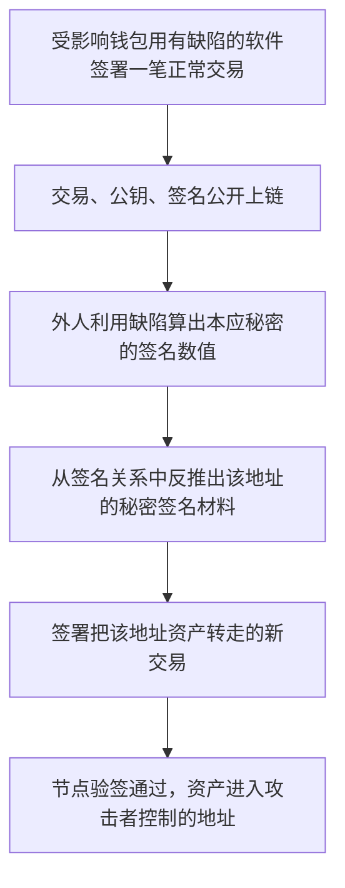

# SecondFi：一次正常签名，为什么可能暴露转账权限

SecondFi（原 Yoroi）是 Cardano 钱包。它帮用户生成地址、查看余额和签署交易。**这是钱包签名软件事件，不是智能合约漏洞。** 按最终收录范围，本案例已从两套 dataset 目录和中英文 CSV 移除；这里只保留事件说明与引用资料，不提供伪造的 Solidity 或受害钱包源码。

官方在后续 [Incident FAQ](https://kb.secondfi.io/en/article/incident-faq-omrng2/) 中说明：签名过程中有个本应依赖秘密信息的数值，在特定条件下能由公开交易数据算出，从而可能推导出受影响地址的私钥材料。下面先解释这条因果链，再说明哪些细节仍未独立验证。

## 1. 事件信息和金额口径

| 项目                   | 内容                                                           |
| ---------------------- | -------------------------------------------------------------- |
| 本次源表位置           | 2026-09-14 读取的第 100 行                                     |
| 数据集日期             | 2026.06.23，保留源表日期                                       |
| 源表原始说法           | 约 1600 万 ADA 被盗，`lost_u = 2,000,000` 美元               |
| CSV 金额               | 中文 200 万美元；英文 2000 千美元                              |
| 后续官方统计           | 2026-06-21 至 23 日，约 1610 万 ADA，374 个钱包，约 260 万美元 |
| 攻击交易、漏洞合约地址 | 原表没有给出；两份 CSV 均留空                                  |
| 样本状态               | `non_contract_incident_evidence_only`                        |

原始五行记录见[固定快照](sources/20260914_sheet_rows_98_102.json)。200 万美元是本次导入必须保留的源表口径；后续官方的 260 万美元是另一时点的统计/估值，不能直接覆盖原值，也不能把 ADA 数量当成美元数。

## 2. 钱包平时做什么

用户发起转账时，钱包先组织交易：花掉哪些旧资金记录，把多少钱发到哪个地址，剩余零钱发回哪里。随后钱包使用该地址对应的秘密签名材料，给交易签名。

交易、签名和验证所需的公钥会公开上链。节点检查签名是否正确，再决定是否允许花掉这些资金。正常设计要求：**别人即使看到很多笔交易和签名，也不能反推出能替你签名的秘密。**

助记词、某个地址的签名私钥、某笔交易签名不是同一件东西。此次官方确认的是受影响地址/私钥层面的暴露，不能据此断言所有用户的整套助记词都泄露了。官方也明确区分了硬件钱包签名路径和受影响的软件钱包路径。[官方范围说明](https://kb.secondfi.io/en/article/incident-faq-omrng2/)

## 3. 哪一步出错

签名不是简单地把私钥附到交易上。它会把私钥、交易内容和一个每次签名使用的秘密数值混在一起，最后只公开验证需要的结果。这里把这个秘密数值称作 `r`，常见资料会称它为 nonce。

小写 `r` 是签名使用的秘密标量；签名中公开的是由它计算出的点 `R = [r]B`。正常情况下，不能从公开的 `R` 直接反推 `r`。用于生成 `r` 的每把密钥的秘密材料，是另一层输入，也不等于 `r` 本身。

nonce 可以由秘密材料和交易内容确定性地产生。**“每次算出来都确定”本身没有问题；关键是外人不能只靠公开信息把它算出来。**

SecondFi 的官方说明确认了“本应秘密的值变得可由公开交易计算”这个缺陷类别。独立取证方 [Tibane Labs 的公开研究入口](https://github.com/KarpelesLab/cardano_secondfi_analysis/blob/master/README.md)进一步把它归因于钱包接入 `@stashers.io/trantor` 签名器时，漏接每把密钥对应的秘密 nonce 材料，导致 nonce 只依赖消息。该团队表示检查过公开链上签名和发布的客户端；本次没有重新执行其取证程序、核对 Android 安装包或取得受害签名器源码，因此具体包版本与部署关联保留为**外部取证结论**。

不能把这个问题笼统写成“随机数不好”或“两个签名用了相同 nonce”。这里描述的核心是 nonce 可以直接从公开消息计算；如果这一条件成立，单个签名就可能足够。

## 4. 攻击链路




这次问题的本质是：**SecondFi 把 Ed25519 签名里本应保密的 nonce 标量 `r`，错误地变成了公开交易内容 `M` 的确定函数。**

这样一来，攻击者不需要破解 SHA-512，也不需要求解椭圆曲线离散对数。只要拿到一份受影响版本生成的链上签名，就能把签名公式改写成一个普通的模运算方程，直接算出该地址的签名私钥标量。BlockSec 将其描述为“遗漏秘密哈希输入导致 Ed25519 nonce 可计算”，并指出这是钱包签名软件问题，不是智能合约问题。[BlockSec 分析](https://blocksec.com/blog/web3-security-taiko-secondfi-exploits)

## 1. 先认识 Ed25519 里的几个数

为了贴近 BlockSec 对 SecondFi 的说明，可以用下面的符号：

| 符号   | 是否公开       | 含义                                            |
| ------ | -------------- | ----------------------------------------------- |
| `M`  | 公开           | 要签名的交易内容                                |
| `kL` | 秘密           | 地址的签名私钥标量                              |
| `kR` | 秘密           | 专门用来生成 nonce 的秘密材料                   |
| `A`  | 公开           | 公钥，满足`A = [kL]B`                         |
| `r`  | 正常情况下秘密 | 本次签名使用的 nonce 标量                       |
| `R`  | 公开           | nonce 对应的曲线点，`R = [r]B`                |
| `c`  | 公开可计算     | 将`R`、公钥和交易绑定起来的挑战值             |
| `S`  | 公开           | 签名的第二部分                                  |
| `L`  | 公开常量       | Ed25519 基点所在子群的阶，所有标量运算都模`L` |
| `B`  | 公开常量       | Ed25519 固定基点                                |

`[x]B` 表示把椭圆曲线基点 `B` 乘以标量 `x`。

Cardano 使用的扩展 Ed25519 密钥通常会把 `kL` 和 `kR` 作为两块不同的秘密材料。放到标准 Ed25519 的说法中，`kL` 对应签名标量，`kR` 对应生成确定性 nonce 时使用的秘密 prefix。

## 2. 正常 Ed25519 怎样签名

正常签名大致分为四步。

### 第一步：用秘密材料和交易生成 nonce

```text
r = SHA-512(kR || M) mod L
```

这里的 `||` 表示拼接。

虽然交易内容 `M` 是公开的，但 `kR` 是秘密的，所以外部观察者无法重新计算 `r`。

RFC 8032 的标准 Ed25519 流程也是先将秘密 prefix 与消息拼接，再计算 `r`；随后计算 `R`、挑战值以及签名标量。[RFC 8032 第 5.1.6 节](https://www.rfc-editor.org/rfc/rfc8032.html#section-5.1.6)

### 第二步：生成公开的 nonce 点

```text
R = [r]B
```

最终签名会公开 `R`，但不会直接公开标量 `r`。

这里有一个很关键的区别：

```text
r：秘密数字
R：公开曲线点
```

知道 `r` 很容易计算 `R`；但只知道 `R`，想反推出 `r`，需要解决椭圆曲线离散对数问题。在正确实现中，这被认为不可行。

### 第三步：把交易、公钥和 nonce 点绑定在一起

为了避免签名的一部分被挪到另一笔交易上，签名算法计算挑战值：

```text
c = SHA-512(R || A || M) mod L
```

`R`、`A` 和 `M` 都会随交易或签名公开，所以任何人都能计算 `c`。

### 第四步：生成签名标量

```text
S = r + c × kL mod L
```

最终签名是：

```text
signature = (R, S)
```

也就是 32 字节的 `R` 加上 32 字节的 `S`。

验证者检查的核心关系是：

```text
[S]B = R + [c]A
```

因为：

```text
[S]B
= [r + c × kL]B
= [r]B + [c × kL]B
= R + [c]A
```

所以，验证者不需要知道 `r`、`kL` 或 `kR`，也能确认签名确实来自公钥 `A` 的持有人。

## 3. 正确实现为什么不会泄露私钥

观察链上交易的人可以得到：

```text
M：交易内容
A：公钥
R：签名第一部分
S：签名第二部分
c：由 R、A、M 计算出来
```

签名公式是：

```text
S = r + c × kL mod L
```

攻击者想求的是 `kL`，但这里还有另一个未知数 `r`。

也就是说，公开数据只给了一个方程：

```text
已知 S、c
未知 r、kL
```

一个方程里有两个未知标量，无法直接求出 `kL`。

攻击者虽然知道：

```text
R = [r]B
```

但从 `R` 恢复 `r` 需要解决椭圆曲线离散对数问题。正确的 Ed25519 安全性正是建立在这个困难问题以及 nonce 保密性之上。

## 4. SecondFi 的实现错在哪里

根据 BlockSec 的分析，受影响实现把正确的 nonce 计算：

```text
r = SHA-512(kR || M) mod L
```

错误地写成了：

```text
r = SHA-512(M) mod L
```

也就是漏掉了秘密的 `kR`。

这两个公式表面上只少了一段输入，安全含义却完全不同。

正常情况：

```text
交易 M 公开
kR 保密
因此 r 保密
```

SecondFi 的错误情况：

```text
交易 M 公开
SHA-512 算法公开
因此 r 也公开
```

此时，签名方程中的 `r` 不再是未知数。攻击者知道：

```text
S = r + c × kL mod L
```

把 `r` 移到左边：

```text
S - r = c × kL mod L
```

再乘以 `c` 在模 `L` 下的逆元：

```text
kL = (S - r) × c⁻¹ mod L
```

右边的所有值都可以从公开信息得到：

- `S` 来自公开签名；
- `M` 来自公开交易；
- `r = SHA-512(M) mod L`；
- `R` 来自公开签名；
- `A` 是公开验证密钥；
- `c = SHA-512(R || A || M) mod L`；
- `c⁻¹` 可以通过普通模运算计算。

所以，攻击者不需要：

- 猜测助记词；
- 暴力破解密码；
- 反推 SHA-512；
- 从公钥求椭圆曲线离散对数；
- 拿到手机或浏览器本地数据；
- 等待同一个 nonce 被重复使用。

只要有一份由受影响实现生成的有效签名，通常就足以恢复对应地址的 `kL`。BlockSec 给出的恢复关系也是：

```text
kL = (S - r) × c⁻¹ mod L
```

其中 BlockSec 将挑战值记作 `H`，数学意义相同。[BlockSec 的漏洞和攻击步骤](https://blocksec.com/blog/web3-security-taiko-secondfi-exploits)

## 5. 用一个很小的数字举例

真实 Ed25519 使用的是非常大的 `L`。为了方便理解，假设这里暂时使用：

```text
L = 19
```

假设地址的私钥标量是：

```text
kL = 7
```

漏洞实现根据公开交易算出的 nonce 是：

```text
r = 5
```

公开挑战值是：

```text
c = 3
```

钱包生成：

```text
S = r + c × kL mod 19
  = 5 + 3 × 7 mod 19
  = 26 mod 19
  = 7
```

攻击者看到公开的 `S = 7`，并且能从交易重新计算出 `r = 5`、`c = 3`。

因此：

```text
kL = (S - r) × c⁻¹ mod 19
```

`3` 在模 `19` 下的逆元是 `13`，因为：

```text
3 × 13 = 39 ≡ 1 mod 19
```

代入：

```text
kL = (7 - 5) × 13 mod 19
   = 26 mod 19
   = 7
```

攻击者恢复出的正是原来的私钥标量。

真实攻击中的数字大得多，但运算性质没有区别。由于 `L` 是素数阶，除挑战值极小概率为零的特殊情况外，逆元可以直接计算。

## 6. 攻击者拿到 `kL` 后为什么能签新交易

恢复 `kL` 后，攻击者可以先检查：

```text
[kL]B 是否等于公开密钥 A
```

如果相等，说明恢复正确。

随后，攻击者构造一笔把受害者 UTXO 转给自己地址的新交易，得到新消息 `M₂`。他可以自行选择一个新的安全随机 nonce `r₂`，然后计算：

```text
R₂ = [r₂]B
c₂ = SHA-512(R₂ || A || M₂) mod L
S₂ = r₂ + c₂ × kL mod L
```

新签名为：

```text
(R₂, S₂)
```

链上验证仍然成立：

```text
[S₂]B = R₂ + [c₂]A
```

验证节点只检查签名是否与公钥匹配，不知道签名是在原钱包里生成，还是攻击者在另一台电脑上生成。因此，这笔恶意转账在密码学上看起来和真正持有人签署的交易完全一样。

这里还有一个容易误解的地方：攻击者没有恢复原来的 `kR`，也不一定恢复了原始 seed，但这不妨碍攻击者签名。`kR` 的作用是帮助合法实现安全、确定地生成 nonce；掌握 `kL` 的攻击者可以自行生成新的随机 nonce。

## 7. 这和“重复使用 nonce”有什么不同

经典的 EdDSA/ECDSA 私钥泄露案例通常是：

```text
同一个秘密 nonce r
被用于两条不同消息
```

攻击者拿到两个签名方程：

```text
S₁ = r + c₁ × kL
S₂ = r + c₂ × kL
```

两式相减即可消掉 `r`，恢复 `kL`。这种情况至少需要两份使用相同 nonce 的签名。

SecondFi 的问题更直接：

```text
r = SHA-512(M)
```

攻击者不需要第二份签名，因为第一份签名中的 `r` 已经可以从公开消息计算出来：

```text
一份签名方程
+
公开可计算的 r
=
直接恢复 kL
```

所以这不是随机数质量较差，也不是偶然碰撞，而是 nonce 派生公式从设计上失去了秘密输入。

## 8. “恢复私钥”具体恢复了什么

这里最好使用更准确的说法：

> 攻击者恢复的是该地址对应的签名私钥标量 `kL`，它足以生成能够通过该地址公钥验证的新签名。

这不必然意味着攻击者同时恢复了：

- 用户的助记词；
- 原始 32 字节 seed；
- 钱包密码；
- `kR`；
- HD 钱包的 chain code；
- 同一助记词派生出的所有其他地址私钥；
- 质押密钥或其他用途的派生密钥。

但是，对资金安全而言，恢复 `kL` 已经足够严重。只要某个 UTXO 的花费条件由对应公钥授权，攻击者就能替这个地址签署花费交易。

因此，BlockSec 将影响范围描述为 **address-level signing key compromise**，也就是地址级签名密钥泄露，而不是必然恢复整个钱包助记词。[BlockSec 影响范围说明](https://blocksec.com/blog/web3-security-taiko-secondfi-exploits)

如果某个账户还要求多签、脚本条件或其他独立授权，仅获得一个地址标量未必满足全部条件。普通单签地址则通常已经完全失守。

## 9. 为什么升级钱包还不够

软件升级只能保证以后生成的签名使用正确公式：

```text
r = SHA-512(kR || M) mod L
```

它不能让已经泄露的 `kL` 重新变成秘密。

如果某个地址已经通过受影响版本发布过签名，攻击者可能已经从历史链上数据算出 `kL`，也可能把它长期保存下来。即使用户：

- 更新 SecondFi；
- 将同一助记词导入修复后的钱包；
- 修改钱包密码；
- 换一台设备；

原地址的公钥和 `kL` 仍然没有变化，攻击者的签名能力也不会消失。

因此，真正的处置方式是：

1. 用未受影响的实现生成全新的密钥；
2. 确保新地址从未使用漏洞版本签名；
3. 将资产转移到新地址；
4. 停止继续使用已经产生过受影响签名的旧地址。

BlockSec 也明确指出，把同一助记词导入已修复的钱包，不能保护已经暴露的地址；相关资产需要迁移到从未通过漏洞实现签名的新密钥。[BlockSec 修复边界](https://blocksec.com/blog/web3-security-taiko-secondfi-exploits)

整个攻击链可以压缩成：

```text
用户通过漏洞版本签署正常交易
        ↓
链上公开 M、A、R、S
        ↓
攻击者计算 r = SHA-512(M) mod L
        ↓
攻击者计算 c = SHA-512(R || A || M) mod L
        ↓
攻击者求出 kL = (S - r) × c⁻¹ mod L
        ↓
攻击者验证 [kL]B = A
        ↓
攻击者用 kL 为恶意转账生成有效签名
        ↓
Cardano 节点正常验证通过
        ↓
受害地址资产被转走
```

这次事件没有证明 Ed25519 或 SHA-512 本身被破解。真正的问题是实现偏离了标准：**原本需要“秘密材料和公开消息共同决定”的 nonce，被错误地降成了“只由公开消息决定”。** 一旦这个秘密输入被删掉，签名公式就不再保护签名私钥标量。

## 5. 为什么一个公开数值能让钱被拿走

下面用 [RFC 8032 第 5.1.6 节](https://www.rfc-editor.org/rfc/rfc8032.html#section-5.1.6)中的 Ed25519 签名关系解释数学原因。**这是算法说明，不是本次受害软件源码或实际攻击交易的复现。**

```text
S = (r + k × s) mod L
```

- `s`：秘密签名标量，也就是需要保密的关键材料。
- `r`：这一次签名使用的秘密数值。
- `k`：根据消息、公钥及签名的公开部分计算出的数值。
- `S`：签名中公开的一个数值。
- `L`：算法规定的固定模数。

正常情况下，外人只知道 `S`、`k` 和 `L`，还缺少 `r`，不能按这条等式直接求出 `s`。如果有缺陷的软件让 `r` 也变得公开，那么当 `k` 可逆时：

```text
s mod L = ((S - r) × inverse(k)) mod L
```

求出的是秘密签名标量在模 `L` 下的等价值，足以产生该公钥下可验证的签名；这不等于已经恢复原始助记词、私钥种子或完整派生钱包。攻击者随后可以给新的交易签名。资产流出不需要某个资金池计算错价格，也不需要绕过合约管理员检查；钱包地址的签名能力已经落到了外人手中。

这也解释了为什么“补丁已经发布”不等于“以前暴露过的地址重新安全”：补丁可以避免以后再生成有缺陷的签名，却不能让别人忘记已经获得的秘密材料。这是密钥暴露后的性质，不代表本次已独立确认每个地址的具体恢复状态。

## 6. 本次资料能证明到哪里

| 结论                                     | 证据范围                                        |
| ---------------------------------------- | ----------------------------------------------- |
| 钱包软件发生签名计算缺陷、部分资金被转走 | 官方事件 FAQ                                    |
| 缺陷可使本应秘密的值由公开交易信息计算   | 官方根因说明                                    |
| nonce 泄露为何能暴露签名标量             | RFC 8032 签名关系及上面的代数推导               |
| 特定 SDK、代码接入和客户端版本的关联     | Tibane 的外部取证陈述；本次未重新核对发布二进制 |
| 具体受害签名、攻击交易、地址逐笔损失     | 本次未取得，不构造占位交易                      |
| 独立编译、主网攻击复现、恢复真实私钥     | 均未执行                                        |

本案例不进入合约审计数据集。保留下来的[来源与事件证据](sources/20260623_SecondFi/SOURCE.md)只用于解释钱包签名问题和事件归因，不能作为智能合约漏洞样本。

## 7. 来源

- [源表最初引用的 SecondFi 公告](https://x.com/secondfiapp/status/2069380358291001425)：保留原始出处，不把无法读取的正文视为已验证。
- [SecondFi 官方 Incident FAQ](https://kb.secondfi.io/en/article/incident-faq-omrng2/)：官方根因、范围及后续统计。
- [Tibane Labs 公开取证仓库说明](https://github.com/KarpelesLab/cardano_secondfi_analysis/blob/master/README.md)：具体签名器接入机制的外部研究来源；本次没有执行仓库中的取证工具。
- [RFC 8032](https://www.rfc-editor.org/rfc/rfc8032.html#section-5.1.6)：解释签名数值间的关系。
