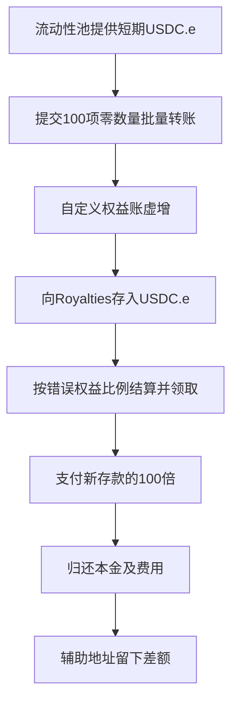

# Royalties：没有转入 NFT，却被记成拥有 100 份分红权

**Royal1155LDA 的权益账按“转账条目数”加一，却没有按实际转账数量记账。攻击者提交数量全部为零的批量转账，随后利用错误份额领取远超自己存款的分红。** 已保存的交易事件包含 100 个相同 ID 的零数量条目，随后的版税付款恰好为新存款的 100 倍。

本次取得了两份实现的全部 45 个 Solidity 文件、编译设置和两份代理源码，状态为 `verified_original_source`。代理与实现的关联来自当前浏览器页面；**攻击时的代理槽、回填标志和档位供应量尚未独立读取**。因此源码错误、交易结果和历史状态前提分开说明。[源码来源与核对范围](../../dataset_artifacts/benchmark_complete/20260624_Royalties/SOURCE.md)

## 1. 合约是干什么的

Royal1155LDA 管理 ERC1155 资产，Royalties 按档位的权益份额分配 USDC.e。`tier` 可以理解为“分红组”：某人拥有多少份、本组总共有多少份，决定他能领多少分红。

系统有两本账。ERC1155 的标准余额按资产 ID 记录真实数量；Royal1155LDA 另外维护 `_BALANCES_[tierId][account]`，按档位记录个人权益。Royalties 通过 [`tierBalanceOf()`](../../dataset/benchmark_complete/20260624_Royalties/source-bundles/lda/contracts/ldas/Royal1155LDA.sol#L595)读取第二本账来付款。第二本账虚增后，即使真实资产余额没变，付款也可能出错。

| 对象 | 地址 | 作用及核实范围 |
| --- | --- | --- |
| Royal1155LDA 代理 | `0x7c885c4bfd179fb59f1056fbea319d579a278075` | 发出本次零数量 TransferBatch 的权益入口。 |
| LDA 实现 | `0xd5b297c08d890376b6cbdba6023a39ffbdf65c78` | 当前代理页面关联的实现，24 份 Solidity 文件已保存。 |
| Royalties 代理 | `0xfe16ee78828672e86cf8e42d8a5119ab79877ec7` | 接收存款、发出领取事件并支付 USDC.e 的资金合约。 |
| Royalties 实现 | `0x1e0598614d9168a657cb57bd038dfd71812c9074` | 当前代理页面关联的实现，21 份 Solidity 文件已保存。 |
| 攻击辅助地址 | `0x11ca9155aedfeb6772df5ea42ff714db7fba6adb` | 源表恶意地址，借入资金、存款、收款并归还资金。 |
| 权益接收器 | `0xbab48f6f6c7d10ca3f73a23e21ef052af460f684` | 批量转账接收方，也是 Claimed 事件中的领取人。 |

攻击辅助地址没有填入 CSV 的漏洞合约字段。详细角色见[本地地址表](../../dataset_artifacts/benchmark_complete/20260624_Royalties/evidence/address_roles.json)。

## 2. 数量为零，为什么也能增加权益

[基础 ERC1155 批量转账](../../dataset/benchmark_complete/20260624_Royalties/source-bundles/lda/contracts/dependencies/openzeppelin/v4_7_0/ERC1155UpgradeableGapless.sol#L204)逐项读取 `amounts[i]`，检查发送方余额足够，再按数量扣减和增加。数量为零时，`0 >= 0` 可以通过，双方余额加减零后均不变。允许零数量转账本身不等于存在盗款漏洞。

错误在项目自行添加的 [`_beforeTokenTransfer()`](../../dataset/benchmark_complete/20260624_Royalties/source-bundles/lda/contracts/ldas/Royal1155LDA.sol#L744)。它按 `ids.length` 遍历，每项 ID 都进入档位记账，却没有使用同一项的 `amounts[i]` 判断实际转移了多少权益。

这条路径还有关键前提。发送方正常应扣一份权益，但源码在[第 780 行](../../dataset/benchmark_complete/20260624_Royalties/source-bundles/lda/contracts/ldas/Royal1155LDA.sol#L780)仅在“回填已经完成，或者发送方档位余额不为零”时执行扣减。因此，回填尚未完成且发送方档位余额为零时，扣减及其余额检查被跳过。接收方的[第 809 行](../../dataset/benchmark_complete/20260624_Royalties/source-bundles/lda/contracts/ldas/Royal1155LDA.sol#L809)仍执行 `oldBalance + 1`。

```text
请求转账数量 = 0
ERC1155 真实余额：发送方减 0，接收方加 0，均不变。
自定义权益账：发送方在上述条件下跳过扣减；接收方按一项 ID 增加 1。
```

同一 ID 重复 100 次，会让这本权益账增加 100。它不代表真的转入或铸造了 100 份 ERC1155 资产。**发送方跳过扣减与接收方无视数量加一，共同构成免费增加权益的路径。** 这些分支已经核对原文，但攻击前的回填标志及双方档位余额未独立读取，不能将必要状态条件当成已验证的历史事实。

## 3. 为什么分红结算没有挡住错误

LDA 的钩子先调用 Royalties 的 [`beforeLdaTransfer()`](../../dataset/benchmark_complete/20260624_Royalties/source-bundles/royalties/contracts/royalties/Royalties.sol#L345)，结算发送方和接收方此前积累的分红，再改变权益账。这原本是为了让历史分红留给正确的人。

但该步骤没有检查自定义权益与真实 ERC1155 余额是否一致。发生新存款后，[`_settleUcr()`](../../dataset/benchmark_complete/20260624_Royalties/source-bundles/royalties/contracts/royalties/Royalties.sol#L969)仍从 `LDA.tierBalanceOf()` 读取虚增后的余额，再用本档位保存的供应量计算比例。比例函数直接用个人份额除以总份额，没有将超出总份额的个人余额识别为错误。

所以，先结算旧分红、更新领取记录，都不能修复错误的权益来源。新存款一出现，就会按错误比例生成新的可领金额。

## 4. 攻击链路与交易中实际看到的结果



这张图将源码路径与事件顺序连接起来，不冒充完整内部调用 trace。[攻击交易](https://polygonscan.com/tx/0x7a92106f145045b7a2bdce60a22109739f9b0cd0185bf16ff83fd1fac98cb42e)的原始页面已归档；[解码字段](../../dataset_artifacts/benchmark_complete/20260624_Royalties/evidence/decoded-events.json)保留原始 topics、data 和解析结果。

1. **取得启动资金。** 池子向攻击辅助地址转入 `2,638.089539 USDC.e`。同笔交易稍后归还更多资金，这与 V2 闪电兑换的资金使用方式一致；本次没有获取完整回调 trace。
2. **进行零数量批量转账。** LDA 的 TransferBatch 原始数据有 100 个相同 ID：`14291859410679415465461733512134265305394`，数量全部为零，接收方为上表的权益接收器。按源码 ID 拆分规则，它属于档位 42。
3. **存入真实 USDC.e。** 辅助地址向 Royalties 转入 `2,638.089539 USDC.e`。Deposited 事件记录档位 42、存款编号 9。
4. **领取被放大的分红。** Claimed 事件中的领取人为权益接收器、收款人为辅助地址，金额为 `263808953900` 个最小单位。对应 Transfer 支付 `263,808.953900 USDC.e`，恰好是新存款的 100 倍。
5. **归还资金，留下差额。** 辅助地址向池子转回 `2,646.027622 USDC.e`，比借入多 `7.938083 USDC.e`。按上述转账计算，辅助地址本笔净流入 `261,162.926278 USDC.e`，未扣 gas。

这不需要反复领取同一条奖励 100 次，而是一次份额被放大后的领取。100 个零数量条目及 100 倍的付款已经独立解码；接收方最终档位余额和分母的历史值，仍需存储查询或完整重放才能独立确认。

## 5. 为什么存两千多，却能取二十多万

源码的 [`_getProRataOwnership()` 和 `_tcrDiffToUcrDiff()`](../../dataset/benchmark_complete/20260624_Royalties/source-bundles/royalties/contracts/royalties/Royalties.sol#L1278)合起来可以理解为：

```text
个人新增分红 = 本组新增分红 × 个人持有份额 ÷ 本组总份额
```

如果接收器原来为零、错误增加 100，而档位供应量为 1，就会变成：

```text
2,638.089539 × (100 ÷ 1) = 263,808.953900 USDC.e
```

这是与付款精确吻合的源码条件解释。**100 倍付款已由事件重算；分母为 1 等历史状态尚未由本次独立读取。** 金额吻合能支持因果分析，不能替代状态证据。

付出去的钱比刚收到的存款多，差额由合约原有资金承担：

```text
Royalties 净流出
= 263,808.953900 − 2,638.089539
= 261,170.864361 USDC.e

攻击辅助地址本笔净流入
= 借入 − 存款 + 领取 − 归还
= 2,638.089539 − 2,638.089539 + 263,808.953900 − 2,646.027622
= 261,162.926278 USDC.e
```

两种净额相差 `7.938083 USDC.e`。归还金额已经包含本金，不能再扣一次本金。后续转移、兑现和 gas 尚未核查，本笔净流入不等于最终实现收益。[精确金额汇总](../../dataset_artifacts/benchmark_complete/20260624_Royalties/evidence/transaction-summary.json)

## 6. 日期、金额和验证范围

源表第 99 行记录 `2026.06.24`、损失 `261200` 美元，本次保留这两个原值。交易位于 Polygon 区块 `89018051`，状态成功，时间 `2026-06-23 16:27:52 UTC`，即北京时间 6 月 24 日 00:27:52。CSV 美元约数与上述 USDC.e 代币净额属于不同口径。

| 证据层次 | 本次完成 | 仍未完成 |
| --- | --- | --- |
| 源表 | 固定第 99 行及整批五行快照 | 不以浏览器当前估值替换原表金额。 |
| 浏览器源码 | 提取两份实现共 45 个 Solidity 文件、配置与两份代理源码；两种页面内表示交叉核对原文 | 攻击时代理实现槽、独立部署字节码匹配。 |
| 交易事件 | 从原始 HTML 解码零数量条目及存款、领取、转账事件 | 原始 RPC 回执、完整内部 trace。 |
| 静态核对 | 对应权益钩子、分红公式和精简切片；精确重算倍数及净额 | 攻击前回填标志、余额及供应量的独立存储查询。 |
| 编译与执行 | 保存浏览器 Solidity 0.8.4 版本与编译设置 | 未独立编译，未运行主网分叉或攻击重放。 |

[完整版](../../dataset_artifacts/benchmark_complete/20260624_Royalties/SOURCE.md)保留原始源包、页面及来源校验；[精简版](../../dataset_artifacts/benchmark_simplified/20260624_Royalties/SOURCE.md)保留 17 份原文函数切片，并映射回完整源码行号。切片用于静态阅读，不能单独当完整合约编译。SHA256SUMS 校验实际保存的文件，不表示已完成链上执行验证。

公开入口：[源表](https://docs.google.com/spreadsheets/d/1ENyVv94OaHW2BesbrSaiIluwjHMjuYrSR1aFk_LxS3Y/edit?gid=0)、[LDA 实现源码](https://polygonscan.com/address/0xd5b297c08d890376b6cbdba6023a39ffbdf65c78#code)、[Royalties 实现源码](https://polygonscan.com/address/0x1e0598614d9168a657cb57bd038dfd71812c9074#code)及上文攻击交易。本文机制核对使用这些已归档源码与事件。
