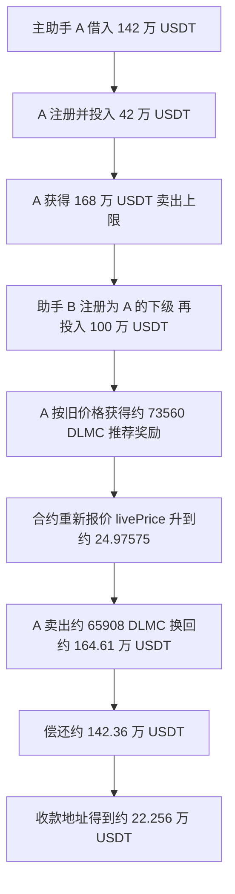

# DLMC：借来的 USDT 抬高内部价格，再把推荐奖励卖回资金库

DLMC 的问题出在几条规则接到一起：**买入会立即增加投资额度和 USDT 储备，大部分新铸 DLMC 却留在合约里；推荐奖励先按旧价格发给推荐人，之后合约又按自身储备重新报价；推荐人可以立刻按新价格卖出奖励。** 攻击者把两个自己控制的地址组成上下级，用同一笔闪电资金完成两次买入，再把奖励中的一部分卖回合约，拿走资金库原有的 USDT。

实际漏洞合约是 `0xf2ca2a3572b26ae7c479dc7ae36d922113b1bdf2`。本次取得其 Sourcify `creationMatch` 和 `runtimeMatch` 均为 `exact_match` 的完整源码，并独立读取成功交易和回执。合约入口之间的联系由源码及回执事件推导；公开 RPC 的完整调用跟踪请求返回 `missing trie node`，未取得完整 trace，也未运行分叉攻击复现。

## 合约原本做什么

DLMC 把 ERC20 代币、投资记录、推荐奖励和一个内部买卖市场放在同一份合约。用户先找一个已注册推荐人登记，再投入 USDT 调用 `buy()`。合约记录这笔投资，将对应 DLMC 铸到合约自己的地址，分配开发者和推荐奖励，并更新 `livePrice`。持有 DLMC 的已注册用户调用 `sell()`，合约按 `livePrice` 计算 USDT，销毁卖方 DLMC 后从自身资金库支付。

这里的 USDT 指 BSC 地址 `0x55d398326f99059ff775485246999027b3197955`，部分浏览器标为 BSC-USD，采用 18 位小数。它和 DLMC 是不同资产；不能把 DLMC 奖励枚数当作美元金额。

| 对象 | 地址 | 作用 |
| --- | --- | --- |
| DLMCToken | `0xf2ca2a3572b26ae7c479dc7ae36d922113b1bdf2` | 漏洞合约，同时持有被提走的 USDT |
| 攻击发起人 | `0x74c4a756933d0f713facb1dea325ef511646c3b1` | 发起本次合约创建交易；不是受害合约 |
| 顶层执行合约 | `0x4adbddea5781caccadd9f73f00e07201b541414e` | 本次交易创建的执行合约 |
| 主助手 A | `0xe81bf6e392eca9ad594b5452ea53cf7071760a04` | 借款、首次买入、作为推荐人收奖、卖出和还款 |
| 下级助手 B | `0x8b5a72c4ce0d3a7676ce06b8e42aeb255bba476e` | 登记在 A 下面，第二次买入 |
| 既有推荐人 | `0x62cefe76eecc737d7ee384efdbad8d2c53c1d792` | A 注册时使用的已登记上级；仅凭这笔交易不能断言其归攻击者所有 |
| Pancake USDT/WBNB 池 | `0x16b9a82891338f9ba80e2d6970fdda79d1eb0dae` | 提供闪电流动性并收取手续费 |
| 最终收款地址 | `0x701bb7b460ae231dbbcfa3d87f0ab5b458429699` | 收到还款后余下的 USDT；不是受害合约 |

地址关系可对照[原始交易](../../dataset_artifacts/benchmark_complete/20260625_DLMC/evidence/transaction.json)和[回执](../../dataset_artifacts/benchmark_complete/20260625_DLMC/evidence/transaction-receipt.json)。A、B 的角色由转账与注册、投资事件结合源码解释；本次未取得内部 CREATE 调用树，未独立证明每个助手的具体创建层级。

## 漏洞具体在哪

**第一处，临时存入的钱立刻成为真实可用的卖出额度。** [buy()](../../dataset/benchmark_complete/20260625_DLMC/contracts/DLMCToken.sol#L394)收取 USDT 后，调用 [_addInvestmentTranche()](../../dataset/benchmark_complete/20260625_DLMC/contracts/DLMCToken.sol#L326)：

```solidity
a.totalInvested += amountUsdt18;
```

虽然分期记录里存在 `lastClaimTime`，这里增加 `totalInvested` 不需要等一天。后来 [sell()](../../dataset/benchmark_complete/20260625_DLMC/contracts/DLMCToken.sol#L462)检查的主要金额限制是：

```solidity
uint256 maxSellValueUsdt18 = a.totalInvested * 4;
require(
    alreadySoldUsdt18 + sellValueUsdt18 <= maxSellValueUsdt18,
    "Exceeds 4x investment sell limit"
);
```

卖出没有要求经过分期等待时间，也没有区分这笔投资是长期持有的本金还是同一交易里借来的资金。因此 A 投入 420,000 USDT 后，立即拥有 1,680,000 USDT 的累计卖出上限。

**第二处，新投入的 USDT 和新发行 DLMC 在报价公式里的处理不一致。** `buy()` 先把全部 USDT 转进合约，再按扣除 15% 后的买入计价额计算代币数量，但接收新铸代币的地址是合约自身：

```solidity
uint256 tokensToUser = (buyAmount * 10 ** 18) / livePrice;
_mint(address(this), tokensToUser);
```

变量名 `tokensToUser` 容易让人以为买方立即拿到了这些币，实际接收者是 `address(this)`。之后 [_updatePrice()](../../dataset/benchmark_complete/20260625_DLMC/contracts/DLMCToken.sol#L932)读取实时 USDT 余额，扣掉 `daoUsdtBalance`，再计算分母：

```solidity
uint256 circulatingSupply = total <= PRE_MINED_LP
    ? 1
    : total - PRE_MINED_LP;
uint256 contractLPTBalance = balanceOf(address(this));
if (circulatingSupply > contractLPTBalance) {
    circulatingSupply = circulatingSupply - contractLPTBalance;
}
if (circulatingSupply == 0) circulatingSupply = 1;
uint256 newPrice = (reserve18 * 1e18) / circulatingSupply;
```

`PRE_MINED_LP` 为 500,000 DLMC。**扣除合约自持余额是有条件的分支，不能把实际公式简写成在所有状态下都无条件相减。** 当条件成立时，留在合约里的大量 DLMC 不进入最终分母，但支付进来的 USDT 会进入分子。奖励向外转移及销毁也会改变总供应和自持余额，从而影响这一分支及最终报价。价格还有 `MIN_PRICE`、`MAX_PRICE` 限制，本次第二次买入后实际记录的价格仍升至约 24.97575 USDT。

本次节点对攻击前区块的总供应和自持余额查询返回 `missing trie node`，因此没有独立还原攻击前完整存储，不能声称已经精确重算每一次分母或定位分支切换的瞬间。可以独立确认的是：源码具有上述计算路径，成功回执记录的两次价格分别为 `0.462205246149005877` 和 `24.975754129523010840`。定价读取的是合约自己的即时资产余额，没有外部市场价格校验。

**第三处，推荐奖励按更新前价格发放，却可以按更新后价格马上兑现。** [_distributeReferralBonusOnBuy()](../../dataset/benchmark_complete/20260625_DLMC/contracts/DLMCToken.sol#L876)拿买入计价额的 5% 作为奖励 USDT 面值，经过收入上限检查后，用当时的 `livePrice` 换算成 DLMC。[_applyBurnAndDaoSplit()](../../dataset/benchmark_complete/20260625_DLMC/contracts/DLMCToken.sol#L1687)把约 10% 销毁，约 10% 计入 DAO 分配，剩余约 80% 立即转给推荐人。最后 `buy()` 才更新价格。

DAO 部分主要增加成员的待领记账，不等于本次已经向 A 付币。推荐奖励也来自合约的代币余额，不能把 `_distributeReferralBonusOnBuy()` 说成自身直接调用 `_mint()`。新币是在前面的 `buy()` 中铸造的。

## 攻击怎样一步步发生



下面的事件编号使用本次独立读取回执中的 `logIndex`，是同一笔交易内部的事件编号。下述函数路径由原始源码与回执中的注册、投资、价格、转账及销毁事件共同推导，不把事件解码当成完整调用跟踪。

**1. 主助手 A 从 Pancake 池借入 1,420,000 USDT。**

`logIndex=0x71` 显示池子将这笔 USDT 转给 A。同笔交易末尾的池子 `Swap` 事件、还款数量及转账顺序支持这是一次闪电兑换资金链。源码层面的通常调用方式是 `swap(..., data)` 经回调先使用借款、随后还款；本次没有完整 trace 来独立展示回调的每一层。A 的下一步操作必须在回调结束前凑齐本金和手续费，否则整笔交易无法成功。

**2. A 先投入 420,000 USDT，取得接收奖励和卖出所需资格。**

A 的 `UserRegistered` 事件位于 `0x72`，对应 `registerAffiliate(既有推荐人)`；随后出现授权、USDT 转入和 `TradeExecuted(BUY)` 事件。`0x74` 是 USDT 转入 DLMC，`0x7f` 的交易事件明确记录买方 A 和 `420000e18` 买入额。合约将 420,000 记入 A 的 `totalInvested`，超过接收推荐奖励所需的 100 USDT 门槛；卖出上限同步成为：

```text
420,000 × 4 = 1,680,000 USDT
```

本次买入的代币计价基数为 `420,000 × 85% = 357,000 USDT`。`0x76` 显示 `865,163.184986627291978275 DLMC` 铸到 DLMC 合约自身。随后开发者和既有上级收到奖励，`0x7e` 记录新价格 `0.462205246149005877 USDT/DLMC`。这次买入给 A 的关键收益是投资资格及可卖额度，大批新币并没有直接转给 A。

**3. B 以 A 为推荐人投入剩余 1,000,000 USDT。**

A 将 1,000,000 USDT 转给 B（`0x80`）。`0x81` 的注册事件明确记录 B 以 A 为推荐人。随后 B 授权并买入，对应入账事件 `0x83` 与 `0x91` 的 `TradeExecuted(BUY, 1000000e18, ...)`。合约将 1,839,009.849156875914417340 DLMC 铸到自身（`0x85`）。

B 买入的计价基数和 A 的奖励面值为：

```text
买入计价基数 = 1,000,000 × 85% = 850,000 USDT
推荐奖励面值 = 850,000 × 5% = 42,500 USDT
按尚未更新的价格换算奖励：
42,500 ÷ 0.462205246149005877
≈ 91,950.492457843795720867 DLMC
```

再按源码的整数规则扣除 10% 销毁和 10% DAO 份额，`0x8b` 实际转给 A：

```text
73,560.393966275036576695 DLMC
```

本次收入上限没有把 42,500 USDT 的奖励削减。奖金记录中的 USDT 面值只是奖励核算值，A 此时实际拿到的是 DLMC，需要随后卖出才有 USDT。

**4. 第二次买入结束，价格升到约 24.97575 USDT。**

两次买入共给 DLMC 资金库增加 1,420,000 USDT。大部分对应新币留在合约内部，奖励发放及销毁改变了供应构成。`_updatePrice()` 用当时的资产余额和上述分母规则更新价格，`0x90` 记录：

```text
livePrice = 24.975754129523010840 USDT/DLMC
```

这里没有等到下一天、下一块或外部市场形成新价格。A 获得奖励、价格更新和随后卖出都发生在同一笔交易内。`nonReentrant` 不会阻止这些按顺序完成的独立入口调用，本事件不需要依靠重入。

**5. A 只卖奖励中的一部分，金额刚好接近资金库全部余额。**

`0x92` 的 DLMC 销毁事件、`0x93` 的 USDT 付款，以及 `0x95` 的 `TradeExecuted(SELL)` 共同对应源码的 `sell()` 路径。交易事件明确记录本次卖出数量为：

```text
sell(65908685295332365480640)
即卖出 65,908.685295332365480640 DLMC
```

按源码使用整数重算：

```text
卖出USDT最小单位
= floor(65908685295332365480640 × 24975754129523010840 / 10^18)
= 1646119118936329868440038

即 1,646,119.118936329868440038 USDT
```

这与独立回执 `0x93` 的付款精确一致，也小于 A 已取得的 1,680,000 USDT 卖出上限。`0x92` 同时记录 A 的 65,908.685295332365480640 DLMC 被销毁。

**卖出的数量小于 A 已收到的 73,560.393966275036576695 DLMC 奖励。** 因此不能写成“卖掉全部奖励”或“奖励加 DAO 分配恰好等于卖出量”。本次没有取得历史余额查询或完整调用跟踪，不能仅凭这些转账事件断言资金库精确剩余余额，也不能断言攻击程序如何选择卖出参数。可以确认的是，销毁数量与价格相乘后，得到的付款与回执完全相同。

**6. A 偿还本金和手续费，再转走余款。**

| 回执编号 | 从哪里到哪里 | USDT 数量 |
| --- | --- | ---: |
| `0x93` | DLMC → A | 1,646,119.118936329868440038 |
| `0x96` | A → Pancake 池 | 1,423,558.897243107769423559 |
| `0x97` | A → 最终收款地址 | 222,560.221693222099016479 |

三笔转账满足 `1,646,119.118936329868440038 − 1,423,558.897243107769423559 = 222,560.221693222099016479`。资金库原有储备最终被拆成了攻击方收款和闪电资金手续费，而不是全部进入攻击者钱包。[逐条事件](../../dataset_artifacts/benchmark_complete/20260625_DLMC/evidence/decoded-events.json)与[金额核算](../../dataset_artifacts/benchmark_complete/20260625_DLMC/evidence/transaction-summary.json)保存了原始最小单位和十进制数量。

## 为什么能拿走资金库原有的钱

攻击者控制的是临时注资、两个地址的推荐关系和调用顺序。第一次买入创建足够大的卖出额度；第二次买入给第一地址发奖励；新存入的借款又参与内部报价，把这些奖励的可兑现价值抬高。卖出从整个合约的 USDT 余额付款，包含之前用户留下的储备，并没有限制只退回攻击者自己投入的部分。

因此，成功条件不只是“可以借很多钱”，而是以下几条都能连起来：有可用的注册上级，A 的投入足以跨过奖励门槛并提供卖出额度，B 的奖励在收入上限内，奖励立即可用，当前价格公式能被这两次买入显著推高，最后资金库流动性足够支付。源码与成功回执共同支持本次金额变化及可达路径；本次没有宣称从任意部署默认状态都必然能复现。

## 日期、损失、收益分别是什么

| 口径 | 本次采用值 | 说明 |
| --- | --- | --- |
| 数据集日期 | 2026-06-25 | 保留当前源表第 98 行，目录为 `20260625_DLMC` |
| 实际交易时间 | 2026-06-24 11:15:10 UTC | 区块 106091607；北京时间同日 19:15:10 |
| CSV 报告损失 | 222,600 美元 | 源表原值，中文 22.26 万美元，英文 222.6 千美元 |
| 攻击方收款 | 222,560.221693222099016479 USDT | 本笔交易净入收款地址，未扣 BNB gas，不计剩余 DLMC 的估值 |
| 闪电手续费 | 3,558.897243107769423559 USDT | 还款减 1,420,000 本金 |
| 受害合约本笔净流出 | 226,119.118936329868440038 USDT | 1,646,119.1189 付款减 1,420,000 两次存款 |
| 总赎回付款 | 1,646,119.118936329868440038 USDT | 包含临时借款本金，不能全部算成受害损失 |

受害净流出与攻击方收款之间的差额正是闪电手续费。源表的美元估计、链上 USDT 数量、最终损失及潜在追回情况不能混为一谈；本次未核实后续追回、补偿或残余代币实际变现。

## 源码、切片和验证边界

| 逻辑 | 完整版 | 精简版 |
| --- | --- | --- |
| 注册、买入 | [DLMCToken.sol](../../dataset/benchmark_complete/20260625_DLMC/contracts/DLMCToken.sol#L372) | [DLMCToken.sol](../../dataset/benchmark_simplified/20260625_DLMC/contracts/DLMCToken.sol#L364) |
| 投资额度、卖出 | [sell](../../dataset/benchmark_complete/20260625_DLMC/contracts/DLMCToken.sol#L462) | [sell](../../dataset/benchmark_simplified/20260625_DLMC/contracts/DLMCToken.sol#L446) |
| 推荐奖励 | [奖励分配](../../dataset/benchmark_complete/20260625_DLMC/contracts/DLMCToken.sol#L876) | [奖励分配](../../dataset/benchmark_simplified/20260625_DLMC/contracts/DLMCToken.sol#L638) |
| 自有储备报价 | [_updatePrice](../../dataset/benchmark_complete/20260625_DLMC/contracts/DLMCToken.sol#L932) | [_updatePrice](../../dataset/benchmark_simplified/20260625_DLMC/contracts/DLMCToken.sol#L672) |
| 销毁、DAO 与到账分配 | [分配函数](../../dataset/benchmark_complete/20260625_DLMC/contracts/DLMCToken.sol#L1687) | [分配函数](../../dataset/benchmark_simplified/20260625_DLMC/contracts/DLMCToken.sol#L722) |

完整包保存 14 份原始 Solidity 内容及 OpenZeppelin 依赖，源文件 UTF-8 字节与 [Sourcify 原始包](https://sourcify.dev/server/v2/contract/56/0xf2ca2a3572b26ae7c479dc7ae36d922113b1bdf2?fields=all)逐份一致。精简版通过 AST 保留注册、买卖及其依赖，去掉无关入口和注释，共 10 份源码；保留了 59 个函数体，与原版忽略注释和空白后完全一致。两版用 `solc 0.8.31+commit.fd3a2265` 本地编译，均无错误和警告。精简版属于审计切片，不用于宣称部署字节码一致。事件名称通过原始 ABI 构造签名，再由同一 Solidity 编译器计算 Keccak topic，与回执匹配；两个注册事件与 `BUY → BUY → SELL` 三个交易事件已经独立解码核对。

已归档[验证结果](../../dataset_artifacts/benchmark_complete/20260625_DLMC/evidence/validation.json)、[来源与原始哈希](../../dataset_artifacts/benchmark_complete/20260625_DLMC/provenance.json)、[完整包哈希](../../dataset_artifacts/benchmark_complete/20260625_DLMC/SHA256SUMS)及[精简包哈希](../../dataset_artifacts/benchmark_simplified/20260625_DLMC/SHA256SUMS)。Sourcify 的 exact match 是该地址的登记验证结果；本次未独立比较攻击前历史 runtime。历史余额查询及独立 RPC 调用跟踪请求均返回 `missing trie node`，失败响应已归档。未取得完整 trace，未把静态源码分析当成逐层调用执行证明。

原始 [TenArmor 告警](https://x.com/TenArmorAlert/status/2069957542109958498)及 [BscScan 交易页](https://bscscan.com/tx/0x151025d3f0a782340a74d30ef33a5fad044b838e74437a803f0652e70c231306)在网页读取时返回 403；受害源码和成功回执通过独立公开渠道取得，并未把访问失败解释成材料不存在。
