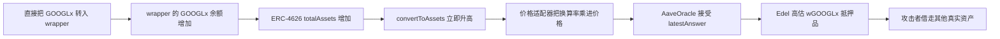

# Edel Finance / xStock：可捐赠的包装汇率怎样被放大成抵押品价格

本 case 收录的是 Ethereum 上的 Edel Finance / xStock 事件。关键价格适配器没有公开验证源码，因此这里使用 **Etherscan Bytecode Decompiler 的 Palkeoramix/Panoramix 全量伪代码**。它是反编译结果，不是已验证原始 Solidity；文中凡是来自反编译器的函数名、类型和表达式，都要按这个边界理解。

## 项目平时做什么

Edel 的借贷市场允许用户存入抵押品，再借出 USDC 或包装股票资产。这里涉及三层价格和资产关系：

1. `GOOGLx` 表示股票敞口对应的底层代币。
2. `wGOOGLx` 是 ERC-4626 包装份额。用户存入 GOOGLx 后拿到 wGOOGLx；正常情况下，一份 wGOOGLx 能换回多少 GOOGLx，由包装合约的总资产和总份额决定。
3. Edel 的 `AaveOracle` 给借贷市场提供抵押品价格。它不直接给 wGOOGLx 定价，而是调用价格适配器 `0x4C2C…4CE2`，再把适配器返回值当成价格。

包装合约的标准实现中，`totalAssets()` 直接返回合约持有的 GOOGLx 余额，`convertToAssets()` 再按总资产和总份额计算换算值。对应原文见 [`totalAssets/convertToAssets`](../../dataset/benchmark_simplified/20260701_EdelFinance_decompiled/slices/wrapper/ERC4626Upgradeable.totalAssets-convertToAssets.sol) 和 [`_convertToAssets`](../../dataset/benchmark_simplified/20260701_EdelFinance_decompiled/slices/wrapper/ERC4626Upgradeable.conversion-formulas.sol)。

## 漏洞具体在哪里

问题不是“ERC-4626 允许别人直接转入底层代币”这一件事本身，而是**价格适配器把这个可被即时捐赠改变的换算率，直接乘进了借贷抵押品价格**，没有采用抗操纵的价格、延迟窗口或其他隔离措施。

完整反编译结果中的 `unknown50d25bcd()` 对应 AaveOracle 实际调用的价格入口。反编译伪代码显示它先向 `0x49b8…b530` 调用 `getPrice(bytes32 orderId)`，再向 wGOOGLx `0x1630…bBBc` 调用选择器 `0x7a2d13a`，参数是 `10^18`。后一个调用就是查询一整份 wGOOGLx 能换回多少 GOOGLx。随后适配器把两个结果经过精度换算后相乘。关键伪代码见 [`EdelPriceAdapter.decompiled.pan` 第 21–42 行](../../dataset/benchmark_complete/20260701_EdelFinance_decompiled/EdelPriceAdapter.decompiled.pan#L21)。另一个聚合器式入口 `unknownfeaf968c()` 重复同一条定价链，见[第 44 行起](../../dataset/benchmark_complete/20260701_EdelFinance_decompiled/EdelPriceAdapter.decompiled.pan#L44)。

`AaveOracle.getAssetPrice()` 的验证源码又说明：只要配置了 source，它就直接读取 source 的 `latestAnswer()`，正值就作为资产价格返回，见 [`AaveOracle.getAssetPrice`](../../dataset/benchmark_simplified/20260701_EdelFinance_decompiled/slices/aave-oracle/AaveOracle.getAssetPrice.sol)。因此因果链是连续的：

## 攻击成立需要什么条件

这次攻击依赖以下条件同时成立：

- 借贷市场允许 wGOOGLx 作为抵押品，并使用上述适配器给它定价。
- wGOOGLx 的 `totalAssets()` 读取合约即时余额，所以任何人直接转入 GOOGLx 都能提高每份份额对应的资产量。
- 适配器即时调用 `convertToAssets(1e18)`，没有使用独立预言机、时间加权值、捐赠隔离或涨幅限制。
- 攻击者能够通过循环借入、转给辅助合约并再次供给，建立足够大的 wGOOGLx 抵押头寸。
- 市场中仍有 USDC 和包装股票可以被借走。

这里没有把 Edel 池本身写成漏洞组件。攻击时池代理实现没有独立匹配；现有 trace 和事后 PoC 只用来说明调用及资产路径。真正收录的待审计对象是链上的价格适配器反编译伪代码，以及有验证源码的 AaveOracle/wrapper 上下文。

## 攻击怎样一步步发生

根据攻击交易 trace、转账和固定 commit 的 DeFiHackLabs 复现材料，攻击流程如下：

1. 攻击者从 Morpho 临时取得 180,000 USDC，并先把 USDC 供给 Edel，作为初始抵押。
2. 攻击合约反复借出市场中的 wGOOGLx，把它转给单独的辅助合约，再由辅助合约重新供给 Edel。复现材料使用 40 次循环；它是事后复现参数，不是本次本地重放结果。
3. 攻击者再借出最后一批 wGOOGLx，并赎回成 GOOGLx。
4. 攻击者把得到的 `8.489334153345952365 GOOGLx` 直接转进 wGOOGLx 包装合约，不调用存款铸份额。总资产增加，但总份额没有同比增加。
5. 交易 trace 中，`convertToAssets(1e18)` 的唯一值序列从 `6.000000000000000481` 变为 `78.863670087342969727`。适配器返回的价格序列也从 `213678000000` 变为 `2808571882820`。
6. 辅助合约原来供给的 wGOOGLx 因此被借贷系统高估。攻击者以这批被高估的抵押品借走市场中的 USDC、wSPYx、wQQQx、wMSTRx、wNVDAx 和 wTSLAx。
7. 攻击合约允许 Morpho 收回临时本金，剩余资产转给攻击者地址。

这里归档的 [DeFiHackLabs PoC](../../dataset/benchmark_simplified/20260701_EdelFinance_decompiled/evidence/edel-xstock_exp.sol) 来自固定 commit `8c520a6ed54c9a19896bfc921d98728b078ffdc2`，只作为事后复现材料。本次没有在本地运行它，也不把它当作原始漏洞源码。

## 钱具体怎样流走

归档转账按攻击交易过滤后，攻击者 EOA 的净正流入包括：

| 资产 | 净正流入 |
| --- | ---: |
| USDC | 204,215.572188 |
| wSPYx | 122.196850288612833306 |
| wQQQx | 62.969726160938091585 |
| wMSTRx | 293.123092617121394703 |
| wNVDAx | 99.85436779558176271 |
| wTSLAx | 37.589277017463227843 |

`204,215.572188 USDC` 是“攻击者 EOA 在这笔交易中的 USDC 净正流入”，不是所有坏账或所有包装股票折美元后的总损失。公开材料同时出现约 `204,200`、`305,000` 和 `403,000` 美元三种口径，目前无法把估值时间、坏账范围和攻击者收益范围统一，所以中英文 CSV 的损失字段保持空白。

## 多个合约分别扮演什么角色

| 合约 | 角色 | 本 case 的源码状态 |
| --- | --- | --- |
| `0x4C2C…4CE2` 价格适配器 | 把 Data Streams 市场价格与 `convertToAssets(1e18)` 相乘，向 AaveOracle 提供价格 | Etherscan Palkeoramix/Panoramix 反编译；不是已验证原始 Solidity |
| `0xBd49…3B29` AaveOracle | 调用资产配置的 source，并接受正数 `latestAnswer()` | Explorer 验证源码已归档 |
| `0x1630…bBBc` wGOOGLx 代理 | 持有 GOOGLx 并暴露 ERC-4626 换算 | 代理及实现验证源码已归档 |
| `0x49b8…b530` Data Streams 价格源 | 返回 GOOGLx 对应的市场价格输入 | 作为外部调用对象记录；不声称其存在漏洞 |
| Edel 池/储备合约 | 记录抵押和债务，发放 USDC 与包装股票借款 | 作为 trace/资金路径上下文；攻击时实现未独立匹配，不声称其代码有漏洞 |

## 证据与边界

- [runtime 对比记录](../../dataset_artifacts/benchmark_complete/20260701_EdelFinance_decompiled/evidence/adapter-runtime-comparison.json)保存了 Etherscan 输入、攻击区块 `25434062` 的 `eth_getCode` 和最新 `eth_getCode` 的长度及 SHA-256。三份都是同一份 3,577 字节 runtime。
- [Etherscan 反编译元数据](../../dataset_artifacts/benchmark_complete/20260701_EdelFinance_decompiled/evidence/etherscan-bytecode-decompiler.json)保存反编译 URL、获取时间、文本长度和哈希。
- [交易汇总](../../dataset_artifacts/benchmark_complete/20260701_EdelFinance_decompiled/evidence/transaction-summary.json)保存 trace 中的价格序列、换算率、捐赠数量和攻击者净流入；完整原始 trace/转账/API 响应在 complete 视图的 `evidence/raw/`。
- 攻击区块 runtime 与 Etherscan 输入一致，只证明“反编译的机器码就是攻击时执行的适配器机器码”。它**不能**证明反编译伪代码等价于原始 Solidity，也不能恢复原作者变量名、注释和完整类型信息。
- 本次没有编译 `.pan`（它也不是 Solidity）、没有做反编译源码等价证明、没有分叉重放、没有重建历史存储，也没有核验攻击时池代理实现。

结论：当前证据足以把漏洞机制定位到“价格适配器把可捐赠操纵的 ERC-4626 即时换算率直接用于抵押品价格”，并把这条链与攻击交易的实际调用和资产流对应起来；但这个 case 必须一直以 `[Decompiled]` 标识，不能当成已验证原始源码样本。
