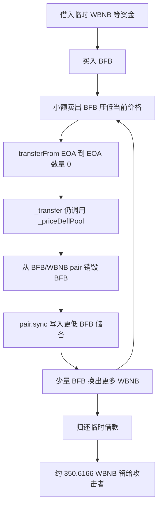

# BFB：零数量转账为什么能反复烧掉交易池资产

本案例对应源表第 113 行。源表日期是 `2026-07-09`；链上焦点交易发生在 2026-07-08 18:08 UTC。源表损失口径为 220,000 美元；按交易中 WBNB 净流出和技术分析采用的交易内价格，估值约为 197,817 美元。两个数字代表不同公开口径，本数据集的 CSV 保留源表值，不把它们强行合并。

## 1. 背景和正常业务

BFB 是 BNB Smart Chain 上的代币。它与 WBNB 在 PancakeSwap 交易池 `0xffB43C8A00A47B737d27b2aE59A35e269A21d040` 中组成交易对。普通用户买卖时，交易池根据两种资产的储备量计算价格：如果有人从池中拿走 WBNB，就必须向池中加入足够的 BFB，交易池的乘积约束负责限制可拿走的数量。

BFB 代币另外加入了“通缩”规则。代码会观察 BFB/WBNB 池子的价格；价格下降到一定幅度时，它可以从交易池地址的 BFB 余额中销毁一部分，再调用池子的 `sync()`，让池子的账面储备跟随实际余额变化。设计者可能希望借此减少市场上的 BFB，但这等于允许代币合约直接修改交易池一侧的储备，风险远高于普通转账税。

事件中的关键角色如下：

| 角色 | 地址 | 作用 |
| --- | --- | --- |
| 漏洞合约 | `0x719699762fFCC7AadBdCec4E7cf03569E5e99999` | BFB 代币；执行转账、池子销毁和 `sync()` |
| 受损交易池 | `0xffB43C8A00A47B737d27b2aE59A35e269A21d040` | 保存 BFB 与 WBNB，最终流出 WBNB |
| 攻击者 EOA | `0x3BFA85127C9871D3f74c30e36A618a77f0aE6b0F` | 发起交易并接收最终 WBNB |
| 攻击辅助合约 | `0xDd868618956418f77d922FA5D42960fb5FB01b7B` | 组织临时借款、循环卖出和零数量转账 |
| DODO、Venus 等 | 多个外部合约 | 提供临时资金；回执显示它们不是漏洞所在 |

## 2. 正常逻辑和角色

正常路径应当是：

**用户授权代币 → `transferFrom` 检查余额和额度 → 真正转移一个正数数量 → 必要时收税或更新通缩状态 → 交易池按真实输入输出资产。**

ERC-20 中，数量为零的转账通常是无害操作：余额不应变化，第三方交易池更不应因这一操作失去资产。BFB 的公开源码在 [`BFBToken.sol`](../../dataset/benchmark_complete/20260709_BFB/source-bundles/vulnerable/BFBToken.sol) 第 501–506 行实现 `transferFrom`。余额和授权检查都使用 `>= amount`；当 `amount=0` 时，即使调用者没有可用余额或额度，这两项检查也自然成立。

随后 `transferFrom` 调用第 364–390 行的 `_transfer`。真正的余额转移发生在 `_transferRoot`，但 `_transfer` 在余额转移以后仍会无条件调用 `_priceDeflPool(from, to)`。这意味着“本次实际转了多少”没有成为通缩副作用的门槛。

## 3. 漏洞到底是什么

一句话概括：**零数量转账本应什么也不做，BFB 却让它继续执行“从交易池烧币并同步储备”的副作用。**

根本缺陷位于三段代码的组合：

1. [`transferFrom`](../../dataset/benchmark_complete/20260709_BFB/source-bundles/vulnerable/BFBToken.sol) 第 501–506 行没有要求 `amount > 0`。
2. `_transfer` 第 364–390 行不论 `amount` 是否为零，都调用 `_priceDeflPool`。
3. `_priceDeflPool` 第 448–469 行在价格跌幅达到条件、`from` 与 `to` 都被判断为 EOA 时，按 `pairBalance × fallPriceBurnRatio / 10000` 计算销毁量，从交易池地址扣除 BFB，并马上调用 `sync()`。

价格由第 471–487 行直接按池子当前储备计算：

`nowPrice = WBNB_reserve × 1e18 / BFB_reserve`

所以攻击者能控制两件事：先用小额卖出改变 `nowPrice`，再用 `transferFrom(attacker, attacker, 0)` 触发与转账数量无关的池子销毁。这里“零数量”只是廉价触发器；根本问题是转账副作用没有与真实转账量绑定，并且副作用可以直接减少 AMM 池子的余额和储备。

## 4. 利用条件

| 条件 | 状态 | 依据 |
| --- | --- | --- |
| BFB/WBNB 池存在且有 WBNB 流动性 | 已在交易中观察 | 回执包含该池的大量 BFB/WBNB `Transfer` 日志 |
| 价格低于 `fallLastPrice` 达到阈值 | 源码要求；本批未独立读取攻击前存储 | `_priceDeflPool` 第 453–467 行 |
| `from`、`to` 通过 `!isContract` | 源码与交易共同支持 | 攻击者把 EOA 同时作为零数量转账两端 |
| 零数量余额和授权检查通过 | 源码确认 | `balance >= 0`、`allowance >= 0` |
| 有足够临时资金购买 BFB 并循环卖出 | 交易可观察 | 回执显示 DODO、Venus 相关借入与归还转账 |

本批没有读取攻击前的 `fallLastPrice`、阈值配置或每一轮储备快照，因此这些历史值不能只凭当前链上状态补写。

## 5. 攻击步骤

焦点交易为 [`0xabcf…3520`](https://bscscan.com/tx/0xabcf5c5c846595b2d0849f2579b67465ed8d06f3b469cee5e3a57c1f7aed3520)。本地归档保留了[交易](../../dataset_artifacts/benchmark_complete/20260709_BFB/evidence/bfb-transaction.json)和[回执](../../dataset_artifacts/benchmark_complete/20260709_BFB/evidence/bfb-receipt.json)。按源码、日志与公开技术分析，可以得到以下链路：

1. 攻击者 EOA 调用辅助合约。辅助合约从 DODO 风格池和 Venus 市场取得 WBNB、BTCB 等临时资金。借入额是资金周转量，不是损失。
2. 辅助合约用 WBNB 买入 BFB，取得可供后续小额卖出的代币。
3. 每一轮先向 BFB/WBNB 池卖出少量 BFB，使按当前储备计算的 BFB 价格下降。
4. 随后调用 `BFB.transferFrom(attacker, attacker, 0)`。回执中可见多条数值为零的 BFB `Transfer` 日志。
5. 零数量转账仍进入 `_priceDeflPool`。条件成立后，BFB 从交易池地址转到零地址，然后代币调用池子的 `sync()`；回执中可见反复的“pair → zero address”BFB 日志。
6. 池子中的 BFB 储备被同步减少。下一次很小的 BFB 输入相对这个被压缩的储备显得更大，于是能换出更多 WBNB。
7. 攻击者重复“卖一点 BFB → 零数量转账 → 烧池子 BFB → `sync` → 再卖”的循环，最后归还临时借款。

本批没有取得独立的完整内部调用跟踪。步骤顺序由已归档日志、原始源码及[公开技术分析](https://anomly.rs/bfb-zero-transfer-deflation-exploit-bsc)共同支持；不能把日志归档写成完整 opcode 重放。

## 6. 钱为什么能流出

完整因果链是：

**零数量转账仍触发通缩副作用 → BFB 从交易池余额中被销毁 → `sync()` 把异常低的 BFB 余额写成新储备 → 少量 BFB 被当成相对巨大的池子输入 → PancakePair 按公式放出 WBNB → 攻击者循环扩大并留下净收益。**

最终付款者是 BFB/WBNB PancakePair，而不是 DODO 或 Venus。回执末尾显示交易池向攻击者转出 `350.584241082291217737 WBNB`，辅助合约另向攻击者转出 `0.032391997416004694 WBNB`，合计 `350.616633079707222431 WBNB`。公开分析按交易内约 `564.19734001` 美元/WBNB 估值约 197,817 美元；源表写 220,000 美元。CSV 按任务规则保留源表口径。

## 7. 多个缺陷与外部合约

单纯允许零数量转账通常不会造成损失；单纯存在池子通缩也不一定能被任意触发。攻击成立需要三件事配合：零数量检查不封闭、转账后无条件执行价格通缩、通缩直接修改 AMM 池子并 `sync()`。闪电资金只是放大手段，使攻击者能先改变价格并完成多轮循环。

PancakePair 按它看到的余额和储备正常执行，DODO/Venus 也按借款规则完成借还。漏洞在 BFB 代币的副作用设计，不应把所有被调用的外部协议都标成漏洞合约。

## 8. 攻击流程图

## 9. 证据、影响与限制

- **源码能够确认的机制：** Sourcify 归档对 BFB 地址给出 creation/runtime `match`；完整版保存[完整源文件](../../dataset/benchmark_complete/20260709_BFB/source-bundles/vulnerable/BFBToken.sol)、编译输入和响应。源码明确显示零数量可到达池子销毁与 `sync()`。
- **交易中观察到的行为：** 焦点交易成功；回执保存 1,233 条日志，包括零数量 BFB 转账、pair 向零地址的 BFB 销毁、临时资金借还和最终 WBNB 流出。金额摘要见 [`transaction-summary.json`](../../dataset_artifacts/benchmark_complete/20260709_BFB/evidence/transaction-summary.json)。
- **由证据推断的部分：** 每轮调用的精确内部嵌套顺序主要由日志序列、源码与公开分析连接；本批没有独立完整 trace。
- **尚未核实：** 攻击前 `fallLastPrice`、阈值存储、逐轮储备的历史读取；未本地编译、未做攻击区块字节码独立比对、未分叉重放。
- **精简代码：** [精简版](../../dataset_artifacts/benchmark_simplified/20260709_BFB/SOURCE.md)是完整版的原文行切片，覆盖状态、公开转账、价格计算、销毁和 `sync()`，不能单独编译。

