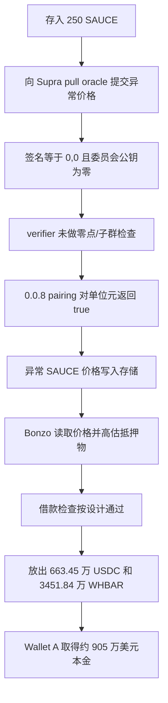

# Bonzo / Supra：零签名为什么会被当成有效预言机证明

本案例对应源表第 110 行。损失主体是 Bonzo Lend 的资金池，但代码缺陷位于它上游使用的 Supra 预言机验证器。Bonzo 官方复盘明确说明：Bonzo 按读到的价格正常计算借款能力；被伪造的是预言机已经写入链上的 SAUCE 价格。

## 1. 背景和正常业务

Bonzo Lend 是 Hedera 上的超额抵押借贷协议。用户先存入抵押品，协议从价格预言机读取抵押品价值，再按贷款价值比决定最多能借多少 USDC、WHBAR 等资产。

Supra 预言机负责把链下委员会签名的价格更新写入链上。BLS 是一种聚合签名方案；这里可以把它理解为“只有预言机委员会共同签过的数据才应通过”。链上验证器将签名、委员会公钥和消息转换成椭圆曲线点，再调用 Hedera 系统合约 `0.0.8` 的 pairing 运算。pairing 返回真只说明输入满足数学等式；调用者仍必须先确认签名点和公钥点不是无穷远点、在正确曲线上和子群中。

关键角色如下：

| 角色 | Hedera ID / EVM 地址 | 作用 |
| --- | --- | --- |
| Supra pull oracle | `0.0.4323024` / `0x41ab…a181` | 接收价格更新并调用验证器 |
| 漏洞验证器代理 | `0.0.4323006` / `0x2fa6…8517` | 对外暴露 `requireHashVerified_V2` |
| 攻击时实现 | `0.0.10414935` / `0x63e0…fbf0` | 交易中由代理 `delegatecall` 的实现代码 |
| pairing 预编译 | `0.0.8` | 只计算 pairing 方程，不替调用者完成全部 BLS 输入验证 |
| 价格存储 | `0xd02c…e0c9` | 保存通过验证的价格 |
| Bonzo 适配器 | `0.0.7308480` / `0xc0Bb…3cBB` | 从 Supra 存储读取价格给借贷池 |
| Bonzo LendingPool | `0.0.7308459` / `0x2368…afc` | 按抵押价值放出真实资产 |

## 2. 正常逻辑和角色

正常流程应是：

**Supra 委员会生成价格 → 委员会用私钥签名 → pull oracle 提交消息、签名、委员会编号 → verifier 检查点合法性并验证签名 → 价格写入存储 → Bonzo 读取价格 → 计算抵押价值与借款上限 → 借款人取得资产。**

公开原始源码来自 XDC 上另一个 Supra 验证器部署，完整源包保存在 [`source-bundles/xdc-reference`](../../dataset/benchmark_complete/20260711_Bonzo_Supra/source-bundles/xdc-reference)。其中 18 个 `.sol` 文件与独立的 `settings.json` 已分开归档，并生成可解析的 `standard-input.json`。`SupraSValueFeedVerifier.sol` 第 314–333 行的 `requireHashVerified_V2` 从 `committee_public_key[committee_id]` 取公钥，直接调用 `BLS.verifySingle`。`BLS.sol` 第 20–56 行组装 12 个域元素并 `staticcall` 地址 `0x08`，只要调用成功且输出非零就返回通过。

源文件其实在 `BLS.sol` 第 176 行以后定义了曲线检查辅助函数，但 `verifySingle` 没有调用它们，也没有显式拒绝全零签名或全零公钥。

## 3. 漏洞到底是什么

一句话概括：**验证器把“无穷远点参与的 pairing 等式为真”误当成“预言机委员会确实签了这条价格”。**

攻击提交的 BLS 签名是 `[0,0]`。官方复盘还指出所引用委员会公钥也是零值，也就是椭圆曲线的单位元/无穷远点。pairing 对单位元有平凡性质，因此预编译合约正确返回 `1`；错误发生在上层验证器，它没有先拒绝这些不可能代表正常委员会签名的输入。

根本缺陷与放大结果要分开：

- 根本缺陷：`requireHashVerified_V2` 和 `BLS.verifySingle` 缺少零点、曲线和子群验证。
- 触发输入：委员会 ID `2`、消息根 `0xd4e6…f3f7f`、签名 `[0,0]`。
- 错误状态：pair 425（SAUCE/WHBAR）的价格被写成 `10^30` 量级。
- 下游放大：250 SAUCE 被 Bonzo 估成极高价值，借款上限随之失真。

## 4. 利用条件

| 条件 | 状态 | 依据 |
| --- | --- | --- |
| 攻击者能向 pull oracle 提交价格包 | 交易已观察 | 焦点交易顶层调用 `0.0.4323024` |
| 验证器接受 `[0,0]` 签名和零公钥 | 交易 actions 与官方复盘确认 | pairing `0.0.8` 返回 32 字节 `1` |
| SAUCE 价格写入 Supra 存储 | 官方复盘与后续借款时序支持 | 更新后 8 秒开始借款 |
| Bonzo 使用该 Supra 价格 | 官方披露确认 | Bonzo 适配器和 LendingPool 地址已公开 |
| 攻击者先存 250 SAUCE | 官方交易时间线确认 | 00:39:53 UTC 存入 |

本批没有独立重建全部 Bonzo 账户存储、贷款价值比或攻击前资金池余额；这些历史状态以官方复盘为依据，未伪装成自主 RPC 读取结果。

## 5. 攻击步骤

价格更新交易是 [`0xd50c…0a60`](https://hashscan.io/mainnet/transaction/1783731093.686041919)。Hedera Mirror Node 的[交易结果](../../dataset_artifacts/benchmark_complete/20260711_Bonzo_Supra/evidence/bonzo-contract-result.json)和[内部 actions](../../dataset_artifacts/benchmark_complete/20260711_Bonzo_Supra/evidence/bonzo-actions.json)已归档。

1. 00:39:53 UTC，Wallet A 向 Bonzo 存入 250 SAUCE。00:40:00 又提交一笔正常价格更新，官方将它视为侦察。
2. 00:51:39.646，Wallet A 调用 Supra pull oracle。输入中包含 pair ID 425、committee ID 2、被抬高的价格和 `[0,0]` 签名。
3. actions 第 1 层显示 pull oracle 代理委托调用 `0.0.10414936`；第 2 层静态调用 verifier 代理 `0.0.4323006`；第 3 层再委托调用攻击时实现 `0.0.10414935`。这条记录直接固定了攻击时代理与实现关系，而不是用当前代理状态倒推。
4. 实现完成若干哈希与曲线映射预编译调用后，在 action 索引 9 调用 pairing 系统合约 `0.0.8`。其返回值是 32 字节整数 `1`。
5. verifier 将这个真值当成有效委员会签名，pull oracle 把异常 SAUCE 价格写入存储。
6. 00:51:47，Wallet A 从 Bonzo 借走 `6,634,528.202695 USDC`；00:51:57 又借走 `34,518,389.36109841 WHBAR`。这些是真实借款本金，不是闪电贷。
7. 01:36 左右正常预言机发布恢复价格，01:41 Bonzo 暂停。

## 6. 钱为什么能流出

因果链是：

**零签名与零公钥未被拒绝 → pairing 平凡返回真 → 伪造价格被写入 Supra 存储 → Bonzo 读到异常高的 SAUCE 价格 → 250 SAUCE 被算成足够的抵押品 → 正常借款检查通过 → LendingPool 向攻击者放出 USDC 和 WHBAR。**

Bonzo 官方以 HBAR 参考价 `0.06998` 美元、USDC 为 1 美元估值，将 Wallet A 借走的本金合计为约 905 万美元。另有 Wallet B 在异常窗口借出约 100 万美元，并自称白帽、准备归还；官方没有把这部分计入 headline loss，本数据集也不把它加到 905 万美元中。

## 7. 多个缺陷与外部合约

pairing 预编译不是漏洞合约。对单位元输入返回真符合它负责的数学运算；验证器必须在调用前实施 BLS 协议需要的输入约束。Bonzo 的借贷合约也按收到的价格和既定 LTV 正常工作。代码缺陷位于 Supra 验证路径，下游 Bonzo 是资金受损系统。

本案例公开源码的证据边界尤其重要：XDCScan 的验证源码确实是 Supra 原始 Solidity，且包含同名、同参数、同缺陷的 `requireHashVerified_V2`/`BLS.verifySingle`。但是[XDC 与 Hedera runtime 对比](../../dataset_artifacts/benchmark_complete/20260711_Bonzo_Supra/evidence/runtime-comparison.json)不相同。攻击时实现的 13,293 字节 runtime 已完整保存并记录哈希，并按用户指定使用 [eveem-org/panoramix](https://github.com/eveem-org/panoramix)（工具自报版本 Panoramix 17 Feb 2020）处理。Panoramix 生成了[9,550 行完整反汇编](../../dataset_artifacts/benchmark_complete/20260711_Bonzo_Supra/evidence/bonzo-panoramix-disassembly.asm)，识别出 20 个 selector，其中包括攻击调用的 `0x2818300e`。但全量和目标 selector 的符号执行都没有收敛，目标运行内存一度约 5.8 GB，因此终止；失败的 `.pan`/`.json` 没有归档。运行边界、输入与反汇编哈希、失败阶段见[运行记录](../../dataset_artifacts/benchmark_complete/20260711_Bonzo_Supra/evidence/bonzo-panoramix-run.json)。XDC 源码足以作为漏洞机制的公开原始源码，但仍不能被描述成“已证明就是 Hedera 攻击时实现的逐字源码”。

## 8. 攻击流程图

## 9. 证据、影响与限制

- **源码能够确认的机制：** XDCScan 原始验证源包显示 `requireHashVerified_V2` 未验证取出的委员会公钥，`BLS.verifySingle` 直接信任预编译结果。18 个 Solidity 文件、独立编译设置、标准输入和编译器 `v0.8.24+commit.e11b9ed9` 已归档。
- **交易中观察到的行为：** Mirror Node actions 明确记录 verifier 代理、攻击时实现、预编译 `0.0.8` 和返回 `1`；顶层交易成功。地址和 selector 摘要见 [`transaction-summary.json`](../../dataset_artifacts/benchmark_complete/20260711_Bonzo_Supra/evidence/transaction-summary.json)。
- **由证据推断的部分：** XDC 源码与 Hedera 实现的函数级机制对应，由同名 Supra 组件、官方复盘和交易 actions 共同支持；不是字节级源码等价证明。
- **尚未核实：** Hedera 攻击时实现的完整可验证 Solidity及高层反编译语义、pull oracle 与价格存储的攻击时完整代码、全部存储槽、每笔借款回执的独立重算、最终追回额。Panoramix 已留下完整反汇编和失败状态记录，但 `0x2818300e` 的高层伪代码没有收敛；这些文件不是验证源码，也不能补足 XDC 源码与 Hedera runtime 的等价性。本批同样没有本地编译或分叉重放。
- **损失边界：** CSV 使用官方 headline principal 905 万美元；白帽约 100 万美元单列，不合并。
- **精简代码：** [精简版](../../dataset_artifacts/benchmark_simplified/20260711_Bonzo_Supra/SOURCE.md)保留 verifier 状态、两个验证入口、`verifySingle` 和未被调用的校验辅助函数，全部是完整版原文切片。

官方事件说明：[Bonzo Lend Incident Report](https://bonzo.finance/blog/bonzo-lend-incident-report-oracle-provider-exploit)。
