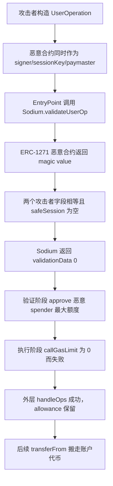

# Lumi / Sodium：伪造会话签名怎样留下永久代币额度

本案例对应源表第 107 行，发生在 Arbitrum One。受影响的不是一个普通流动性池，而是 Lumi 用户使用的 Sodium 智能账户。攻击者把同一个恶意合约同时伪装成 ERC-1271 签名者、待加入的会话密钥、paymaster 和代币 spender，在 ERC-4337 的“验证阶段”留下可长期使用的代币授权。

## 1. 背景和正常业务

Sodium 是账户抽象智能钱包实现。ERC-4337 用户不直接向钱包发送普通交易，而是构造 `UserOperation`，交给统一的 EntryPoint 合约批量处理。EntryPoint 先调用账户的 `validateUserOp` 检查签名、nonce 和费用安排；验证通过后，才进入执行阶段让钱包真正调用目标合约。

Sodium 还支持 session key（会话密钥）：账户所有者可以临时授权某个地址执行有限操作。ERC-1271 则允许“合约账户”通过 `isValidSignature` 返回固定 magic value `0x1626ba7e` 来确认签名。正常安全边界应是：当前 UserOperation 只能使用账户此前已经授权的 owner/session；它不能自己指定一个全新的签名者，再让那个签名者自称签名有效。

主要角色如下：

| 角色 | 地址 | 作用 |
| --- | --- | --- |
| Sodium 实现 | `0xb5BC46dF04dEe31D219E7664122e29EEd9506b8b` | 含签名验证、session 与 paymaster 授权逻辑 |
| EntryPoint v0.6 | `0x5FF137D4b0FDCD49DcA30c7CF57E578a026d2789` | 先统一验证，再统一执行 UserOperation |
| 恶意合约 | `0x56362412AE17cac443AAFBAb4289946Ad958E8a1` | 充当 signer、sessionKey、paymaster、spender 和后续搬币者 |
| 攻击者 EOA | `0xCe1a3BB0b98D0D90C7Dd0620Ab86C9A771888d88` | 提交批量操作并控制恶意合约 |
| Sodium 代理账户 | 多个用户账户 | 保存 USDT0 等真实资产并被写入 allowance |

## 2. 正常逻辑和角色

正常流程应为：

**用户/既有 session 对 UserOperation 签名 → EntryPoint 调用 `validateUserOp` → Sodium 确认 signer 已被账户授权 → 验证只读或只更新安全 nonce/费用状态 → EntryPoint 执行账户操作 → 账户按签名者权限付款。**

Sodium 源码在 [`contracts/Sodium.sol`](../../dataset/benchmark_complete/20260713_Lumi_Sodium/source-bundles/vulnerable/contracts/Sodium.sol) 第 340–395 行解析自定义签名。类型 `0x01` 的布局是 `{类型}{20 字节 signer}{其余签名字节}`。代码直接从用户输入里取出 `signer`，再调用 OpenZeppelin `SignatureChecker.isValidSignatureNow(signer, hash, signatureBytes)`。

如果 `signer` 是合约，`SignatureChecker` 会调用它的 ERC-1271 `isValidSignature`。这项能力本身是正常设计；问题是 Sodium 后续没有把这个 signer 与账户预先建立的授权充分绑定。

## 3. 漏洞到底是什么

这次攻击需要两个代码缺陷配合。

第一个缺陷是会话授权绕过。`Sodium.sol` 第 167–181 行处理 `executeWithSodiumAuthSession`：

- `sessionKey` 直接从当前 `userOp.callData` 提取；
- `signer` 直接从当前 `userOp.signature` 提取；
- 当 `_safeSession.owner == address(0)` 时，`isSafe` 直接为真；
- 最终只比较 `sessionKey == signer`。

攻击者把这两个输入都填成自己的恶意 ERC-1271 合约。恶意合约对任意一字节 `0x00` 都返回 magic value，因此签名看起来有效；两个攻击者控制的地址字段又相等，Sodium 就返回 `validationData=0`，没有要求它是账户所有者预先授权的 session。

第二个缺陷是验证阶段产生攻击者控制的持久授权。`Sodium.sol` 第 83–106 行把 `paymasterAndData` 解释为：

`20 字节 paymaster || 0x095ea7b3 || 20 字节 token`

然后调用这个 paymaster 的 `getTokenAllowanceCast`，让它自己返回最低额度和建议授权额，最后执行 `token.approve(paymaster, suggestApproveValue)`。攻击者控制 paymaster、token 选择、阈值、额度和 spender。

## 4. 利用条件

| 条件 | 状态 | 依据 |
| --- | --- | --- |
| 调用必须来自 EntryPoint | 已满足 | 攻击者通过 `handleOps`，不是直接调用账户 |
| Sodium 账户未配置 safe session | 示例账户的公开跟踪支持；本批未逐账户读取历史槽 | 该状态使 `isSafe` 默认等于真 |
| 恶意合约能返回 ERC-1271 magic value | 公开跟踪已观察 | `0x5636…8e8a1` 返回 `0x1626ba7e` |
| `paymasterAndData` 长度与 selector 匹配 | 已解码 | 20 + 4 + 20 字节，selector 为 `approve` |
| 验证有足够 gas、执行为零 gas | 已解码 | `verificationGasLimit=800000`，`callGasLimit=0` |
| 账户持有可 `transferFrom` 的代币 | 后续交易观察 | 示例账户持有 99,577,041 个 USDT0 最小单位 |

## 5. 攻击步骤

本地保存了源表交易、示例授权交易和示例搬币交易的原始[交易与回执](../../dataset/benchmark_complete/20260713_Lumi_Sodium/evidence)。详细字段解码由[Verichains 技术复盘](https://blog.verichains.io/p/lumi-finance-exploit-erc-1271-bypass)提供。

1. 攻击者调用恶意合约，恶意合约再调用 EntryPoint 的 `handleOps`。账户看到的直接调用者是可信 EntryPoint，所以 `_requireFromEntryPoint()` 正常通过。
2. UserOperation 的 `signature` 把恶意合约写成 signer，并携带任意 `0x00`。该合约的 ERC-1271 函数主动返回 magic value，`SignatureChecker` 因此报告有效。
3. `callData` 要求调用 `executeWithSodiumAuthSession`，其中 proposed `sessionKey` 也等于恶意合约。因为 `_safeSession.owner` 为空，Sodium 不调用外部安全验证器，两个攻击者字段相等就使 `_validateSignature` 返回 0。
4. `validateUserOp` 在第 112–122 行继续执行 `_approvePaymasterToken`。恶意 `paymasterAndData` 指定自己为 spender、指定 USDT0 等目标 token。
5. 恶意 paymaster 返回 `miniAllowance=1` 和 `suggestApproveValue=2^256-1`。Sodium 账户在验证阶段调用 token 的 `approve`，给恶意合约最大额度。
6. EntryPoint 完成所有账户验证后才进入执行循环。攻击者把账户调用的 `callGasLimit` 设为 0，所以真正的 `executeWithSodiumAuthSession` 没有足够 gas，无法走到会要求完整授权证明的执行逻辑。
7. 这次内部执行失败被记为 `opReverted`，但外层 `handleOps` 没有整体回滚。前面验证阶段产生的 allowance 保留下来。
8. 在单独的后续交易中，恶意合约查询账户余额和 allowance，然后直接调用代币 `transferFrom`，无需新的钱包签名即可搬走全部余额，再进行兑换。

一个容易混淆的点是：`validateUserOp` 即使返回 1 也会暂时调用 `approve`，但 EntryPoint 随后会因 AA24 签名错误回滚整个操作。真正让授权存活的是第一个缺陷把未经授权的操作变成了返回值 0。因此两个缺陷缺一不可。

## 6. 钱为什么能流出

因果链是：

**攻击者自选 ERC-1271 signer 与 sessionKey → Sodium 错把它当成有效会话 → validationData 返回 0 → 验证阶段按攻击者的 paymasterAndData 给出最大代币额度 → 零 gas 让危险执行分支失败但不回滚外层批次 → allowance 长期存在 → 恶意 spender 调用 `transferFrom` → 用户账户真实代币流出。**

最终付款路径不是 Sodium 主动执行一次“提款”，而是各 ERC-20 合约在看到已存在的 allowance 后，按标准 `transferFrom` 从多个 Sodium 账户扣款。示例 drain 交易 `0x1cdba4…b9f0` 中，一个账户的 `99,577,041` 个 USDT0 最小单位被全部转走。源表用约 270,000 美元表示多账户总损失；本批没有从全部账户逐笔重算最终总额，因此保留该公开口径。

## 7. 多个缺陷与外部合约

OpenZeppelin `SignatureChecker` 正常实现 ERC-1271：调用指定合约询问签名是否有效。错误是 Sodium 允许当前不可信 UserOperation 决定“问谁”，又把这个地址与同一 UserOperation 自己提出的 sessionKey 相比较。EntryPoint 的验证/执行分阶段也按 ERC-4337 设计工作；Sodium 不应在验证阶段基于不可信 paymaster 数据制造可长期使用的资产权限。

因此应把漏洞归到 Sodium 实现，而不是 ERC-20、EntryPoint 或 Lumi 的流动性池。

## 8. 攻击流程图

## 9. 证据、影响与限制

- **源码能够确认的机制：** Sourcify 对 Sodium 实现给出 creation/runtime `exact_match`，31 个原始源文件、标准编译输入、设置和 ABI 均已归档。关键代码是 `Sodium.sol` 第 83–122、136–210、340–395 行及 `SessionManager.sol`。
- **交易中观察到的行为：** 三组公开 RPC 交易和回执均成功；分别对应示例授权、示例 drain 和源表代表交易。摘要见 [`transaction-summary.json`](../../dataset/benchmark_complete/20260713_Lumi_Sodium/evidence/transaction-summary.json)。
- **由证据推断的部分：** UserOperation 的逐字段解释、ERC-1271 返回值和 EntryPoint 两阶段顺序主要依赖公开完整跟踪分析；本批归档的是交易和回执，没有独立 debug trace。
- **尚未核实：** 所有受害账户清单、每个账户攻击前 safe-session 存储、270,000 美元的逐币种最终净额、追回情况。未本地编译或分叉重放。
- **精简代码：** [精简版](../../dataset/benchmark_simplified/20260713_Lumi_Sodium/SOURCE.md)保留签名、session、验证阶段 approve 和 OpenZeppelin ERC-1271 分支的原文切片。

