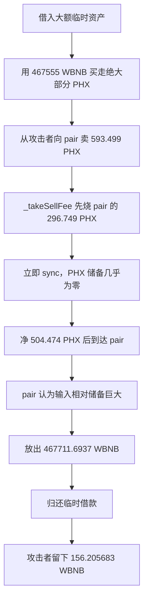

# PHX：先烧掉交易池储备，再用很少代币换走几乎全部 WBNB

本案例对应源表第 108 行。源表日期为 `2026-07-13`，焦点交易实际发生在 2026-07-12 02:05:29 UTC；目录和 CSV 按任务规则保留源表日期，并在这里明确差异。源表损失是 89,600 美元，公开技术分析按交易内价格估计约 89,532 美元。

## 1. 背景和正常业务

PHX 是带转账费用的 BNB Smart Chain 代币。它在 PancakeSwap 的 PHX/WBNB 池 `0x09DBd035059b954d1D9c0076BDf6f70D2EFEB6CF` 中交易。代币通过 `_update` 判断转账是买入、卖出还是普通转账，再收取运营、LP、基金会和销毁费用。

AMM 交易池的重要假设是：储备变化要通过受控的转入、转出、增减流动性和 `sync` 完成。代币合约如果可以在卖出过程中直接扣掉“交易池账户”的代币余额，就能在当前交换尚未完成时改写池子的价格基线。

| 角色 | 地址 | 作用 |
| --- | --- | --- |
| 漏洞 PHX 代币 | `0x2540CDc3317Aa614178c29e2a1C7d5cDcEBBa481` | 卖出路径直接烧 pair 的 PHX 并 `sync` |
| 受损 PancakePair | `0x09DBd035059b954d1D9c0076BDf6f70D2EFEB6CF` | 最终放出 WBNB |
| 攻击者 EOA | `0xf61FF6CD361561aC0274a7d3D197C79310bDEE61` | 准备 PHX 并接收净收益 |
| 执行合约 | `0x8D161cb068A576B53F5Be6f9f024B9c489e005f8` | 临时借款、交易和还款 |
| 未验证 helper | `0xB4a7E7cC2841725CdFFB5502C392c08D9433C217` | 代攻击者调用 `PHX.transferFrom` |

## 2. 正常逻辑和角色

正常卖出流程应是：

**卖家把 PHX 转入 pair → 代币从卖家金额中扣除费用 → 净 PHX 到达 pair → pair 根据旧储备和真实输入计算可付 WBNB → 储备在 swap 后更新。**

PHX 的 [`_update`](../../dataset/benchmark_complete/20260713_PHX/source-bundles/vulnerable/contracts/phx.sol) 第 172–212 行把 `to` 是 AMM pair 的转账认定为卖出，并调用 `_takeSellFee`。配置中 `sellPairBurnRate` 决定还要按卖出数量从 pair 自身销毁多少 PHX。

## 3. 漏洞到底是什么

一句话概括：**卖出费用不只扣卖家的币，还在卖家净输入到达之前烧掉交易池自己的 PHX，并马上把这个异常余额同步成储备。**

`_takeSellFee` 位于 `contracts/phx.sol` 第 228–259 行：

1. 先按卖出 `amount` 计算各类费用与 `receiveAmount`；
2. 另算 `pairBurnAmount = amount × sellPairBurnRate / DENOMINATOR`；
3. 第 245 行执行 `_burn(pair, pairBurnAmount)`；
4. 第 246 行立即 `pair.sync()`；
5. 直到第 257 行才把卖家净额 `receiveAmount` 转给 pair。

这个顺序把一次普通卖出拆成“先缩小 pair 的 PHX 储备，再加入净卖出额”。如果攻击者先把池中 PHX 买到极少，销毁步骤能把剩余 PHX 几乎清空。此时后到的几百枚 PHX 相对新储备非常大，常数乘积公式允许取走极多 WBNB。

## 4. 利用条件

| 条件 | 状态 | 依据 |
| --- | --- | --- |
| `sellPairBurnRate` 为正 | 交易与公开分析确认 | 本次按 5000，即卖出额的 50% 计算 |
| 攻击者先买走池中大部分 PHX | 回执观察 | 467,555.4880 WBNB 买出 886,011.3669 PHX |
| 攻击者已有约 593.4995 PHX 可卖 | 前置交易与焦点回执支持 | 技术分析列出准备交易 |
| 卖出路径不在费用豁免名单 | 执行成功说明满足；攻击前名单未独立读取 | `_update` 中的源码条件 |
| 临时借款足以大规模买入 | 回执观察 | DODO、Venus、Aave 风格路径借入且同交易归还 |

## 5. 攻击步骤

焦点交易为 [`0xb5a64…1ebe`](https://bscscan.com/tx/0xb5a64c9c43da7b817b2450149b55cb542697d9a676b2f8a89ec748b37f821ebe)，原始[交易](../../dataset/benchmark_complete/20260713_PHX/evidence/phx-transaction.json)与[回执](../../dataset/benchmark_complete/20260713_PHX/evidence/phx-receipt.json)已保存。

1. 攻击者部署执行合约，并通过多个借贷场所取得 WBNB、BTCB 和 USDT 临时资金。
2. 执行合约向 Pancake 路由器支付 `467,555.488029525477661032 WBNB`，从 PHX/WBNB pair 买出 `886,011.366874573088068552 PHX`，把 pair 的 PHX 一侧压到约 `296.749735 PHX`。
3. helper 调用 `PHX.transferFrom`，准备从攻击者 EOA 向 pair 卖出 `593.499469494402906536 PHX`。
4. `_update` 判断 `to` 是 pair，进入 `_takeSellFee`。代码先从 pair 销毁 `296.749734747201453268 PHX`，然后 `sync()`。回执中有 pair 到零地址的精确数量。
5. `sync` 时 pair 只剩 `1,000,000` 个 PHX 最小单位，而 WBNB 一侧仍约为 `467,711.693812892500744808 WBNB`。
6. 扣除运营、LP、基金会与普通销毁费用后，`504.474549070242470556 PHX` 才真正进入 pair。
7. 执行合约直接调用 pair.swap，取出 `467,711.693712892500744808 WBNB`，仅给池中留下约 `0.0001 WBNB`。
8. 临时借款和费用被归还，执行合约最终向攻击者 EOA 转出 `156.205683366923083775 WBNB`。

## 6. 钱为什么能流出

因果链是：

**先用临时资金买空 PHX 一侧 → 卖出费用路径从 pair 自身再烧 PHX → `sync` 把几乎为零的 PHX 写成新储备 → 卖家的净 PHX 随后进入并相对储备显得巨大 → pair 公式允许支付几乎全部 WBNB → 归还借款后剩余 156.205683 WBNB。**

最终损失承担者是 PHX/WBNB pair 的流动性提供者。大额 `467,711.6937 WBNB` 是这一轮从 pair 取出的交换输出，其中绝大部分用于归还攻击前后取得的临时资金；真正留下的 WBNB 是 `156.205683366923083775`。不能把交换总输出全部写成攻击者利润。

## 7. 多个缺陷与外部合约

攻击依赖“代币能销毁 pair 余额”和“在净卖出到账前立即 sync”两点。只收高卖出税不会产生同样效果；只允许管理员定期烧池子也不等于本交易路径可利用。临时借款让攻击者能先买走几乎全部 PHX，是放大条件，不是根本代码错误。

PancakePair 根据同步后的余额正常计算交换，外部借贷协议也按约收回本金。漏洞合约应填写 PHX 代币，不应把正常工作的 pair、路由器和资金来源都列为漏洞代码。

## 8. 攻击流程图

## 9. 证据、影响与限制

- **源码能够确认的机制：** Sourcify 对 PHX 地址给出 creation/runtime `exact_match`，七个原始源文件及编译输入已归档。`_takeSellFee` 的销毁、`sync`、净输入顺序可以直接阅读。
- **交易中观察到的行为：** 回执日志精确显示买入、pair 销毁、净 PHX 输入、pair WBNB 输出和最终攻击者 WBNB。摘要见 [`transaction-summary.json`](../../dataset/benchmark_complete/20260713_PHX/evidence/transaction-summary.json)。
- **由证据推断的部分：** 完整内部调用先后由事件顺序、源码与公开分析连接；本批未独立取得完整 trace。
- **尚未核实：** 攻击前费用豁免名单、所有参数的历史存储证明、前置准备交易的完整状态差分。未本地编译、未做分叉重放。
- **日期与金额：** CSV 保留源表 `2026.07.13` 和 89,600 美元；正文单列链上 UTC 日期和约 89,532 美元估值。
- **精简代码：** [精简版](../../dataset/benchmark_simplified/20260713_PHX/SOURCE.md)保存费用状态、分派逻辑、卖出路径及 OpenZeppelin `_update/_burn` 原文切片。

公开技术分析：[PHX Pair Burn Exploit Analysis](https://anomly.rs/phx-pair-burn-reserve-manipulation)。

