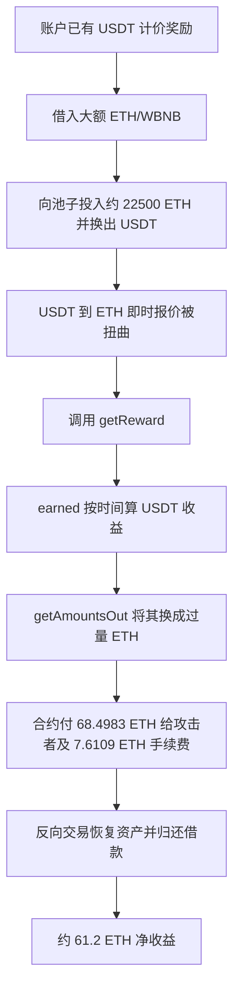

# VECAndETH：按刚被操纵的池价计算奖励，为什么会多付几十个 ETH

本案例对应源表第 106 行，源表日期为 `2026-07-14`。焦点交易在 BNB Smart Chain 上执行，受害合约 `0x3e5059…47a1` 保存 Binance-Peg ETH，并按用户累积的 USDT 计价收益向其发放 ETH。

## 1. 背景和正常业务

VECAndETH 是一个质押/收益合约。用户投入 VEC 后，合约按时间和 `rewardRate` 累积一笔“以 USDT 表示的可领取价值”；领取时再把这笔 USDT 价值换算成应付的 Binance-Peg ETH 数量。合约直接持有 ETH 代币，因此算出的数字会成为真实付款额。

理解这个案例需要区分两类价格：

- 抗操纵预言机通常使用多个来源、时间平均或延迟，短时大额交易不应立即决定结算价。
- `PancakeRouter.getAmountsOut` 只是询问“按当前交易池储备，现在交换会得到多少”。它适合给用户预览交易，不适合不加保护地决定合约应付多少奖励。

| 角色 | 地址 | 作用 |
| --- | --- | --- |
| 漏洞及付款合约 | `0x3e505942bfa3ed145935223f9e3d1e2103cd47a1` | 累积 USDT 价值并按即时池价支付 ETH |
| 攻击者 | `0x39B3D12f8C4e9644f8A9Eba9c07Ca37DF9eCF27c` | 暂时改变 ETH/USDT 池价并领取 |
| PancakeRouter | `0x10ED43C718714eb63d5aA57B78B54704E256024E` | 返回当前 `getAmountsOut` 报价并执行交换 |
| Binance-Peg ETH | `0x2170Ed0880ac9A755fd29B2688956BD959F933F8` | 受害合约实际付出的资产 |
| 临时资金来源 | 包括 `0x8F73…E5D8C` 等 | 提供 WBNB/ETH 周转，交易内归还 |

## 2. 正常逻辑和角色

正常流程是：

**用户质押 VEC → 合约记录 USDT 计价本金和剩余奖励额度 → 时间经过后 `earned` 算出本期 USDT 收益 → 使用可信价格换算为 ETH → `getReward` 清零已计奖励并付款。**

[`VECAndETHFinance.sol`](../../dataset/benchmark_complete/20260714_VECAndETH/source-bundles/vulnerable/V4/VECAndETHFinance.sol) 第 1311–1323 行的 `_updateReward` 先调用 `earned(account)`，把当前收益记入 `_rewards`，同时减少 `_remain`。第 1393–1408 行的 `getReward` 再计算手续费，把 `_rewards` 清零，最后执行两次 `ETHToken.transfer`：一笔给用户，一笔给基金地址。

这种“先计算、后清零、再付款”本身没有明显问题。危险点是计算使用什么价格。

## 3. 漏洞到底是什么

一句话概括：**合约把可由一笔大额交易瞬间改变的 PancakeSwap 现货报价，直接当成奖励结算价。**

`earned` 在第 1457–1465 行按下式得到本期 USDT 价值：

`receivable = balance × (block.timestamp - lastUpdateTime) × rewardRate / 1e18`

`calculateAvableUsed` 将它限制在用户剩余额度内，然后调用第 1443–1448 行：

`PancakeRouter.getAmountsOut(receivableValue, [USDT, ETH])[1]`

返回值就是 `totalReward`，最终进入 `_rewards` 并由 `getReward` 真实转账。代码没有时间加权价格、价格偏差上限、最小流动性检查、延迟结算或独立预言机。攻击者可以在同一交易里先改变 USDT/ETH 储备比例，领取后再反向交易恢复池子。

## 4. 利用条件

| 条件 | 状态 | 依据 |
| --- | --- | --- |
| 攻击者账户已有可领取、未耗尽的奖励 | 源码要求且交易成功说明满足 | `reward > 0`、`_remain` 限制 |
| 领取间隔已到且未在黑名单 | 源码要求；历史值未独立读取 | `getReward` 第 1397–1399 行 |
| `msg.sender == tx.origin` | 已满足 | 焦点交易是攻击者地址自调用，并使用 EIP-7702 风格执行 |
| ETH/USDT 路径有可短时操纵的流动性 | 交易可观察 | 回执显示大额 ETH/USDT 往返交换 |
| 受害合约持有足够 ETH 支付异常奖励 | 付款日志确认 | 合约实际转出约 76.1092 ETH（含手续费） |

## 5. 攻击步骤

焦点交易为 [`0xe1f1…b72`](https://bscscan.com/tx/0xe1f1e3e0706aa995b47a8ba1d310526e14f4db6ad78277853fa10932236eeb72)。本地保存了[交易](../../dataset/benchmark_complete/20260714_VECAndETH/evidence/vec-transaction.json)和[70 条日志的回执](../../dataset/benchmark_complete/20260714_VECAndETH/evidence/vec-receipt.json)。

1. 攻击者从外部场所取得大额 WBNB 和 Binance-Peg ETH 临时资金。公开分析描述其短时向目标池投入约 22,500 ETH。
2. 攻击者把大量 ETH 换成 USDT，强烈改变 USDT→ETH 路径的当前储备比例。对 `getAmountsOut(少量 USDT, [USDT, ETH])` 来说，此时每单位 USDT 能换算出远高于正常值的 ETH。
3. 攻击者调用受害合约的 `getReward`。`_updateReward` 先按时间计算 USDT 计价收益，再在被操纵的同一区块价格上调用 `calculateUSDTToETH`。
4. 错误报价被写入用户 `_rewards`，随后立即清零并付款。回执显示受害合约向攻击者转出 `68.498286303203816978 Binance-Peg ETH`，并向基金地址转出 `7.610920700355979664 ETH`。
5. 攻击者反向兑换 USDT，恢复用于操纵的 ETH，逐笔归还临时资金。
6. 公开分析将最终净收益估为约 `61.2 ETH`，约 109,000–109,600 美元。这个数字小于受害合约毛付款，因为交易操纵、借款和手续费都要成本。

## 6. 钱为什么能流出

因果链是：

**临时大额交易改变 ETH/USDT 储备 → `getAmountsOut` 给出异常 USDT→ETH 现货报价 → `earned` 把正常 USDT 收益换算成过量 ETH → `_updateReward` 把错误数量记入 `_rewards` → `getReward` 认为计算结果合法 → 受害合约直接转出真实 Binance-Peg ETH。**

最终付款函数就是 `getReward` 第 1405–1406 行。攻击者没有凭空铸造 ETH；它利用错误价格让一个本来只能领很少奖励的账户通过正常付款出口领走合约库存。临时借入和往返交换的数万 ETH 是周转量，不能算作净利润或受害合约损失。

## 7. 多个缺陷与外部合约

PancakeRouter 的 `getAmountsOut` 按当前池价返回结果是正常行为，交易池也按输入执行交换。漏洞是 VECAndETH 把这个报价用于不可逆的奖励结算，没有任何抗操纵约束。

`msg.sender == tx.origin` 只限制普通合约代理调用，并不能保证价格可信，也不能阻止 EIP-7702 等让账户执行复杂逻辑的方式。它不是有效的预言机防护。

## 8. 攻击流程图

## 9. 证据、影响与限制

- **源码能够确认的机制：** Sourcify 对受害地址给出 creation/runtime `exact_match`，单一原始源文件、标准输入、编译器 `0.8.30+commit.73712a01` 和设置已归档。源代码直接把 `getAmountsOut` 结果接入奖励和付款。
- **交易中观察到的行为：** 回执精确显示受害合约向攻击者和基金地址的两笔 ETH 转账，以及临时资金进入、反向交换和归还。摘要见 [`transaction-summary.json`](../../dataset/benchmark_complete/20260714_VECAndETH/evidence/transaction-summary.json)。
- **由证据推断的部分：** 每次交换对应的具体池子储备变化主要由日志和公开分析连接。本批尝试完整历史 trace 时遇到 `missing trie node`，没有把失败请求当成完整跟踪。
- **尚未核实：** 攻击前成员结构体、确切正常奖励 17.14 USDT 的独立历史存储读取、全部交换费用和最终跨协议净利润重算。未本地编译或分叉重放。
- **金额边界：** 毛付款、基金手续费、公开净收益和源表美元损失分别记录，不互相替代。
- **精简代码：** [精简版](../../dataset/benchmark_simplified/20260714_VECAndETH/SOURCE.md)保存状态、更新 modifier、领取函数、收益公式和现货报价的原文切片。

公开分析归档入口：[CoinKyt 事件说明](https://coinkyt.com/blog/kontrakt-schital-nagradu-po-siyuminutnoj-cene-zloumyshlennik-eyo-obrushil-i-poluchil-109-tys)。

